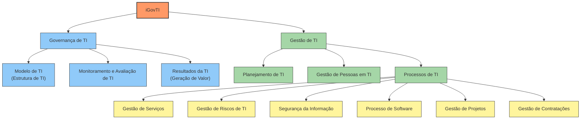

# Relatório Técnico: Índice de Governança e Gestão de TI (iGovTI)

## 1. Introdução e Contexto

O **iGovTI** (Índice de Governança e Gestão de Tecnologia da Informação) é um indicador sintético desenvolvido pelo Tribunal de Contas da União (TCU) para avaliar a situação de governança e gestão de TI na Administração Pública Federal.

Originalmente parte do levantamento do Perfil Integrado de Governança e Gestão (iGG), o iGovTI consolidou-se como a principal métrica para aferir a maturidade institucional no uso de recursos de tecnologia, sendo utilizado não apenas para diagnóstico, mas também como indutor de melhorias.

Recentemente, este índice foi integrado ao contexto do **iESGo** (Índice de Avaliação da Situação de Governança Pública), mantendo sua estrutura metodológica focada em alinhar a TI aos objetivos institucionais e garantir a entrega de valor à sociedade.

## 2. Objetivos e Finalidade

O iGovTI serve a múltiplos propósitos estratégicos para o controle externo e para os próprios gestores públicos:

1. **Diagnóstico de maturidade/capacidade** em TI (visão segmentada e holística da adoção de práticas de TI).
2.  **Identificação de Riscos:** Mapear pontos críticos (como segurança da informação, continuidade de negócios e contratações) que podem comprometer a missão institucional.
3. **Priorização de melhorias**: identificar quais práticas (planejamento, serviços, riscos, segurança, projetos, contratos etc.) estão mais frágeis.
4. **Comparação interna no tempo (série histórica)**: acompanhar evolução do próprio órgão (antes/depois de iniciativas).
5.  **Indução de Boas Práticas:** Estimular a adoção de frameworks de mercado e conformidade com a legislação (ex: Lei de Governo Digital, LGPD).
6.  **Benchmarking:** Permitir a comparação entre organizações de mesmo porte ou setor (autarquias, fundações, estatais, etc.).
7.  **Subsídio ao Controle:** Orientar o planejamento de auditorias baseadas em risco.

Não se recomenda a utilização dos índices de governança e gestão para:

- **Ranking geral** de organizações “melhores/piores”:  em geral, organizações **não são diretamente comparáveis** e que o indicador é **auto declarado**, com erro não mensurável.
- **Metas simplistas de aumento do índice** sem análise de risco/custo-benefício: controles custam caro e devem ser calibrados por exposição a risco.
- **Conclusões determinísticas** com diferenças pequenas (ex.: 0,80 vs 0,70): podem estar dentro de margens de erro e de subjetividade.

## 3. Dimensões e Componentes do Índice

O iGovTI não é um bloco monolítico; ele é composto por dois grandes subíndices que refletem a distinção conceitual entre **Governança** (mecanismos de liderança, estratégia e controle para avaliar, direcionar e monitorar a gestão e a entrega de resultados) e **Gestão** (conjunto de práticas para planejar, executar, controlar operações e iniciativas, visando produzir resultados).

No iGovTI, essa separação vira **duas dimensões agregadoras**:
1. **Governança de TI** (se a alta administração estrutura e conduz a TI de forma alinhada, monitorada e orientada a resultados).
2. **Gestão de TI** (se a organização planeja, provê pessoas e executa processos essenciais de TI com qualidade e controle).

Nesse contexto, a estrutura hierárquica do índice é a seguinte:

### 3.1. Índice de Governança de TI (GovernancaTI)
#### “A alta administração governa TI?”
Foca na atuação da Alta Administração e nas estruturas de decisão. Compõe-se de:

*   **Modelo de Gestão de TI (ModeloTI):** Avalia se a alta administração estabelece diretrizes, estruturas, papéis e responsabilidades. Verifica se há comitês estratégicos de TI e se as decisões de investimento são priorizadas com base em critérios claros.
*   **Monitoramento e Avaliação (MonitorAvaliaTI):** Verifica os mecanismos para monitorar e avaliar desempenho e conformidade da TI (indicadores, relatórios, acompanhamento pela liderança).
*   **Resultados de TI (ResultadoTI):** Mede a entrega de valor, incluindo a ampliação de serviços digitais, satisfação dos usuários e transparência.

### 3.2. Índice de Gestão de TI (iGestTI)
#### “A organização gere TI no dia a dia e em suas entregas?”
Foca na capacidade de execução das práticas gerenciais pelas áreas técnicas. Compõe-se de três pilares fundamentais:

#### A. Planejamento de TI (PlanejamentoTI)
*   Verifica se há **processo** e **plano vigente** de TI (planejamento e direção).

#### B. Gestão de Pessoas em TI (PessoasTI)
*   Avalia o dimensionamento da força de trabalho, capacitação, retenção de talentos e a escolha de gestores com base em competências.

#### C. Processos de TI (ProcessosTI)
Este é o componente mais extenso, agrupando processos críticos alinhados a boas práticas consolidadas de gestão de TI (ex: COBIT/ITIL):

*   **Gestão de Serviços (iGestServicosTI e iGestNiveisServicoTI):** Catálogo de serviços e gestão de níveis de serviço (SLA).
*   **Gestão de Riscos de TI (iGestRiscosTI):** Identificação, análise e tratamento de riscos tecnológicos (inclui integração com a gestão de riscos institucional/continuidade).
*   **Segurança da Informação (iGestSegInfo):** Estrutura (governança, papéis, políticas) e processos (controles, incidentes, continuidade, conformidade).
*   **Processo de Software:** Processo de desenvolvimento/gestão de software (quando aplicável), desenvolvimento seguro e manutenção de sistemas.
*   **Gestão de Projetos:** Metodologias para gerenciamento de projetos de TI (planejamento, execução, controle, resultados).
*   **Gestão de Contratações de TI (iGestContratosTI):** Planejamento da contratação, seleção do fornecedor e gestão contratual (fiscalização), com foco em economicidade e eficácia.

### 3.3 Alterações
[Relatório Técnico de Fiscalização do iESGo 2024](https://iesgo.tcu.gov.br/wp-content/uploads/sites/12/iesgo2024/iESGo2024_Relatorio_tecnico.pdf)

> Em 2024, o iGovTI passou por modificações, passando a enfocar exclusivamente nas práticas relacionadas à governança e gestão de TI e da segurança da informação. Como consequência dessa mudança de direcionamento, práticas vinculadas a outros temas que eram avaliados no questionário, incluindo a gestão de contratações, a gestão de pessoas e a governança organizacional, foram excluídas dos indicadores que compõem o iGovTI.

## 4. Metodologia de Cálculo

### 4.1. Itens do questionário
A coleta é realizada via questionário de autoavaliação (baseado no método CSA - *Control Self-Assessment*). As respostas variam em uma escala de aderência à prática:
| Categoria de resposta | Valor típico |
|---|---:|
| Não adota | 0,00 |
| Há decisão formal / plano aprovado para adotá-la | 0,05 |
| Adota em menor parte | 0,15 |
| Adota parcialmente | 0,50 |
| Adota em grande parte ou totalmente | 1,00 |
| Não se aplica | valor depende da justificativa (pode ser equiparado a 0,00; 0,50; ou 1,00) |

> A categoria “há decisão/plano” recebe valor maior que “não adota” por indicar disposição/decisão formal de implementar o controle.

> A categoria "Não se aplica" não é neutra. Ela passa por uma validação (pelo TCU) e, se a justificativa for inconsistente (ex: dizer que não se aplica gestão de riscos porque o órgão é pequeno), a resposta é convertida para "Não Adota" (Nota 0)recebe valor maior que “não adota” por indicar disposição/decisão formal de implementar o controle.

*Nota: Para algumas respostas de adoção parcial ou total, o questionário exige evidências (itens de verificação) para validar a resposta.*

Para cada prática são coletadas atividades esperadas associadas àquela prática por meio de subquestões "sim/não".

Isso é relevante porque o cálculo do índice não é uma simples média: há **tratamento estatístico** e mecanismos de **ajuste** (p.ex., desconto por subquestões não respondidas).

#### Como funcionam os descontos (efeito prático)
- Para respostas com valor alto (1,00) e intermediário alto (0,50), o não preenchimento das subquestões pode reduzir o valor final.
- Em caso extremo, a nota pode ser reduzida até o patamar equivalente a “adota em menor parte” (0,15), pois essa é a alternativa mais alta que não exige subquestão.

### 4.2 Visão geral do processo (do dado bruto ao índice 0–1)
A metodologia de cálculo do índice segue estas etapas:

1. **Coleta**: respostas do questionário (autoavaliação), com exigência de evidência em várias alternativas.
2. **Conversão de respostas em valores numéricos (0 a 1)**:
   - As categorias são convertidas para valores numéricos padronizados.
   - A opção “não se aplica” é tratada com **justificativa** e avaliação (pode ser equiparada a níveis diferentes conforme consistência e risco residual).
3. **Ajuste por subquestões**:
   - Para certas respostas altas, o questionário exige marcar subitens (ou subquestões).
   - O não atendimento das subquestões **reduz** (desconta) a pontuação final da questão principal.
4. **Construção de agregadores (subíndices) por análise multivariada**:
   - Em vez de “média simples”, o TCU usa **Análise de Componentes Principais (ACP/PCA)** para extrair o **primeiro componente principal (PC1)** de um conjunto de itens (questões) que medem um mesmo construto (p.ex., “Gestão de riscos”, “ProcessosTI” etc.).
   - Esse PC1 é interpretado como a **melhor estimativa estatística** do conceito intangível (adoção da prática), expurgando ruído e influências indesejadas.
5. **Hierarquia de agregações**:
   - Uma vez calculados agregadores em nível de prática, o método pode ser reaplicado em **níveis superiores**, agregando agregadores (ex.: ProcessosTI agrega vários subíndices; iGestTI agrega PlanejamentoTI/PessoasTI/ProcessosTI; iGovTI agrega GovernancaTI e iGestTI).
6. **Classificação por estágios de capacidade**:
   - O resultado numérico (0–1) pode ser classificado em faixas (inexpressivo, inicial, intermediário, aprimorado), para comunicação executiva.

### 4.3 Como o PCA/ACP entra no cálculo
Para um conjunto de itens de verificação \(Q_1, Q_2, ..., Q_n\) que medem uma prática \(P\), a “equação esperada” é do tipo:

\[
P \approx p_1 Q_1 + p_2 Q_2 + ... + p_n Q_n
\]

No método descrito:
- aplica-se ACP/PCA para obter o **PC1**, que explica a maior parcela possível da variância relevante do conjunto de itens;
- os pesos \(p_i\) podem ser obtidos por aproximação (ex.: regressão linear múltipla) para permitir cálculo operacional e interpretação.

Critérios comuns de qualidade do agregado (quando possível):
- PC1 explicando **> 50%** da variância;
- apenas **1 componente** relevante (critério de Kaiser: autovalor > 1).

### 4.4 Como o iGovTI e subíndices são definidos
O Apêndice de formulações do iGG 2021 explicita relações do tipo:

- **iGovTI** ⟵ GovernancaTI + iGestTI
- **GovernancaTI** ⟵ ModeloTI + MonitorAvaliaTI + ResultadoTI
- **iGestTI** ⟵ PlanejamentoTI + PessoasTI + ProcessosTI
- **ProcessosTI** ⟵ iGestServicosTI + iGestNiveisServicoTI + iGestRiscosTI + iGestSegInfo + ProcessoSoftware + iGestProjetosTI + iGestContratosTI
- **iGestSegInfo** ⟵ EstruturaSegInfo + ProcessoSegInfo

E cada bloco se ancora em práticas/subquestões específicas do questionário (exemplos):
- PlanejamentoTI ⟵ 4211, 4212
- ProcessosTI ⟵ (por exemplo) 4221–4227, 4231, 4241–4242, 4271, 4281, 4352 etc. (dependendo do subagregador)

> Importante: o “peso” de cada item no índice não é um peso arbitrário fixo; ele deriva do procedimento estatístico (ACP/PCA) aplicado ao conjunto de respostas e agregações, conforme o modelo adotado.

### 4.5. Níveis de Capacidade/Maturidade (faixas)
O resultado final é um número entre 0 e 1 (ou 0 a 100%), classificado nas seguintes faixas:

*   **Inexpressivo (0% a 14,9%):** Não há evidências de práticas de governança/gestão. Risco crítico.
*   **Inicial (15% a 39,9%):** Práticas *ad hoc*, desorganizadas ou em estágio muito incipiente.
*   **Intermediário (40% a 70%):** Práticas definidas, mas execução pode não ser uniforme ou total.
*   **Aprimorado (70,1% a 100%):** Práticas institucionalizadas, gerenciadas e otimizadas.

## 5. Como usar o iGovTI para melhoria e para auditoria

### 5.1 Uso gerencial (melhoria interna)
1. **Quebrar o iGovTI** nos dois blocos (GovernancaTI e iGestTI) e, em seguida, nos componentes internos.
2. **Identificar gargalos**:
   - Governança fraca + gestão razoável → provável falta de direção/monitoramento pela liderança.
   - Planejamento fraco + processos fortes → TI pode estar “apagando incêndio” sem rumo.
   - Segurança fraca → risco de incidentes, indisponibilidade e não conformidade.
3. **Vincular ações a evidências** (normas, comitês, planos, indicadores, SLAs, inventários, gestão de riscos, continuidade).
4. **Definir roadmap** por risco e custo-benefício (evitar metas “por meta”).

### 5.2 Uso em auditoria/avaliação (Matrizes)
As **Matrizes de governança e gestão de TI** do iESGo do TCU funcionam como um “mapa de auditoria” por prática:
- descrevem **conteúdo** e **subquestões** da prática (ex.: 4211, 4212);
- estruturam **evento de risco, causas, efeitos**;
- sugerem **informações requeridas**, procedimentos e **possíveis achados/recomendações**;
- vinculam a **acórdãos correlatos**.

Isso facilita transformar o diagnóstico (iGovTI) em:
- escopo de auditoria baseado em risco,
- testes e evidências,
- achados típicos e recomendações alinhadas.

## 6. Limitações e cautelas metodológicas
- O iGovTI é produzido por **respostas das próprias organizações** e pode conter **imprecisões** não quantificáveis.
- “Ranking” geral costuma ser inadequado: comparação deve ser feita, quando fizer sentido, entre **pares** (mesmo segmento e condições).
- Diferenças pequenas podem não ser significativas (erro desconhecido).
- O índice representa um **conjunto mínimo** de controles internos considerados convenientes para riscos comuns; organizações com exposições muito diferentes demandam leituras diferentes (risco/custo-benefício).
- Controles custam caro: metas devem considerar risco, materialidade e contexto, evitando “subir número” sem justificativa.

## 7. Referências
- Relatório Consolidado iGG 2021 (inclui Apêndice de método/ACP e formulações de agregação).
- Estrutura para compreensão dos dados (2018) — escala, conversões, tratamento de “não se aplica”, TipoX e lógica de estágios.
- Matrizes de governança e gestão de TI (v2) — planejamento e possíveis achados por prática.
- Esclarecimentos para uso dos dados — cautelas de interpretação e comparabilidade.
- Questionário iESGo 2024 — exemplo de estrutura de questões, exigência de evidências e subitens TipoX (padrão análogo de questionários).