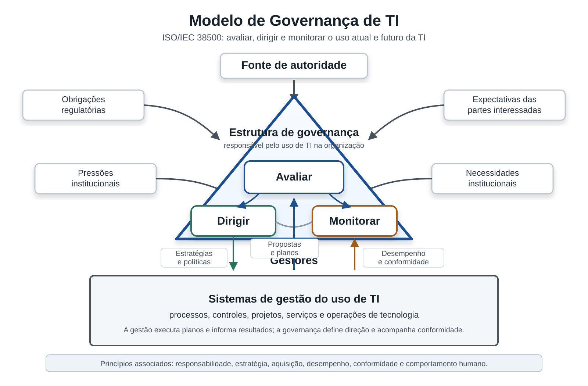

\newpage

**DADOS DA FISCALIZAÇÃO**

|  |  |
| --- | --- |
| Número da fiscalização: | 18/2026 |
| Modalidade: | AUDITORIA DE CONFORMIDADE |
| Forma de autorização: | ORDINÁRIA |
| Ato originário: | PROCESSO TCE-RJ nº 303.389-0/2025 |
| Jurisdicionados: | 119 organizações do Estado e Municípios do Rio de Janeiro. |
| Objetivo da fiscalização: | Avaliar o grau de adoção dos jurisdicionados às boas práticas de governança e gestão de TI. |
| Ofícios de apresentação: | AUD/SGE/GAP 3232/25 a 3241/25, 3243/25 a 3268/25 todos de 06/08/2025. |
| Período abrangido: | janeiro/24 a julho/26 |
| Período de execução: | 02/02/26 à 03/07/26 |
| Equipe: | Augusto César Benvenuto de Almeida, mat. 02/4823;  João Paulo de Freitas Ramirez, mat. 02/4820 |
| Supervisão: | Bruno Mattos Souza de Souza Melo, mat. 02/4258 |

\newpage

::: {.toc}
:::

\newpage

# LISTA DE ANEXOS

| **ANEXOS** | |
| --- | --- |
| **Documento nº** | **Descrição** |
| AN01 | **Ofícios de Apresentação**  (arquivo digital “*AN01 - Ofícios de Apresentação.zip*”) |
| AN02 | **Matriz de Planejamento**  (arquivo digital “AN02 - Matriz de Planejamento.pdf”) |
| AN03 | **Questionário iGovTI 2026, metodologia e resultado**  (arquivo digital “AN03 – Questionário iGovTI 2026 e informações.zip”) |
| AN04 | **Evidências** (arquivo digital “AN04 – Evidências dos achados.pdf”) |
| AN05 | **Respostas aos Questionários (avaliação de respostas e comentários do gestor) e planilhas de ajustes**  (arquivo digital “*AN05 – Respostas aos questionários e ajustes.zip*”) |
| AN06 | Matriz de Achados  (arquivo digital “AN06 – Matriz de Achados.pdf”) |
| AN07 | **Impacto da avaliação das evidências**  (arquivo digital “AN07 – Impacto da avaliação das evidências.pdf”) |
| AN08 | **Avaliação da relação entre iGovTI 2026 e achados de auditoria**  (arquivo digital “AN08 – Avaliação iGovTI 2026 e achados de auditoria.pdf”) |
| AN09 | **Cenário de utilização de inteligência artificial no ERJ**  (arquivo digital “AN09 – Cenário de utilização de IA no ERJ.pdf”) |
| AN10 a AN123 | **Informações das organizações (TSIDs, respostas, evidências enviadas, comentários do gestor e relatório individual)**  *(arquivos digitais “ANXX – [ORGANIZAÇÃO].zip”)* |

\newpage

# 1. RESUMO

#### O que o TCE-RJ fiscalizou?

O TCE-RJ realizou auditoria de conformidade, com contornos operacionais, para avaliar a adoção de boas práticas de governança e gestão de TIC nas organizações públicas sob sua jurisdição, traçando o panorama de maturidade e a evolução temporal em relação a 2023.

A fiscalização abrangeu 119 organizações estaduais e municipais de todos os poderes e esferas. Desse total, 113 apresentaram resposta válida ao questionário e foram avaliadas nos resultados do iGovTI e nos achados consolidados; as outras 6 foram classificadas como não respondentes[^nao_respondentes_obstrucao].

A avaliação cobriu seis temas: formalização da área de TI, governança e comitês, planejamento (PDTI), força de trabalho, gestão de serviços e controle de contratações. As respostas ao questionário eletrônico de autoavaliação foram validadas por análise documental, servindo de base para o cálculo do Índice de Governança e Gestão de TI (iGovTI 2026) e classificação em quatro níveis de maturidade (Inexpressivo, Iniciando, Intermediário e Aprimorado). Realizou-se ainda comparação longitudinal para 68 entidades pareadas com a fiscalização de 2023.

#### O que o TCE-RJ encontrou?

A fiscalização constatou baixa maturidade e fragilidades estruturais na governança e gestão de TIC fluminense. A média consolidada do iGovTI 2026 foi de 0,184 (mediana de 0,134), com 88,5% (100 de 113) das entidades nos níveis mais baixos (54,0% Inexpressivo e 34,5% Iniciando). Apenas 9 atingiram o nível Intermediário e 4 o Aprimorado. Na análise comparativa ajustada (68 organizações comuns), 39 (57,4%) mantiveram o mesmo nível de maturidade, 13 (19,1%) avançaram de nível e 16 (23,5%) regrediram, com destaque negativo para **Processos de Contratação de TIC** (redução média de -0,210) e **Gestão de Pessoas de TIC** (redução média de -0,142).

Foram consolidados seis achados principais de desconformidade técnica:

* **Achado 1 (Estrutura):** 62,8% têm fragilidades na formalização, atribuições ou posicionamento da área de TIC.
* **Achado 2 (Governança):** 94,7% carecem de modelo básico de governança ou de comitês formalmente instituídos e efetivos.
* **Achado 3 (Planejamento):** 96,5% apresentam planejamento de TIC insuficiente para orientar a gestão, o orçamento e as contratações.
* **Achado 4 (Pessoal):** 100,0% apresentam fragilidades de capacidade institucional em TIC e segurança da informação.
* **Achado 5 (Serviços):** 100,0% operam com fragilidades em catálogo, níveis de serviço, ativos, configuração ou incidentes de TIC.
* **Achado 6 (Contratações):** 99,1% apresentam fragilidades na governança técnica da fase preparatória das contratações de TIC.

#### Qual é a proposta de encaminhamento?

Propõem-se recomendações transversais direcionadas aos gestores, fundamentadas nas melhores práticas (COBIT 2019 e ITIL 4), organizadas em cinco eixos:

* **Estrutura e Governança:** formalização da TI e instituição ativa de comitês gestores multidisciplinares.
* **Planejamento:** elaboração e revisão do PDTI com vinculação direta ao orçamento anual.
* **Recursos Humanos:** dimensionamento de equipes e planos para reduzir a dependência crítica de terceirizados.
* **Serviços e Ativos:** instituição de catálogo de serviços, inventário de ativos e gestão de incidentes.
* **Contratações:** padronização do fluxo de compras e obrigatoriedade de anuência técnica prévia da área de TIC.

#### Quais os próximos passos?

Após o contraditório, o relatório e os encaminhamentos serão submetidos à deliberação do Plenário do TCE-RJ. Com a aprovação, as recomendações transversais serão notificadas e os relatórios individuais com planos de ação serão enviados às organizações avaliadas, sob monitoramento posterior do Tribunal.

[^nao_respondentes_obstrucao]: Para as organizações não respondentes, será sugerida a abertura de processo de obstrução de auditoria em razão da não entrega das informações solicitadas pela Equipe de Auditoria.

\newpage

# 2. INTRODUÇÃO

Trata-se de auditoria de conformidade, com contornos operacionais, autorizada no âmbito do processo TCE-RJ nº 303.389-0/2025. O trabalho tem por objeto as práticas de governança e gestão de tecnologia da informação adotadas pelas organizações da Administração Pública Estadual e Municipal do Estado do Rio de Janeiro.

Os trabalhos foram conduzidos em conformidade com as Normas Brasileiras de Auditoria do Setor Público (NBASP) e de acordo com os padrões estabelecidos no Manual de Auditoria deste Tribunal de Contas do Estado do Rio de Janeiro (TCE-RJ).

## 2.1 Antecedentes

A presente fiscalização insere-se no conjunto de ações de controle externo planejadas por esta Corte de Contas para avaliar e induzir a maturidade da governança e da gestão de Tecnologia da Informação e Comunicação (TIC) sob sua jurisdição.

Um importante marco nesse tema foi o levantamento realizado no âmbito do Processo nº 105.096-3/2020, que avaliou aspectos-chave da governança de TI das principais entidades da esfera estadual que utilizam soluções de tecnologia da informação, mensurando suas práticas pelo Índice de Governança e Gestão de TI (iGovTI).

Posteriormente, no ano de 2023, o Tribunal realizou duas auditorias de conformidade com o escopo de verificar as políticas de governança e gestão de TI como norteadoras das contratações de TIC. A primeira delas, autuada no Processo nº 205.089-9/2023, avaliou a maturidade dessas práticas em nível municipal, alcançando as prefeituras de Maricá, Rio das Ostras, Saquarema e Volta Redonda. A segunda, processada sob o nº 109.009-4/2023, concentrou-se nas organizações que compõem o Sistema Estadual de Tecnologia da Informação e Comunicação (SETIC) do Executivo Estadual.

Paralelamente às avaliações gerais de governança, este Tribunal realizou fiscalizações dedicadas a aspectos específicos de segurança. Nesse sentido, as auditorias de conformidade dos Processos nº 105.895-5/2024 e 107.097-5/2025 verificaram a adoção de controles e a aderência das organizações públicas estaduais às boas práticas de segurança da informação, como a ISO 27001/2022 e os Controles CIS v8.

Em virtude de a temática de Segurança da Informação (SI) e Segurança Cibernética ter sido objeto de avaliação detalhada nesses dois trabalhos específicos anteriores (Processos nº 105.895-5/2024 e nº 107.097-5/2025), ressalta-se que esse tema não será avaliado como questão de auditoria autônoma na presente fiscalização, cujos exames concentram-se na governança e na gestão geral de TI (iGovTI).

## 2.2 Objetivo e escopo

O objeto do presente trabalho consiste nas práticas de governança e gestão de TI de 119 jurisdicionados estaduais e municipais do Estado do Rio de Janeiro.

Os objetivos específicos da fiscalização compreendem:

* Mensurar o índice de maturidade de governança e gestão de TI (iGovTI) de todos os jurisdicionados no exercício de 2026;
* Analisar a evolução temporal das capacidades de TIC por meio da comparação dos resultados de 2026 com os levantados em 2023;
* Propor recomendações de melhoria de controles internos de governança e gestão nos auditados.

O escopo da auditoria abrangeu 119 (cento e dezenove) organizações das Administrações Públicas Estadual e Municipal. Desse total, 113 (cento e treze) apresentaram resposta válida ao questionário e foram consideradas nos resultados do iGovTI e nos achados consolidados. As seis organizações sem resposta válida foram tratadas como não respondentes. O período de execução dos trabalhos de campo ocorreu entre fevereiro e julho de 2026.

## 2.3 Limitações

A principal limitação metodológica do trabalho reside no caráter predominantemente autodeclaratório das informações fornecidas pelas organizações por meio do questionário eletrônico.

Visando mitigar os riscos de assimetria informacional, a Equipe de Auditoria requereu dos auditados o envio de evidências documentais correspondentes às respostas prestadas. A análise limitou-se ao confronto das declarações com os documentos encaminhados, sem a realização de testes locais de validação de controles.

A limitação não obstou o atingimento dos objetivos propostos.

## 2.4 Critérios aplicados

Os exames fundamentaram-se em modelos e padrões internacionalmente consagrados de governança e gestão de TIC, especificamente o *COBIT 2019* e o *ITIL 4*, em conjunto com as diretrizes do Decreto Federal nº 9.203/2017 e com a jurisprudência desta Corte de Contas.

## 2.5 Metodologia utilizada

A metodologia combinou quatro frentes de trabalho: questionário eletrônico de autoavaliação, análise das evidências encaminhadas, cálculo do iGovTI 2026 e execução de procedimentos de auditoria para identificação de achados. O objetivo foi produzir um diagnóstico quantitativo de maturidade e, ao mesmo tempo, verificar a consistência das práticas declaradas pelos gestores.

A sequência metodológica adotada está sintetizada na [@fig:fluxo_metodologia_igovti_2026] e detalhada nos parágrafos seguintes.

{#fig:fluxo_metodologia_igovti_2026#}

(Fonte: elaboração própria)

Na fase de planejamento, a Equipe de Auditoria elaborou questionário estruturado com base nas métricas de iGovTI do Tribunal de Contas da União (TCU) dos anos de 2021 e 2024. O instrumento foi adaptado ao contexto dos jurisdicionados do TCE-RJ e estruturado para avaliar temas essenciais de governança e gestão de TIC, como segurança da informação, gestão de riscos, continuidade de negócios, serviços de tecnologia, contratações de TIC, estrutura e força de trabalho, desenvolvimento de soluções, gestão de projetos e uso de inteligência artificial.

O questionário foi disponibilizado em meio eletrônico, por meio do sistema *LimeSurvey*, com links individualizados encaminhados às organizações. A avaliação adotou o método de autoavaliação de controles (*Control Self-Assessment* - CSA): cada gestor informou o nível de adoção das práticas avaliadas e, quando aplicável, anexou documentos para comprovar a resposta. Dos 119 jurisdicionados abrangidos no escopo, 113 apresentaram resposta válida e integraram as análises estatísticas e os achados consolidados; os seis casos sem resposta válida foram classificados como não respondentes.

Após a coleta, a base de respostas passou por saneamento e ajustes registrados pela Equipe de Auditoria, incluindo retificações, correções de inconsistências e tratamento de problemas identificados no questionário. Em seguida, as respostas e evidências foram analisadas para verificar se a documentação apresentada sustentava as práticas declaradas. Quando a evidência não comprovou a resposta afirmada, a resposta foi ajustada ou considerada não conforme, conforme a regra aplicável ao item avaliado.

Com a base ajustada, foi calculado o iGovTI 2026. O índice é medido em escala de 0 a 1. Para calcular a nota, as respostas categóricas foram convertidas em coeficientes numéricos: **Não adota** = 0,00; **Há decisão formal ou plano aprovado para adotá-lo** = 0,05; **Adota em menor parte** = 0,15; **Adota parcialmente** = 0,50; e **Adota em maior parte ou totalmente** = 1,00. Nas questões com itens de detalhamento, a pontuação da questão principal sofre deduções proporcionais aos itens não atendidos. Depois disso, os valores são consolidados por agregação ponderada.

O índice final é composto por dois blocos principais, conforme sintetizado na [@fig:composicao_igovti_2026]: **Governança de TIC**, com peso de 47,8%, formado por quatro questões de agregação direta; e **Gestão de TIC (iGestTI)**, com peso de 52,2%, estruturado em seis dimensões operacionais que consolidam vinte questões principais ponderadas.

{#fig:composicao_igovti_2026#}

(Fonte: elaboração própria)

Com base na pontuação consolidada, cada organização com resposta válida foi classificada em um de quatro níveis de maturidade: **Inexpressivo** (0,00 <= iGovTI < 0,15), **Iniciando** (0,15 <= iGovTI < 0,40), **Intermediário** (0,40 <= iGovTI < 0,70) e **Aprimorado** (0,70 <= iGovTI <= 1,00).

A apuração do iGovTI permitiu comparar o grau de adoção das práticas avaliadas entre as organizações e subsidiou a comparação longitudinal com o ciclo de 2023, mediante estrutura ajustada de itens comparáveis.

Paralelamente ao cálculo do índice, a Equipe de Auditoria executou procedimentos específicos para identificar achados. Esses procedimentos cruzaram o banco de auditados, as respostas ajustadas pelo painel de avaliação de evidências e a lista de procedimentos de auditoria definidos. Como resultado, foram consolidados achados, situações inconformes, evidências e propostas de encaminhamento para cada organização avaliada.

Ao final da fase de execução, foram elaborados relatórios individuais preliminares. Para as organizações avaliadas, esses relatórios apresentaram a nota do iGovTI, a posição relativa no conjunto de jurisdicionados, os achados identificados, as situações encontradas, os ajustes decorrentes da análise documental e o plano de ação proposto. Para os não respondentes, foi registrada a ausência de resposta válida.

As manifestações dos gestores foram posteriormente apreciadas pela Equipe de Auditoria e consideradas na consolidação dos dados e das conclusões apresentados neste relatório.

## 2.6 Benefícios estimados

Espera-se que a presente fiscalização induza a melhoria da governança e da gestão de TIC nas organizações auditadas. Os principais benefícios compreendem a otimização da estrutura organizacional, o aprimoramento do planejamento estratégico de TIC, a padronização na prestação de serviços, a adequada gestão de pessoas e o fortalecimento do controle das contratações de tecnologia, inserindo a TIC como elemento estratégico para a execução de políticas públicas.

Além disso, a auditoria desempenha um papel fundamental na promoção de uma cultura organizacional que atribui à tecnologia da informação valor estratégico para as entidades, contribuindo diretamente para o cumprimento de suas políticas públicas.

## 2.7 Organização do Relatório

O presente relatório de auditoria consolidado está organizado da seguinte forma:

* **Capítulo 1 (Resumo):** apresenta uma síntese da fiscalização, incluindo os objetivos, a relevância do tema, os principais resultados obtidos e as conclusões gerais do trabalho;
* **Capítulo 2 (Introdução):** descreve a contextualização da auditoria, os objetivos, a delimitação do escopo, as diretrizes de fiscalização, a metodologia adotada e a estrutura do relatório;
* **Capítulo 3 (Visão Geral do Objeto):** detalha os conceitos de governança e gestão de TI, o modelo de governança, seus princípios e responsabilidades no setor público, bem como as mensurações anteriores do iGovTI;
* **Capítulo 4 (Resultados da Auditoria):** apresenta os resultados gerais do iGovTI 2026, a comparação longitudinal temporal com o ciclo de 2023, a consolidação dos achados de auditoria resultantes da validação probatória, a análise da relação entre o iGovTI e os achados e o cenário de utilização de inteligência artificial;
* **Capítulo 5 (Comentários do Gestor e Análise da Equipe):** consolida as manifestações enviadas pelos gestores sobre os achados de auditoria e a respectiva avaliação técnica da equipe acerca das concordâncias e discordâncias apresentadas;
* **Capítulo 6 (Considerações Finais):** expõe as conclusões gerais obtidas ao término da fiscalização, destacando o diagnóstico consolidado da maturidade em governança e gestão tecnológica;
* **Capítulo 7 (Proposta de Encaminhamento):** apresenta o conjunto de propostas de encaminhamento geral e recomendações transversais formuladas para orientar as melhorias no setor público.

\newpage

# 3. VISÃO GERAL DO OBJETO

O uso de tecnologia da informação é capaz de impulsionar de forma significativa os resultados das organizações. A governança de TI cumpre papel fundamental para garantir que os recursos digitais tragam os melhores benefícios.

Nesse sentido, a governança é responsável por garantir que as necessidades das partes interessadas sejam avaliadas para determinar objetivos institucionais equilibrados e acordados. Além disso, a governança define a direção por meio de priorizações e tomadas de decisão, monitorando o desempenho e a conformidade em relação à direção definida.

A ABNT NBR ISO/IEC 38500:2025 estabelece o modelo de governança de TI, ilustrado na [@fig:modelo_governanca_ti_iso_38500], que apresenta as três atividades da governança: avaliar, dirigir e monitorar. Avaliar consiste em estabelecer o ambiente interno e externo e determinar como a organização é atualmente apoiada e habilitada por meio do uso de TI. Dirigir significa definir como a organização deve ser apoiada e habilitada por meio do uso adequado da TI. Por fim, monitorar é a atividade que verifica se o que foi planejado e direcionado está realmente sendo executado.

{ width=90% }{#fig:modelo_governanca_ti_iso_38500#}

(Fonte: elaboração própria, adaptado da ABNT NBR ISO/IEC 38500:2025)

## 3.1. O Papel e os Mecanismos da Governança de TI

A governança no setor público baseia-se na teoria da agência, visando reduzir a assimetria de informação entre a sociedade (o principal) e os gestores públicos (os agentes). Ela opera por meio de três mecanismos fundamentais:

* Liderança: Compreende práticas de integridade, competência, responsabilidade e motivação exercidas pela alta administração para assegurar a boa governança;
* Estratégia: Envolve a definição de objetivos, diretrizes e planos, além do alinhamento entre as partes interessadas para o alcance dos resultados;
* Controle: Consiste em processos estruturados para gerenciar riscos e garantir a execução eficiente, eficaz e ética das atividades.

A alta administração é a principal responsável pela governança, cabendo a ela estabelecer políticas, objetivos e conduzir a estratégia institucional. Na área de TI, o estabelecimento de um Comitê Gestor Multidisciplinar é uma prática essencial para priorizar investimentos e garantir que a TI suporte efetivamente os objetivos institucionais.

## 3.2. Princípios e Responsabilidades na Governança Pública

Para assegurar a legitimidade e a eficácia, a governança deve pautar-se por princípios fundamentais, conforme estabelecido pelo Decreto Federal nº 9.203/2017 e pelo Referencial Básico de Governança adotado pelo Tribunal de Contas da União (TCU):

* Capacidade de resposta: Responder de forma tempestiva e inovadora às demandas da sociedade;
* Integridade: Priorizar o interesse público sobre os privados, sustentando padrões éticos;
* Confiabilidade: Minimizar incertezas e manter consistência com a missão institucional;
* Melhoria regulatória: Elaborar políticas baseadas em evidências e consultas públicas;
* Prestação de contas e responsabilidade (*Accountability*): Agentes públicos devem responder por seus atos e omissões de forma clara e transparente;
* Transparência: Disponibilizar informações sobre decisões e desempenho além do que exige a lei;
* Equidade e participação: Tratar todas as partes interessadas de forma justa e participativa.

## 3.3. Gestão de TI

A gestão é a função encarregada de planejar, construir, executar e monitorar as atividades em alinhamento com a direção estabelecida pelo órgão de governança para atingir os objetivos da organização. Enquanto a governança avalia e direciona, a gestão executa as operações diárias de tecnologia e informação.

As instâncias de gestão podem ser táticas (coordenando áreas setoriais como a TI) ou operacionais (executando processos de apoio ou finalísticos).

As funções típicas da gestão de TI incluem o gerenciamento de serviços, a segurança da informação, a gestão de riscos e a continuidade dos serviços. A gestão deve operar em um ciclo de melhoria contínua (como o modelo PDCA), garantindo a conformidade com as normas e o reporte sistemático do progresso em relação aos objetivos estratégicos.

## 3.4. Instrumentos de Integração: PETI e PDTI

A integração entre governança e gestão materializa-se em instrumentos de planejamento. O Plano Estratégico de TI (PETI) e o Plano Diretor de TI (PDTI) são os principais documentos que vinculam a alocação de recursos de tecnologia aos objetivos organizacionais.

O PDTI, aprovado pela alta administração, deve conter o inventário de necessidades, planos de metas, ações, orçamento e gestão de riscos. É por meio desses instrumentos que a governança exerce seu papel de direcionamento, enquanto a gestão utiliza-os como guia para a execução eficiente das soluções de TIC.

## 3.5 Modelos de governança e gestão de TI dos auditados

Os auditados deste trabalho seguem modelos distintos de governança e gestão de TI. Observa-se que as organizações estaduais exibem, em média, maior maturidade nessa seara em comparação àquelas municipais[^maturidade_estadual_municipal]. Nesse sentido, destaca-se a estruturação do Poder Executivo e Judiciário do Estado do Rio de Janeiro.

O Decreto Estadual nº 48.997/2024 é o normativo que define o atual modelo de gestão e governança de TI no âmbito do Poder Executivo do Estado do Rio de Janeiro.

Esse normativo estabelece que o Sistema Estadual de Tecnologia da Informação e Comunicação - SETIC é composto pelo conjunto de recursos humanos, tecnológicos e de equipamentos voltados para o estabelecimento e a implementação de políticas para a informação e a comunicação pública, organizando-se em dois níveis: Direção Geral, sob competência do PRODERJ; e nível setorial, representado pelas assessorias de informática, ou setores equivalentes, de todos os órgãos da administração direta e indireta do Estado do Rio de Janeiro.

O modelo do SETIC atribuiu ao PRODERJ competências relevantes, como a coordenação e supervisão do Sistema, a normatização de aspectos de TI, a elaboração e disponibilização de atas de registro de preço para contratação de bens e serviços de TI, e a avaliação e consolidação dos planos de TI dos órgãos do nível setorial do sistema.

No Poder Judiciário, a Resolução CNJ nº 370/2021, que estabelece a Estratégia Nacional de Tecnologia da Informação e Comunicação do Poder Judiciário (ENTIC-JUD), dispõe no art. 6º que cada órgão elabore e mantenha o Plano Diretor de Tecnologia da Informação e Comunicação (PDTIC), "o qual deverá elencar as ações que estarão alinhadas ao Planejamento Estratégico Institucional, ao Planejamento Estratégico Nacional do Poder Judiciário e à Estratégia Nacional de Tecnologia da Informação e Comunicação do Poder Judiciário".

[^maturidade_estadual_municipal]: Os trabalhos de auditoria citados na seção de antecedentes demonstram essa diferença: a fiscalização municipal (Processo TCE-RJ nº 205.089-9/2023) e a fiscalização estadual (Processo TCE-RJ nº 109.009-4/2023) apresentaram, em média, resultados inferiores para os municípios em comparação às organizações estaduais. As fiscalizações sobre a aderência a LGPD aplicada a municípios e Estado (Processos TCE-RJ nº 105.895-5/2024 e nº 107.097-5/2025)também seguem a mesma tendência.

## 3.6. Mensuração da governança e gestão da TI pelos Tribunais de Contas

Desde 2010, o TCU avalia a governança e gestão de TI na administração federal por meio do iGovTI, índice baseado nas respostas das organizações a um questionário específico sobre o tema.

Atualmente, o iGovTI compõe o iESGo, índice que aborda os temas Liderança, Estratégia, Controle, Gestão de Pessoas, Gestão de Tecnologia da Informação e da Segurança da Informação, Gestão de Contratações, Gestão Orçamentária, Sustentabilidade Ambiental, Sustentabilidade Social.

O Tribunal de Contas de Pernambuco adotou o iGovTI oficialmente por meio da Resolução TC nº 207 de 2023, que dispõe sobre a apuração do índice a cada dois anos. A edição de 2025 utilizou o mesmo questionário aplicado pelo TCU em 2021, mas com algumas adaptações para tornar algumas questões que tratam de mais de uma temática mais focadas na área de tecnologia da informação.

No Tribunal de Contas do Rio de Janeiro, as últimas mensurações do iGovTI foram nas auditorias dos processos TCE-RJ 205.089-9/2023, que abrangeu quatro prefeituras municipais, e TCE-RJ 109.009-4/2023, que abrangeu os órgãos estaduais do Sistema Estadual de Tecnologia da Informação e Comunicação (SETIC). Em ambas as fiscalizações, utilizou-se o questionário de 2021 do TCU com adaptações.

No contexto do Índice de Efetividade da Gestão Municipal (IEGM) também existe um índice chamado iGovTI. O IEGM foi concebido em 2015 pelo Tribunal de Contas do Estado de São Paulo e disponibilizado aos demais Tribunais de Contas por meio do Instituto Rui Barbosa (IRB). O iGovTI do IEGM é baseado em um questionário que não se confunde com aquele aplicado nos demais trabalhos supracitados.

Esses referenciais conceituais, normativos e históricos fundamentam a metodologia e os critérios aplicados na presente auditoria, cujos resultados são apresentados no capítulo seguinte.

\newpage

# 4. RESULTADOS DA AUDITORIA

Esta seção apresenta os resultados consolidados obtidos na avaliação do Índice de Governança e Gestão de TI (iGovTI 2026), a comparação longitudinal com o ciclo anterior e os achados de auditoria resultantes da validação das informações autodeclaradas e das evidências documentais encaminhadas pelas organizações jurisdicionadas.

## 4.1. Resultados Gerais do iGovTI 2026

A mensuração da maturidade em governança e gestão de tecnologia da informação e comunicação, realizada junto a 113 organizações jurisdicionadas da Administração Pública Estadual e Municipal do Estado do Rio de Janeiro, revela um cenário predominantemente incipiente e marcado por fragilidades recorrentes de formalização, coordenação, planejamento, capacidade institucional e controle operacional da TIC.

A análise do Índice de Governança e Gestão de TI (iGovTI 2026) demonstra concentração de organizações com avaliações baixas. Esse resultado indica que, para a maioria dos entes avaliados, os mecanismos de direção e os processos operacionais de tecnologia ainda não apresentam grau de formalização e efetividade compatível com o nível mínimo esperado de maturidade institucional.

A distribuição por nível de maturidade, apresentada na [@fig:distribuicao_maturidade_igovti_2026], mostra forte concentração nos estágios iniciais. Das organizações avaliadas, **61 (54,0%)** foram classificadas no nível **Inexpressivo** e **39 (34,5%)** no nível **Iniciando**. Assim, **100 organizações (88,5%)** obtiveram resultado inferior a 0,40. Somente **9 organizações (8,0%)** alcançaram o nível **Intermediário** e **4 (3,5%)** o nível **Aprimorado**.[^cautela_ranking]

[^cautela_ranking]: Diferenças marginais de pontuação entre organizações adjacentes no ranking devem ser interpretadas com cautela analítica, visto que o modelo matemático de composição do índice não pressupõe estimativa de erro amostral e que os resultados estão sujeitos à qualidade e à fidedignidade declaratória do jurisdicionado.

{#fig:distribuicao_maturidade_igovti_2026#}

(Fonte: elaboração própria)

O iGovTI apresentou média de **0,184** e mediana de **0,134**. O primeiro quartil foi **0,066** e o terceiro quartil, **0,223**, o que evidencia a concentração de metade das organizações avaliadas nesse intervalo, bem como a permanência de pelo menos 75% das entidades abaixo do nível Intermediário. A divergência positiva entre a média e a mediana, combinada com o valor máximo de **0,777** e com apenas quatro organizações no nível Aprimorado, caracteriza uma distribuição com assimetria à direita: um grupo reduzido de resultados elevados desloca a média para cima, sem alterar o quadro predominante de baixa maturidade. Destaca-se que 5 organizações (4,4%) apresentaram valor igual a zero no índice calculado, o que indica ausência das práticas necessárias mensuradas pelo modelo aplicado.

A avaliação das evidências documentais influenciou materialmente os resultados do índice. Em comparação com o cenário calculado a partir das respostas iniciais, a média do iGovTI passou de **0,235 para 0,184**, e **18 organizações** foram reposicionadas para nível de maturidade inferior. Esse resultado demonstra que parte das práticas inicialmente declaradas não foi suficientemente comprovada.[^impacto_evidencias_igovti]

[^impacto_evidencias_igovti]: A comparação considerou as respostas iniciais e as respostas após a avaliação das evidências. Foram alteradas 1.964 respostas de 103 organizações, e 90 organizações apresentaram redução no iGovTI. A análise detalhada consta do Anexo "AN07 – Impacto da avaliação das evidências.pdf".

A distribuição contínua da [@fig:distribuicao_continua_igovti_2026] complementa a classificação por faixas e permite observar a concentração dos resultados, os limites de maturidade e a distância entre a mediana e os valores mais elevados. A leitura conjunta das duas figuras demonstra que a baixa maturidade não decorre apenas do enquadramento por faixas, mas também da distribuição efetiva das notas, concentrada nos intervalos inferiores da escala.

{#fig:distribuicao_continua_igovti_2026#}

(Fonte: elaboração própria)

### 4.1.1. Relação entre Governança e Gestão de TIC

A decomposição do iGovTI 2026 entre seus dois componentes principais — Governança de TIC (peso de 47,8%) e Gestão de TIC (iGestTI, peso de 52,2%) — revela assimetrias relevantes entre a capacidade de direção e a capacidade operacional das organizações.

Os indicadores descritivos apresentados na [@tbl:estatisticas_componentes_igovti] mostram que os resultados operacionais de gestão foram ligeiramente superiores aos de governança no conjunto avaliado. A média da Gestão de TIC foi **0,205**, ante **0,161** para Governança de TIC; as medianas foram, respectivamente, **0,151** e **0,116**. As duas médias situaram-se no nível Iniciando, enquanto a mediana de Governança de TIC permaneceu no nível Inexpressivo e a mediana de Gestão de TIC, no nível Iniciando.

: Estatísticas descritivas do iGovTI 2026 e de seus componentes principais {#tbl:estatisticas_componentes_igovti#}

| Indicador | Média | 1º quartil | Mediana | 3º quartil | Mínimo | Máximo | Organizações com valor >= 0,40 |
|:---|---:|---:|---:|---:|---:|---:|---:|
| **Governança de TIC** | 0,161 | 0,016 | 0,116 | 0,211 | 0,000 | 0,865 | 15 (13,3%) |
| **Gestão de TIC** | 0,205 | 0,082 | 0,151 | 0,280 | 0,000 | 0,796 | 16 (14,2%) |
| **iGovTI 2026** | 0,184 | 0,066 | 0,134 | 0,223 | 0,000 | 0,777 | 13 (11,5%) |

(Fonte: elaboração própria)

A [@fig:distribuicao_componentes_igovti_2026] permite comparar a dispersão dos três indicadores. O resultado em Gestão de TIC superou o de Governança de TIC em **76 organizações (67,3%)**; o movimento inverso ocorreu em **32 (28,3%)**; e houve igualdade em **5 (4,4%)**. O padrão indica que, para a maior parte das organizações, as capacidades operacionais de gestão se situaram em patamar superior ao dos mecanismos de direção, monitoramento e controle exercidos pela alta administração. Essa diferença, contudo, não elimina a baixa maturidade da gestão: **97 organizações (85,8%)** também obtiveram resultado em Gestão de TIC inferior a 0,40.

{#fig:distribuicao_componentes_igovti_2026#}{width=85%}

(Fonte: elaboração própria)

A [@fig:governanca_vs_gestao_igovti_2026] mostra a posição simultânea das organizações nos dois componentes. Pontos abaixo da diagonal representam resultado de gestão superior ao de governança; pontos acima da diagonal representam a situação inversa. A concentração de pontos próxima à origem reforça que, mesmo quando há diferença entre os componentes, a maior parte das organizações permanece distante de patamar intermediário tanto em direção e monitoramento quanto em execução e controle operacional.

{#fig:governanca_vs_gestao_igovti_2026#}

(Fonte: elaboração própria)

### 4.1.2. Desempenho por Dimensões da Gestão de TIC

A decomposição da Gestão de TIC revela diferenças relevantes entre as seis dimensões avaliadas. Conforme a [@tbl:estatisticas_dimensoes_gestao], **Planejamento de TIC** apresentou a maior média (**0,291**) e a maior mediana (**0,150**). Essa dimensão também figurou como a de maior resultado em **49 organizações (43,4%)**, considerados os empates. Esse resultado indica que as organizações possuem alguma capacidade de planejar e elaborar planos de TIC (como PDTIs), mas frequentemente encontram dificuldades para converter essas diretrizes em processos operacionais e de segurança.

: Estatísticas descritivas das dimensões de Gestão de TIC {#tbl:estatisticas_dimensoes_gestao#}

| Dimensão | Média | Mediana | Mínimo | Máximo | Resultados iguais a zero | Organizações com valor inferior a 0,40 |
|:---|---:|---:|---:|---:|---:|---:|
| **Planejamento de TIC** | 0,291 | 0,150 | 0,000 | 1,000 | 21 (18,6%) | 80 (70,8%) |
| **Gestão de Serviços de TIC** | 0,140 | 0,077 | 0,000 | 0,724 | 20 (17,7%) | 102 (90,3%) |
| **Gestão de Riscos de TI e Segurança da Informação** | 0,165 | 0,097 | 0,000 | 1,000 | 32 (28,3%) | 97 (85,8%) |
| **Estrutura de Segurança da Informação** | 0,258 | 0,130 | 0,000 | 1,000 | 25 (22,1%) | 83 (73,5%) |
| **Processos de Segurança da Informação** | 0,200 | 0,141 | 0,000 | 0,723 | 10 (8,8%) | 95 (84,1%) |
| **Gestão de Soluções de TIC** | 0,193 | 0,150 | 0,000 | 1,000 | 26 (23,0%) | 101 (89,4%) |

(Fonte: elaboração própria)

A distribuição completa das seis dimensões é apresentada na [@fig:distribuicao_dimensoes_gestao_2026], incluindo medianas, intervalos interquartis e médias. A figura permite identificar que as diferenças entre dimensões não alteram o diagnóstico geral: mesmo as capacidades com melhor desempenho relativo ainda apresentam grande quantidade de organizações abaixo de 0,40.

{#fig:distribuicao_dimensoes_gestao_2026#}

(Fonte: elaboração própria)

As menores médias foram observadas em **Gestão de Serviços de TIC** (**0,140**) e **Gestão de Riscos de TI e Segurança da Informação** (**0,165**). A primeira registrou valor inferior a 0,40 em **102 organizações (90,3%)** e apareceu entre as dimensões de menor resultado de **37 organizações (32,7%)**, considerados os empates. Para a segunda, esses quantitativos foram, respectivamente, **97 organizações (85,8%)** e **39 organizações (34,5%)**. O quadro indica que a formalização do planejamento, quando existente, frequentemente não é acompanhada, na mesma intensidade, pelas demais capacidades operacionais, de serviços e de segurança.

A dimensão Estrutura de Segurança da Informação apresentou média de **0,258** e mediana de **0,130**. Essa diferença, associada à ampla dispersão observada na [@fig:distribuicao_dimensoes_gestao_2026], evidencia heterogeneidade: um grupo de organizações possui estruturas de segurança mais consolidadas, enquanto parcela expressiva permanece próxima dos níveis inferiores. A dimensão Processos de Segurança da Informação mostrou mediana superior à de Estrutura de Segurança da Informação, mas **84,1%** das organizações ainda permaneceram abaixo de 0,40, o que recomenda examinar separadamente a existência da estrutura formal e a execução contínua dos processos de segurança.

A [@fig:maturidade_dimensoes_igovti_2026] explicita a composição de cada dimensão por nível de maturidade e permite verificar em quais capacidades se concentram as organizações nos estágios iniciais. Essa leitura é útil para orientar ações de indução e monitoramento, pois evidencia que a melhoria do iGovTI depende de avanços simultâneos em planejamento, serviços, riscos, segurança e soluções de TIC, e não apenas da existência formal de planos.

{#fig:maturidade_dimensoes_igovti_2026#}

(Fonte: elaboração própria)

## 4.2. Comparação Longitudinal (2023 vs 2026)

A estrutura de 2026 preservou a escala de 0 a 1, as categorias de resposta e as quatro faixas de maturidade empregadas em 2023, mas alterou de forma relevante a composição dos agregados e seus pesos. As principais diferenças metodológicas estão sintetizadas na [@tbl:diferencas_igovti_2023_2026].

: Principais diferenças entre as estruturas do iGovTI 2023 e do iGovTI 2026 {#tbl:diferencas_igovti_2023_2026#}

| Aspecto | iGovTI 2023 | iGovTI 2026 | Implicação analítica |
|:---|:---|:---|:---|
| **Composição do índice final** | Governança de TIC e Gestão de TIC com pesos iguais de 0,50. | Governança de TIC com peso 0,4777 e Gestão de TIC com peso 0,5223. | A gestão passou a ter participação ligeiramente superior no índice final. |
| **Governança de TIC** | Agregação hierárquica de ModeloTI, MonitorAvaliaTI e ResultadoTI. | Agregação direta de quatro práticas relativas ao modelo de gestão, monitoramento, auditoria interna e simplificação de serviços públicos. | O componente tornou-se mais direto e incorporou práticas com escopo distinto da estrutura anterior. |
| **Gestão de TIC** | Agregação de Planejamento de TIC, Pessoas e Processos de TIC; este último reunia serviços, níveis de serviço, riscos, segurança, software, projetos e contratos. | Agregação direta das seis dimensões de Gestão de TIC descritas neste relatório. | O índice passou a evidenciar separadamente seis capacidades operacionais e de segurança. |
| **Pessoas e contratações** | Pessoas e contratações de TIC integravam o cálculo da Gestão de TIC. | Não integram a árvore de cálculo do iGovTI 2026, embora continuem relevantes para o diagnóstico e para a auditoria. | Mudanças nessas matérias não explicam diretamente a variação do índice oficial de 2026. |
| **Serviços, software e projetos** | Serviços e níveis de serviço eram agregados distintos; software e projetos integravam Processos de TIC. | Serviços foram consolidados na dimensão Gestão de Serviços de TIC; software e projetos foram reunidos na dimensão Gestão de Soluções de TIC. | A leitura deve considerar a nova delimitação conceitual dos componentes. |

(Fonte: elaboração própria)

Em razão dessas alterações, a diferença entre os valores nominais de 2023 e 2026 não deve ser interpretada automaticamente como evolução ou retrocesso institucional. Uma análise temporal válida exige a harmonização das questões e dos agregados comparáveis, além da consideração de mudanças de escopo, pesos, respondentes e qualidade das evidências.

Para viabilizar a análise longitudinal, foram elaboradas estruturas ajustadas comparáveis para 2023 e 2026, com a manutenção apenas das práticas passíveis de correspondência entre os instrumentos e a aplicação de estrutura comum de agregação. Após a normalização das siglas e a validação das correspondências institucionais, foram identificadas **68 organizações** presentes nos dois ciclos, equivalentes a **60,2%** das organizações com respostas completas em 2026.

Os resultados ajustados comparáveis têm finalidade exclusivamente analítica. Eles não substituem os índices oficiais de cada ciclo, não eliminam integralmente os efeitos de alterações de respondentes ou de contexto institucional e não constituem, isoladamente, evidência de conformidade ou de inconformidade.

A análise longitudinal revela cenário de estabilidade agregada com heterogeneidade relevante. O iGovTI ajustado comparável passou de média **0,180**, em 2023, para **0,184**, em 2026, variação média de apenas **+0,004**. A mediana agregada passou de **0,142** para **0,130**, diferença de aproximadamente **-0,012**; considerada a distribuição das variações individuais, a variação mediana foi **-0,004**.[^efeito_evidencias_2026] No conjunto pareado, **32 organizações (47,1%)** apresentaram avanço no iGovTI ajustado e **36 (52,9%)** apresentaram regressão.

[^efeito_evidencias_2026]: No ciclo de 2026, foram solicitadas e avaliadas evidências documentais para todos os itens do questionário, procedimento que não havia sido adotado com a mesma abrangência no trabalho anterior. Essa mudança metodológica pode ter reduzido pontuações no ciclo atual, especialmente nos casos em que a prática foi declarada, mas não comprovada por evidência suficiente.

Em termos de enquadramento por faixas de maturidade, **13 organizações (19,1%)** avançaram de nível, **16 (23,5%)** regrediram e **39 (57,4%)** permaneceram no mesmo nível. A transição detalhada entre níveis de maturidade é apresentada na [@tbl:transicao_maturidade_2023_2026].

: Matriz de transição de níveis de maturidade entre os levantamentos de 2023 e 2026 {#tbl:transicao_maturidade_2023_2026#}

| Nível em 2023 | Inexpressivo (2026) | Iniciando (2026) | Intermediário (2026) | Aprimorado (2026) | Total (2023) |
|:---|---:|---:|---:|---:|---:|
| **Inexpressivo** | 23 | 9 | 3 | 0 | 35 |
| **Iniciando** | 14 | 13 | 1 | 0 | 28 |
| **Intermediário** | 0 | 1 | 3 | 0 | 4 |
| **Aprimorado** | 0 | 0 | 1 | 0 | 1 |
| **Total (2026)** | 37 | 23 | 8 | 0 | **68** |

(Fonte: elaboração própria)

Os dados da matriz de transição mostram que a permanência nos níveis iniciais continuou predominante. Das 35 organizações classificadas como Inexpressivo em 2023, 23 permaneceram nessa faixa em 2026. Entre as 28 organizações classificadas como Iniciando em 2023, 13 permaneceram no mesmo nível e 14 regrediram para Inexpressivo. Ao final do período, **60 das 68 organizações pareadas (88,2%)** continuavam abaixo do nível Intermediário. O dado é relevante porque demonstra que eventuais avanços individuais não foram suficientes para deslocar a maior parte das organizações para patamar de maturidade intermediário.

A evolução dos agregados e dimensões comparáveis é detalhada na [@tbl:comparativo_agregados_2023_2026].

: Evolução média dos agregados e dimensões comparáveis do iGovTI entre 2023 e 2026 {#tbl:comparativo_agregados_2023_2026#}

| Indicador / Dimensão | Média 2023 | Média 2026 | Variação Média | Organizações com Avanço | Organizações com Regressão | Organizações Estáveis |
|:---|---:|---:|---:|---:|---:|---:|
| **iGovTI ajustado** | 0,180 | 0,184 | +0,004 | 32 (47,1%) | 36 (52,9%) | 0 (0,0%) |
| **Governança de TIC** | 0,151 | 0,160 | +0,009 | 31 (45,6%) | 34 (50,0%) | 3 (4,4%) |
| **Gestão de TIC** | 0,209 | 0,209 | -0,000 | 32 (47,1%) | 36 (52,9%) | 0 (0,0%) |
| *Estrutura de segurança da informação* | 0,131 | 0,268 | +0,136 | 43 (63,2%) | 19 (27,9%) | 6 (8,8%) |
| *Planejamento de TIC* | 0,293 | 0,375 | +0,082 | 38 (55,9%) | 25 (36,8%) | 5 (7,4%) |
| *Gestão de projetos de TIC* | 0,142 | 0,215 | +0,073 | 32 (47,1%) | 17 (25,0%) | 19 (27,9%) |
| *Gestão de riscos de TIC* | 0,101 | 0,167 | +0,066 | 31 (45,6%) | 25 (36,8%) | 12 (17,6%) |
| *Processos de segurança da informação* | 0,172 | 0,213 | +0,041 | 38 (55,9%) | 28 (41,2%) | 2 (2,9%) |
| *Processo de software* | 0,195 | 0,234 | +0,039 | 29 (42,6%) | 22 (32,4%) | 17 (25,0%) |
| *Modelo de gestão de TIC* | 0,178 | 0,203 | +0,025 | 27 (39,7%) | 29 (42,6%) | 12 (17,6%) |
| *Monitoramento e avaliação de TIC* | 0,078 | 0,101 | +0,024 | 19 (27,9%) | 29 (42,6%) | 20 (29,4%) |
| *Gestão de serviços de TIC* | 0,150 | 0,172 | +0,023 | 34 (50,0%) | 31 (45,6%) | 3 (4,4%) |
| *Gestão de níveis de serviço* | 0,116 | 0,091 | -0,025 | 22 (32,4%) | 23 (33,8%) | 23 (33,8%) |
| *Resultados de TIC* | 0,203 | 0,178 | -0,025 | 19 (27,9%) | 34 (50,0%) | 15 (22,1%) |
| *Gestão de pessoas de TIC* | 0,202 | 0,060 | -0,142 | 13 (19,1%) | 51 (75,0%) | 4 (5,9%) |
| *Processos de contratação de TIC* | 0,457 | 0,247 | -0,210 | 17 (25,0%) | 48 (70,6%) | 3 (4,4%) |

(Fonte: elaboração própria)

Os maiores avanços médios ocorreram em **Estrutura de Segurança da Informação** (+0,136), **Planejamento de TIC** (+0,082), **Gestão de Projetos de TIC** (+0,073) e **Gestão de Riscos de TIC** (+0,066). Esses movimentos indicam alguma evolução em capacidades formais e de estruturação inicial, mas devem ser lidos em conjunto com os baixos patamares absolutos ainda observados em 2026.

Por outro lado, as maiores regressões médias ocorreram em **Processos de Contratação de TIC** (-0,210) e **Gestão de Pessoas de TIC** (-0,142). Embora essas matérias não integrem diretamente a árvore oficial de cálculo do iGovTI 2026, permanecem relevantes para o diagnóstico e para a auditoria, pois afetam a capacidade de sustentação da TIC, a governança das aquisições e a continuidade dos serviços tecnológicos. A regressão nesses temas ajuda a explicar por que a melhoria pontual de alguns agregados não se traduz, por si só, em fortalecimento institucional consistente.

Conclui-se, portanto, que a comparação longitudinal não autoriza afirmar melhora geral consistente. O quadro ajustado mostra estabilidade do índice médio, redução da mediana agregada, permanência predominante nos níveis iniciais e deterioração relevante em contratações e força de trabalho de TIC, ainda que haja avanços pontuais em estrutura de segurança e planejamento. Para fins de controle externo, a leitura adequada é a de continuidade do problema público, com evolução desigual entre capacidades e organizações.

## 4.3. Achados de Auditoria

Os exames e procedimentos de auditoria aplicados sobre as informações autodeclaradas pelas **113 organizações respondentes avaliadas** e a respectiva validação documental permitiram constatar fragilidades sistemáticas nos controles de governança, planejamento, capacidade institucional, gestão de serviços e contratações de tecnologia da informação.

Os achados decorrem da avaliação das Questões 1 a 6. As evidências que embasam as constatações encontram-se consolidadas nos anexos da fiscalização e individualizadas nos relatórios preliminares de cada organização auditada. As causas específicas das inconformidades não foram objeto de procedimento próprio de identificação causal nesta etapa; por isso, os encaminhamentos foram formulados com foco na correção das fragilidades observadas e no aprimoramento proporcional das capacidades institucionais.

A validação documental também ampliou a identificação de fragilidades em relação ao cenário baseado apenas nas respostas iniciais, com maior impacto nos temas de contratações, planejamento, gestão de serviços e segurança da informação.[^impacto_evidencias_achados]

[^impacto_evidencias_achados]: Na execução dos procedimentos de auditoria sobre a base pós-avaliação de evidências, foram registradas 625 marcações de achados por auditado e 2.140 situações inconformes. A metodologia, os resultados por organização e as limitações da comparação constam do Anexo "AN07 – Impacto da avaliação das evidências.pdf".

: Síntese quantitativa dos achados e situações inconformes {#tbl:sintese_achados_auditoria#}

| Achado | Tema | Organizações com achado | Situações inconformes consolidadas mais frequentes |
|:---:|:---|---:|:---|
| **1** | Estrutura de TIC | 71 (62,8%) | Área de TIC sem atribuições formais suficientes para planejamento, coordenação, gestão, execução, monitoramento e controle da TIC: 58; posicionamento organizacional inadequado da área de TIC: 22; ausência de área, unidade, setor ou função de TIC formalmente instituída: 5. |
| **2** | Governança e comitê de TIC | 107 (94,7%) | Modelo básico de governança e gestão de TIC inexistente ou insuficiente quanto a papéis, responsabilidades, objetivos, indicadores, metas ou acompanhamento: 107; Comitê de TIC ou instância equivalente não instituído formalmente: 86; Comitê de TIC ou instância equivalente sem evidências suficientes de atuação efetiva: 23. |
| **3** | Planejamento de TIC | 109 (96,5%) | Plano de TIC sem vínculo demonstrado com orçamento e contratações de TIC: 108; inexistência ou fragilidade do processo formal de planejamento de TIC: 101; ausência de acompanhamento, revisão ou atualização periódica do plano de TIC: 89. |
| **4** | Capacidade institucional de TIC e segurança da informação | 113 (100,0%) | Perfis profissionais inexistentes, insuficientes ou não utilizados: 112; lacunas de competências não são identificadas ou tratadas: 112; quantitativo necessário de pessoal de TIC e segurança da informação não definido: 107. |
| **5** | Gestão de serviços de TIC | 113 (100,0%) | Ausência ou fragilidade na definição e no monitoramento de níveis mínimos de serviço de TIC: 112; inexistência ou insuficiência do catálogo de serviços de TIC: 110; ausência ou fragilidade do processo de gestão de configuração: 110. |
| **6** | Governança técnica das contratações de TIC | 112 (99,1%) | Contratações de TIC sem alinhamento demonstrado ao planejamento de TIC, ao plano de contratações ou à proposta orçamentária: 108; inexistência ou fragilidade de processo formal e padronizado para contratações de TIC: 99; contratações de TIC sem análise prévia e aprovação técnica obrigatória da área de TIC: 86. |

(Fonte: elaboração própria)

A distribuição das ocorrências por esfera governamental é apresentada nos gráficos específicos dos achados, quando gerados pelo fluxo de consolidação do relatório. Esses gráficos permitem verificar se a fragilidade se concentra em determinado grupo ou se possui caráter transversal. A elevada incidência dos achados 2 a 6 indica que os problemas não se limitam a casos isolados; trata-se de fragilidades disseminadas, com potencial de comprometer a capacidade de planejamento, contratação, operação e monitoramento da TIC nas organizações avaliadas.

\newpage

### 4.3.1. Achado 1 - Estrutura de TIC insuficiente para coordenar, gerir e sustentar a tecnologia da informação

Este achado avalia se a organização possui área, unidade, setor ou função de TIC formalmente instituída, com atribuições suficientes e posicionamento compatível com suas responsabilidades institucionais. Os critérios centrais decorrem do COBIT 2019 (APO01.04, APO01.05, APO01.06 e APO01.09), da ABNT NBR ISO/IEC 38500:2025 e da Portaria SGD/ME nº 778/2019, utilizada como referência de boa prática quanto à vinculação preferencial da área de TIC à alta administração.

Com base na análise das respostas aos itens 0101, 0102 e 0103 do questionário e da avaliação das evidências documentais, constatou-se que **71 organizações (62,8%)** apresentam fragilidades na estrutura de TIC. A situação mais frequente foi a existência de área de TIC sem atribuições formais suficientes para planejamento, coordenação, gestão, execução, monitoramento e controle, identificada em **58 organizações**. Também foram constatados posicionamento organizacional inadequado em **22 organizações** e ausência de área, unidade, setor ou função de TIC formalmente instituída em **5 organizações**.

{#fig:achado1_esferas#}

(Fonte: elaboração própria)

Essas situações reduzem a segurança de que a organização disponha de condições institucionais suficientes para coordenar, gerir e sustentar a tecnologia da informação de forma alinhada às necessidades institucionais. A ausência de formalização dificulta a responsabilização; a insuficiência de atribuições favorece atuação reativa e fragmentada; e o posicionamento incompatível com a relevância da função de TIC reduz sua capacidade de interlocução com a alta administração e de participação em decisões estratégicas, orçamentárias, contratuais e de gestão de riscos.

Diante disso, são propostas recomendações para que as organizações afetadas formalizem a área, unidade, setor ou função de TIC em instrumento compatível com seu porte e complexidade; definam formalmente atribuições que contemplem planejamento, coordenação, gestão, execução, monitoramento e controle da TIC; e avaliem o posicionamento organizacional da função de TIC, de modo a assegurar interlocução adequada com a alta administração.

### 4.3.2. Achado 2 - Governança de TIC insuficiente para avaliar, dirigir e monitorar a tecnologia da informação

Este achado avalia a existência de modelo básico de governança e gestão de TIC e a instituição e atuação efetiva de Comitê de TIC ou instância equivalente. Os critérios centrais decorrem do COBIT 2019 (EDM01.02, MEA01.04 e APO01.05), do Decreto Federal nº 12.198/2024, como referência de boas práticas de governança digital, e do Acórdão TCE-RJ nº 44.490/2024-PLEN.

Com base na análise das respostas aos itens 0201, 0202 e 0203 do questionário e da avaliação das evidências documentais, constatou-se que **107 organizações (94,7%)** apresentam fragilidades na governança de TIC. A inexistência ou insuficiência de modelo básico de governança e gestão de TIC quanto a papéis, responsabilidades, objetivos, indicadores, metas ou acompanhamento foi identificada em **107 organizações**. A não instituição formal de Comitê de TIC ou instância equivalente ocorreu em **86 organizações**. Mesmo entre organizações com alguma estrutura formal, houve ausência de evidências suficientes de atuação efetiva do colegiado em **23 organizações**.

{#fig:achado2_esferas#}

(Fonte: elaboração própria)

O achado demonstra que a governança de TIC ainda é frequentemente tratada de forma documental ou episódica, sem mecanismos regulares de direção, priorização, acompanhamento e responsabilização. A falta de modelo básico prejudica a clareza decisória; a ausência de instância colegiada reduz a participação das áreas finalísticas e da alta administração nas decisões de tecnologia; e a inexistência de atuação efetiva do comitê compromete o acompanhamento de prioridades, projetos, riscos, serviços, orçamento e contratações.

Diante disso, são propostas recomendações para que as organizações afetadas estabeleçam modelo básico de governança e gestão de TIC; instituam formalmente Comitê de TIC ou instância equivalente, quando inexistente; e assegurem funcionamento efetivo do colegiado, com reuniões periódicas, registro de deliberações e acompanhamento dos encaminhamentos.

### 4.3.3. Achado 3 - Planejamento de TIC insuficiente para orientar a gestão, o orçamento e as contratações de TIC

Este achado avalia a existência de processo formal de planejamento, plano de TIC vigente e aprovado, alinhamento ao planejamento institucional, integração com orçamento e contratações e acompanhamento periódico. Os critérios centrais decorrem do COBIT 2019 (APO02.05 e APO06.03), do Acórdão 1.411/2014-TCU-Plenário e do Acórdão TCE-RJ nº 44.490/2024-PLEN.

Com base na análise dos itens 0301 a 0305 do questionário e da documentação apresentada, constatou-se que **109 organizações (96,5%)** apresentam fragilidades no planejamento de TIC. As situações mais frequentes foram plano de TIC sem vínculo demonstrado com orçamento e contratações de TIC, em **108 organizações**; inexistência ou fragilidade do processo formal de planejamento de TIC, em **101 organizações**; ausência de acompanhamento, revisão ou atualização periódica do plano de TIC, em **89 organizações**; ausência de aprovação formal do plano de TIC, em **87 organizações**; e plano de TIC sem alinhamento adequado ao planejamento institucional, em **74 organizações**.

{#fig:achado3_esferas#}

(Fonte: elaboração própria)

A insuficiência de planejamento compromete a conversão das necessidades institucionais em iniciativas, prioridades, recursos, prazos e benefícios esperados. Quando o plano de TIC não está aprovado, alinhado ao planejamento institucional, integrado ao orçamento e ao plano de contratações, ou periodicamente acompanhado, a organização tende a executar ações reativas, sem previsibilidade orçamentária e sem mecanismo suficiente de monitoramento de resultados.

Diante disso, são propostas recomendações para que as organizações afetadas formalizem processo de planejamento de TIC; aprovem formalmente o plano de TIC pela autoridade competente; promovam alinhamento entre plano de TIC e planejamento institucional; integrem planejamento de TIC, orçamento e contratações; e estabeleçam rotina de acompanhamento, revisão e atualização periódica do plano.

### 4.3.4. Achado 4 - Capacidade institucional insuficiente para sustentar a gestão de TIC e segurança da informação

Este achado avalia se a organização possui força de trabalho, perfis, competências, funções, vínculos e capacidade interna suficientes para sustentar a TIC e a segurança da informação. Os critérios centrais decorrem do COBIT 2019 (APO01.05, APO07.01, APO07.02, APO07.03, APO07.05, APO07.06, APO10.04 e DSS01.02), da ABNT NBR ISO/IEC 27002:2022 e de referências de boa prática sobre responsabilização, segregação de funções, competências e supervisão de serviços terceirizados.

Com base na análise das respostas e evidências relacionadas à força de trabalho de TIC e segurança da informação, constatou-se que **113 organizações (100,0%)** apresentam fragilidades de capacidade institucional. As situações mais frequentes foram perfis profissionais de TIC e segurança da informação inexistentes, insuficientes ou não utilizados na escolha de gestores, em **112 organizações**; lacunas de competências dos colaboradores e gestores de TIC e segurança da informação não são identificadas ou tratadas, em **112 organizações**; ausência de definição do quantitativo necessário de pessoal de TIC e segurança da informação, em **107 organizações**; ausência de cargos, funções, perfis ou ocupações específicas de TIC e segurança da informação, em **93 organizações**; ausência de força de trabalho dedicada à TIC ou à segurança da informação, em **59 organizações**; e dependência externa relevante sem capacidade interna suficiente para coordenar e fiscalizar a TIC, em **17 organizações**.

{#fig:achado4_esferas#}

(Fonte: elaboração própria)

O achado evidencia gargalo transversal. A ausência de força de trabalho mínima, de definição de quantitativos, de perfis profissionais e de tratamento de lacunas de competências limita a capacidade de planejar, contratar, fiscalizar, operar e proteger serviços de TIC. Em organizações com dependência relevante de terceiros ou de estruturas externas, a insuficiência de capacidade interna tende a agravar riscos de perda de conhecimento, baixa supervisão contratual e descontinuidade de serviços.

Diante disso, são propostas recomendações para que as organizações afetadas avaliem a força de trabalho dedicada à TIC e à segurança da informação; definam quantitativos e perfis profissionais mínimos; avaliem a necessidade de cargos, funções, gratificações, perfis ou ocupações específicas; identifiquem e tratem lacunas de competências; e, quando houver dependência externa relevante, assegurem capacidade interna suficiente de coordenação, aprovação técnica, fiscalização e retenção de conhecimento.

### 4.3.5. Achado 5 - Gestão de serviços de TIC insuficiente para assegurar controle sobre serviços, ativos e incidentes

Este achado avalia catálogo de serviços, níveis mínimos de serviço, inventário de ativos, gestão de configuração e gestão de incidentes. Os critérios centrais decorrem do COBIT 2019 (APO09.02, APO09.03, BAI09.01, BAI10.01, DSS02.02, DSS02.04 e DSS02.07), da ABNT NBR ISO/IEC 20000-1:2020 e de boas práticas da ITIL 4.

Com base na análise das respostas e evidências relacionadas à gestão de serviços de TIC, constatou-se que **113 organizações (100,0%)** apresentam fragilidades nesse tema. As situações mais frequentes foram ausência ou fragilidade na definição e no monitoramento de níveis mínimos de serviço de TIC, em **112 organizações**; inexistência ou insuficiência do catálogo de serviços de TIC, em **110 organizações**; ausência ou fragilidade do processo de gestão de configuração, em **110 organizações**; inexistência ou fragilidade do inventário de ativos de TIC, em **106 organizações**; e inexistência ou fragilidade do processo de gestão de incidentes de TIC, em **104 organizações**.

{#fig:achado5_esferas#}

(Fonte: elaboração própria)

O achado revela operação de TIC predominantemente reativa. Sem catálogo de serviços, usuários e áreas demandantes não dispõem de visão clara dos serviços, responsáveis, condições de acesso e canais de atendimento. Sem níveis mínimos de serviço, a organização não controla qualidade, desempenho e expectativas. Sem inventário e gestão de configuração, há baixa rastreabilidade dos ativos, sistemas, dependências e impactos de mudanças. Sem processo de incidentes, falhas de serviços e de segurança tendem a ser tratadas de forma inconsistente e pouco aprendida.

Diante disso, são propostas recomendações para que as organizações afetadas instituam e mantenham catálogo de serviços de TIC; definam, pactuem e monitorem níveis mínimos de serviço ou metas de atendimento; estabeleçam e mantenham inventário de ativos; formalizem e executem processo de gestão de configuração; e formalizem e executem processo de gestão de incidentes de TIC.

### 4.3.6. Achado 6 - Fragilidades na governança técnica da fase preparatória das contratações de TIC

Este achado avalia a governança técnica da fase preparatória das contratações de TIC, incluindo processo formal de contratação, análise prévia e aprovação técnica pela área de TIC, alinhamento ao planejamento e designação formal de equipe de planejamento. Os critérios centrais decorrem da Lei nº 14.133/2021, da Lei nº 13.709/2018, quando aplicável, do COBIT 2019 (BAI02.04, APO01.05, APO01.09, APO10.03 e APO10.05) e da Instrução Normativa SGD/ME nº 94/2022 como referência de boa prática para proporcionalidade dos ritos de contratação de TIC.

Com base na análise das respostas aos itens relacionados às contratações de TIC e da documentação apresentada, constatou-se que **112 organizações (99,1%)** apresentam fragilidades na governança técnica da fase preparatória das contratações de TIC. As situações consolidadas no atual resultado de auditoria foram: contratações de TIC sem alinhamento demonstrado ao planejamento de TIC, ao plano de contratações ou à proposta orçamentária, em **108 organizações**; inexistência ou fragilidade de processo formal e padronizado para contratações de TIC, em **99 organizações**; contratações de TIC sem análise prévia e aprovação técnica obrigatória da área de TIC, em **86 organizações**; e contratações de TIC sem equipe de planejamento formalmente designada e com participação técnica de TIC, em **45 organizações**.

{#fig:achado6_esferas#}

(Fonte: elaboração própria)

O achado demonstra que a fase preparatória das aquisições de tecnologia ainda é frequentemente conduzida sem governança técnica suficiente. A ausência de fluxo padronizado aumenta a dependência de iniciativas isoladas; a falta de análise técnica da área de TIC eleva riscos de incompatibilidade, vulnerabilidade e duplicidade de soluções; o desalinhamento ao planejamento e ao orçamento favorece contratações reativas; e a ausência de equipe formal de planejamento compromete a qualidade dos estudos preliminares, dos requisitos, da análise de riscos e da fiscalização futura.

Diante disso, são propostas recomendações para que as organizações afetadas formalizem e padronizem o processo de contratação de TIC, compatível com seu porte, complexidade e riscos; submetam contratações de TIC à análise prévia da área técnica, inclusive quando demandadas por outras áreas, admitidos fluxos simplificados para contratações de baixa complexidade ou baixo valor, desde que preservada análise técnica mínima compatível com o risco; integrem contratações de TIC ao planejamento, ao plano de contratações e à proposta orçamentária; e designem formalmente equipe responsável pelo planejamento das contratações de TIC, com participação da área requisitante, da área técnica de TIC e das demais áreas necessárias.

## 4.4. Relação entre iGovTI 2026 e Achados de Auditoria

A Equipe de Auditoria realizou análise complementar para avaliar a relação entre as notas do iGovTI 2026 e a carga de achados e situações inconformes registradas na execução dos procedimentos. Foram cruzadas as notas do iGovTI 2026, o resultado estruturado da auditoria e as tabelas consolidadas de achados, situações inconformes e encaminhamentos. Entraram no cruzamento **113 organizações** presentes simultaneamente nas bases.

A análise identificou **625 marcações de achados por auditado**, **2.140 situações inconformes** e **2.140 encaminhamentos associados** nas tabelas consolidadas. A média de achados distintos por organização foi **5,531**, com mediana **6,0**; a média de situações inconformes foi **18,938**, com mediana **20,0**. **112 organizações (99,1%)** apresentaram quatro ou mais achados, **105 (92,9%)** apresentaram cinco ou seis achados e **69 (61,1%)** apresentaram todos os seis achados.

O resultado central é que a associação entre o iGovTI e a carga de achados é negativa. Considerando todas as organizações, a correlação de Spearman entre iGovTI e quantidade de achados foi **-0,354** e entre iGovTI e quantidade de situações inconformes foi **-0,614**. A leitura substantiva é coerente com a expectativa de auditoria: organizações com maior maturidade relativa tendem a apresentar menos achados e, sobretudo, menos situações inconformes.

: Correlações principais entre notas do iGovTI 2026 e achados de auditoria {#tbl:correlacoes_achados_igovti_2026#}

| Alvo | Indicador | Correlação de Spearman | Correlação de Pearson | Organizações analisadas |
|:---|:---|---:|---:|---:|
| Quantidade de achados | Gestão de Soluções de TIC | -0,422 | -0,617 | 113 |
| Quantidade de achados | iGovTI | -0,354 | -0,584 | 113 |
| Quantidade de achados | Gestão de TIC | -0,352 | -0,544 | 113 |
| Quantidade de situações inconformes | Gestão de TIC | -0,660 | -0,807 | 113 |
| Quantidade de situações inconformes | Planejamento de TIC | -0,618 | -0,758 | 113 |
| Quantidade de situações inconformes | iGovTI | -0,614 | -0,799 | 113 |

(Fonte: elaboração própria)

A relação visual entre iGovTI e situações inconformes pode ser observada na [@fig:achados_vs_igovti_2026]. A matriz de correlação da [@fig:correlacao_achados_notas_igovti_2026] reforça que a quantidade de situações inconformes se associa de modo mais forte aos componentes de gestão, planejamento e operação do que a simples quantidade de achados distintos. Essa associação não deve ser lida como prova de causalidade; sua utilidade é apoiar a priorização de monitoramento e a identificação de organizações cuja carga de fragilidades seja incompatível com a maturidade declarada ou calculada.

{#fig:achados_vs_igovti_2026#}

(Fonte: elaboração própria, com base nos artefatos de execução do iGovTI 2026)

{#fig:correlacao_achados_notas_igovti_2026#}

(Fonte: elaboração própria, com base nos artefatos de execução do iGovTI 2026)

A alta concentração de organizações com cinco ou seis achados revela forte efeito de teto na métrica "quantidade de achados". Nessa configuração, a simples contagem de achados distingue mal as organizações em situação crítica. A quantidade de situações inconformes é mais granular e informativa, pois diferencia organizações que materializam os mesmos achados em poucas ou muitas fragilidades concretas.

A análise por nível de maturidade reforça essa leitura. Organizações no nível **Inexpressivo** apresentaram média de **5,705 achados** e **20,541 situações inconformes**; no nível **Iniciando**, as médias foram **5,590 achados** e **18,282 situações**; no nível **Intermediário**, **4,778 achados** e **15,111 situações**; e no nível **Aprimorado**, **4,000 achados** e **9,500 situações**. A melhoria de maturidade aparece de forma mais clara na redução da quantidade de situações inconformes do que na redução do número de achados distintos.

As situações inconformes mais frequentes, apresentadas na [@fig:situacoes_mais_frequentes_igovti_2026], indicam problemas transversais que podem exigir resposta de controle externo combinando recomendações individuais, orientação normativa, indução de boas práticas, priorização de capacitação e monitoramento em bloco. A recorrência dessas situações também evidencia que a solução não depende apenas de providências pontuais por organização, mas de melhoria progressiva dos processos básicos de governança e gestão de TIC.

{#fig:situacoes_mais_frequentes_igovti_2026#}

(Fonte: elaboração própria, com base nos artefatos de execução do iGovTI 2026)

Conclui-se que o iGovTI é sinalizador relevante de maturidade, mas não substitui a execução dos procedimentos de auditoria. Para fins de priorização e monitoramento, recomenda-se combinar a nota do iGovTI, a quantidade de situações inconformes, a natureza dos achados e a divergência entre nota e carga de achados esperada. Usar apenas a nota pode deixar de priorizar casos relevantes, enquanto usar apenas a quantidade de achados pode ocultar diferenças importantes de intensidade e materialidade das fragilidades.

## 4.5. Cenário de utilização de inteligência artificial

As questões sobre inteligência artificial tiveram caráter diagnóstico e complementaram a avaliação do iGovTI 2026, que não captura integralmente todos os aspectos de capacidade institucional de TIC levantados no questionário. A análise buscou identificar o grau de utilização institucional de IA, a existência de diretrizes, contratações, controles sobre IA generativa e os principais riscos associados ao tema.

O cenário apurado indica baixa institucionalização. Das 113 organizações avaliadas, **32 (28,3%)** declararam algum grau de uso institucional, decisão formal ou plano para IA, mas apenas **16 (14,2%)** informaram adoção parcial ou em maior parte/total. As diretrizes e controles são ainda menos disseminados: **11 organizações (9,7%)** declararam diretrizes de IA em nível parcial ou superior, e **11 (9,7%)** declararam controles de IA generativa em nível parcial ou superior. Além disso, **89 organizações (78,8%)** informaram não adotar medidas para identificar ou controlar o uso não autorizado ou não mapeado de IA generativa.

O principal risco identificado é a possibilidade de uso difuso de ferramentas de IA, especialmente generativa, sem inventário, regras para dados em prompts, avaliação prévia de riscos, validação, transparência e revisão humana. Esse cenário recomenda atuação preventiva e orientativa, sem prejuízo de fiscalizações específicas quando o uso de IA envolver dados sensíveis, serviços críticos, contratações relevantes ou decisões que afetem direitos de cidadãos. A análise detalhada consta no anexo **"AN09 – Cenário de utilização de IA no ERJ.pdf"**.

\newpage

# 5. COMENTÁRIOS DO GESTOR E ANÁLISE DA EQUIPE

Visando fortalecer o caráter dialógico da fiscalização e assegurar o contraditório, foram encaminhados relatórios individuais preliminares às organizações auditadas, com indicação das situações inconformes identificadas, das evidências consideradas e dos encaminhamentos propostos. 

Essa etapa permite o esclarecimento de pontos obscuros, a correção de informações imprecisas ou inconsistentes e o aperfeiçoamento das medidas propostas. As manifestações recebidas devem ser confrontadas com o conjunto probatório produzido na fase de execução, de modo a verificar se os argumentos ou documentos apresentados são suficientes para afastar, ajustar ou manter as situações encontradas.

Nas subseções a seguir, apresenta-se modelo de consolidação da avaliação dos comentários dos gestores, segregado por achado de auditoria.

## 5.1. Achado 1 - Estrutura de TIC insuficiente para coordenar, gerir e sustentar a tecnologia da informação

Este achado trata da existência de área, unidade, setor ou função de TIC formalmente instituída, com atribuições suficientes e posicionamento compatível com suas responsabilidades institucionais. A consolidação das manifestações dos gestores deverá indicar, para cada situação encontrada, se houve concordância, discordância, apresentação de providências em curso ou envio de evidência adicional.

Figura XX - Comentários dos gestores sobre as situações encontradas do Achado 1

*[Gráfico a ser inserido após consolidação dos comentários do gestor.]*

(Fonte: elaboração própria)

Na análise das discordâncias, a Equipe deverá verificar se os atos normativos, organogramas, regimentos, portarias ou documentos equivalentes apresentados comprovam a formalização da função de TIC, a suficiência de suas atribuições e a adequação de seu posicionamento organizacional. Providências futuras ou planos ainda não implementados devem ser registrados como compromisso de aprimoramento, mas não afastam, por si só, situação inconforme existente na data-base da auditoria.

Figura XX - Resultado da análise das discordâncias do Achado 1

*[Tabela a ser inserida após análise das discordâncias do Achado 1.]*

(Fonte: elaboração própria)

Concluída a análise das manifestações, a Equipe deverá registrar se os apontamentos foram mantidos, ajustados ou afastados, com indicação objetiva dos fundamentos adotados e dos reflexos sobre os encaminhamentos propostos.

## 5.2. Achado 2 - Governança de TIC insuficiente para avaliar, dirigir e monitorar a tecnologia da informação

Este achado trata da existência de modelo básico de governança e gestão de TIC e da instituição e atuação efetiva de Comitê de TIC ou instância equivalente. A consolidação das manifestações deverá distinguir argumentos relativos à existência formal dos mecanismos daqueles relacionados ao seu funcionamento efetivo.

Figura XX - Comentários dos gestores sobre as situações encontradas do Achado 2

*[Gráfico a ser inserido após consolidação dos comentários do gestor.]*

(Fonte: elaboração própria)

Na análise das discordâncias, a Equipe deverá verificar se os documentos apresentados demonstram papéis, responsabilidades, objetivos, indicadores, metas, acompanhamento e deliberações efetivas. A mera existência de comitê ou ato de designação, desacompanhada de registros de atuação, deve ser tratada com cautela, pois não comprova necessariamente funcionamento regular da governança de TIC.

Figura XX - Resultado da análise das discordâncias do Achado 2

*[Tabela a ser inserida após análise das discordâncias do Achado 2.]*

(Fonte: elaboração própria)

Concluída a análise das manifestações, a Equipe deverá explicitar eventuais ajustes na caracterização do achado e preservar a distinção entre formalização documental e efetividade dos mecanismos de direção, priorização, acompanhamento e responsabilização.

## 5.3. Achado 3 - Planejamento de TIC insuficiente para orientar a gestão, o orçamento e as contratações de TIC

Este achado trata da existência de processo formal de planejamento, plano de TIC vigente e aprovado, alinhamento ao planejamento institucional, integração com orçamento e contratações e acompanhamento periódico. A consolidação das manifestações deverá evidenciar se os gestores apresentaram planos, atas, aprovações, vínculos orçamentários, planos de contratações ou registros de monitoramento suficientes para alterar a avaliação inicial.

Figura XX - Comentários dos gestores sobre as situações encontradas do Achado 3

*[Gráfico a ser inserido após consolidação dos comentários do gestor.]*

(Fonte: elaboração própria)

Na análise das discordâncias, a Equipe deverá diferenciar a existência de documento de planejamento da comprovação de processo formal, aprovado, alinhado, integrado ao orçamento e periodicamente acompanhado. Planos elaborados após a data-base da fiscalização podem demonstrar providência corretiva, mas devem ser avaliados separadamente da situação existente no período auditado.

Figura XX - Resultado da análise das discordâncias do Achado 3

*[Tabela a ser inserida após análise das discordâncias do Achado 3.]*

(Fonte: elaboração própria)

Concluída a análise das manifestações, a Equipe deverá indicar se os elementos apresentados modificam a situação encontrada, recomendam ajuste de redação ou apenas demonstram início de saneamento posterior.

## 5.4. Achado 4 - Capacidade institucional insuficiente para sustentar a gestão de TIC e segurança da informação

Este achado trata da força de trabalho, perfis, competências, funções, vínculos e capacidade interna necessários para sustentar a TIC e a segurança da informação. A consolidação das manifestações deverá identificar argumentos relacionados à suficiência de pessoal, definição de perfis, tratamento de lacunas de competências e capacidade de coordenação e fiscalização de terceiros.

Figura XX - Comentários dos gestores sobre as situações encontradas do Achado 4

*[Gráfico a ser inserido após consolidação dos comentários do gestor.]*

(Fonte: elaboração própria)

Na análise das discordâncias, a Equipe deverá verificar se foram apresentados estudos de dimensionamento, descrições de cargos ou funções, matrizes de competências, planos de capacitação, designações formais e evidências de capacidade interna suficiente. Alegações genéricas de escassez de pessoal ou restrição orçamentária podem contextualizar a dificuldade enfrentada, mas não afastam automaticamente a fragilidade constatada.

Figura XX - Resultado da análise das discordâncias do Achado 4

*[Tabela a ser inserida após análise das discordâncias do Achado 4.]*

(Fonte: elaboração própria)

Concluída a análise das manifestações, a Equipe deverá registrar se houve comprovação suficiente para ajuste dos apontamentos e se os encaminhamentos devem permanecer voltados à avaliação da força de trabalho, à definição de perfis mínimos e ao tratamento de lacunas de competências.

## 5.5. Achado 5 - Gestão de serviços de TIC insuficiente para assegurar controle sobre serviços, ativos e incidentes

Este achado trata de catálogo de serviços, níveis mínimos de serviço, inventário de ativos, gestão de configuração e gestão de incidentes. A consolidação das manifestações deverá separar as situações relativas à existência de instrumentos formais daquelas relacionadas à execução, atualização e monitoramento dos processos.

Figura XX - Comentários dos gestores sobre as situações encontradas do Achado 5

*[Gráfico a ser inserido após consolidação dos comentários do gestor.]*

(Fonte: elaboração própria)

Na análise das discordâncias, a Equipe deverá verificar se os catálogos, inventários, registros de configuração, acordos de nível de serviço e registros de incidentes apresentados estão formalizados, atualizados e em uso. Relações incompletas de ativos, controles informais ou evidências sem data e responsabilidade definida devem ser avaliados com cautela.

Figura XX - Resultado da análise das discordâncias do Achado 5

*[Tabela a ser inserida após análise das discordâncias do Achado 5.]*

(Fonte: elaboração própria)

Concluída a análise das manifestações, a Equipe deverá indicar se a documentação apresentada comprova a existência e a operação dos controles ou se apenas demonstra iniciativas pontuais ainda insuficientes para afastar as situações encontradas.

## 5.6. Achado 6 - Fragilidades na governança técnica da fase preparatória das contratações de TIC

Este achado trata da governança técnica da fase preparatória das contratações de TIC, incluindo processo formal de contratação, análise prévia e aprovação técnica pela área de TIC, alinhamento ao planejamento e designação formal de equipe de planejamento. A consolidação das manifestações deverá evidenciar se os gestores apresentaram fluxos, normas internas, estudos técnicos, aprovações, vínculos com planejamento e orçamento ou designações formais suficientes para reavaliar os apontamentos.

Figura XX - Comentários dos gestores sobre as situações encontradas do Achado 6

*[Gráfico a ser inserido após consolidação dos comentários do gestor.]*

(Fonte: elaboração própria)

Na análise das discordâncias, a Equipe deverá verificar se as contratações de TIC foram submetidas a processo padronizado e proporcional ao risco, complexidade e valor, com participação da área técnica e vinculação demonstrada ao planejamento, ao plano de contratações e à proposta orçamentária. A existência de processos licitatórios regulares, isoladamente, não comprova governança técnica suficiente da contratação de TIC.

Figura XX - Resultado da análise das discordâncias do Achado 6

*[Tabela a ser inserida após análise das discordâncias do Achado 6.]*

(Fonte: elaboração própria)

Concluída a análise das manifestações, a Equipe deverá registrar se houve ajuste das situações encontradas e se os encaminhamentos devem ser mantidos para assegurar análise técnica prévia, integração ao planejamento e designação formal de equipe responsável pelo planejamento das contratações.

## 5.7. Avaliação dos gestores sobre a fiscalização

Como parte do processo de melhoria contínua do controle externo, poderá ser consolidada a avaliação dos gestores sobre a qualidade e a condução da fiscalização, caso essa informação tenha sido coletada. A análise deve distinguir comentários sobre clareza do escopo, adequação dos prazos, compreensão das solicitações de evidência, utilidade dos relatórios individualizados e sugestões de aprimoramento para ciclos futuros.

Figura XX - Avaliação dos gestores quanto à qualidade e condução da fiscalização

*[Gráfico a ser inserido após consolidação da avaliação dos gestores.]*

(Fonte: elaboração própria)

As oportunidades de melhoria eventualmente apontadas pelos gestores deverão ser consideradas no planejamento de futuras fiscalizações, sem prejuízo da manutenção dos achados quando as manifestações não afastarem as situações inconformes constatadas na execução dos procedimentos de auditoria.

# 6. CONSIDERAÇÕES FINAIS

A presente fiscalização avaliou a maturidade da governança e da gestão de tecnologia da informação e comunicação no âmbito das organizações jurisdicionadas, por meio do iGovTI 2026, da análise longitudinal em relação ao ciclo anterior e da execução de procedimentos de auditoria voltados à validação das informações autodeclaradas e das evidências documentais encaminhadas.

Os resultados demonstram que a governança e a gestão de TIC ainda se encontram, de forma predominante, em estágio inicial de maturidade. Das 113 organizações avaliadas, 100 obtiveram resultado inferior a 0,40 no iGovTI 2026, concentrando-se nos níveis Inexpressivo e Iniciando. A baixa mediana do índice e a concentração dos resultados nos quartis inferiores indicam que as fragilidades observadas não se restringem a casos isolados, mas compõem quadro abrangente de insuficiência de formalização, coordenação, planejamento, capacidade institucional e controle operacional da TIC.

A comparação longitudinal entre os ciclos de 2023 e 2026, realizada sobre bases ajustadas e comparáveis, não autoriza concluir pela existência de melhora geral consistente. Embora tenham sido identificados avanços pontuais em determinadas capacidades, especialmente em estrutura de segurança da informação e planejamento de TIC, o conjunto pareado revelou estabilidade do índice médio, redução da mediana e permanência predominante das organizações nos níveis iniciais de maturidade. Esse resultado recomenda cautela na leitura evolutiva dos índices e reforça a necessidade de continuidade do acompanhamento pelo controle externo.

Os procedimentos de auditoria confirmaram a materialidade das fragilidades apontadas pelo índice. Foram consolidados seis achados, relacionados à estrutura de TIC, governança de TIC, planejamento de TIC, capacidade institucional, gestão de serviços de TIC e contratações de TIC. Em todos esses temas, verificou-se incidência expressiva de situações inconformes, com destaque para fragilidades na definição de papéis e responsabilidades, na atuação da alta administração, na integração entre planejamento, orçamento e contratações, na composição e capacitação da força de trabalho, no controle de serviços, ativos e incidentes e na governança técnica das aquisições de tecnologia.

A análise complementar entre as notas do iGovTI 2026 e os achados de auditoria demonstrou associação coerente entre menor maturidade e maior carga de situações inconformes. Ao mesmo tempo, evidenciou que a nota do índice não substitui a execução de procedimentos de auditoria, pois organizações com pontuações semelhantes podem apresentar naturezas e intensidades distintas de fragilidades. Assim, o iGovTI deve ser utilizado como instrumento de diagnóstico, priorização e monitoramento, em conjunto com a análise qualitativa dos achados e das situações concretamente verificadas.

Ressalta-se que a metodologia empregada não teve por objetivo identificar causas específicas para cada inconformidade. Por essa razão, os encaminhamentos propostos concentram-se na correção das fragilidades constatadas e no aprimoramento proporcional das capacidades institucionais, preservando espaço para que cada organização, conforme seu porte, complexidade, riscos e contexto administrativo, defina os meios adequados para implementar as melhorias necessárias.

Conclui-se que o trabalho alcançou seu objetivo ao produzir diagnóstico consolidado da maturidade de governança e gestão de TIC, validar evidências apresentadas pelos jurisdicionados, identificar fragilidades recorrentes e estruturar encaminhamentos individualizados e proporcionais. Os resultados indicam a necessidade de atuação indutora deste Tribunal para promover a formalização de estruturas e processos, fortalecer a governança e a capacidade institucional de TIC e aprimorar o controle das contratações, dos serviços e dos riscos tecnológicos no âmbito das organizações fiscalizadas.

# 7. PROPOSTA DE ENCAMINHAMENTO

**CONSIDERANDO** o pleno atendimento ao objetivo proposto pela auditoria, qual seja, o de avaliar o grau de adoção de boas práticas de governança e gestão de tecnologia da informação e comunicação pelos jurisdicionados;

**CONSIDERANDO** que o foco do presente trabalho é induzir os jurisdicionados a maior maturidade em governança e gestão de TIC, em alinhamento com modelos consagrados como o COBIT 2019 e o ITIL 4;

**CONSIDERANDO** que a governança e a gestão de TIC não se esgotam nas práticas abordadas nesta auditoria, e que devem ser encaradas como um processo de melhoria contínua, norteado por mecanismos de direção, avaliação e monitoramento, centrados na definição de papéis, responsabilidades, indicadores e metas;

**CONSIDERANDO** o caráter orientador e dialógico do presente trabalho, assim como o alinhamento à diretriz de incremento de eficiência e efetividade na gestão administrativa;

**CONSIDERANDO** o caráter sigiloso dos relatórios individuais anexos, classificando-os como informação reservada, nos termos do inciso I, § 3º, art. 8º c/c incisos IV, V, VIII do art. 9º da Resolução TCE-RJ nº 433/2023, pelo caráter sensível das análises e informações presentes;

**CONSIDERANDO** que os resultados decorrentes das ações previstas no Plano de Ação poderão ser objeto de avaliação futura por meio de Monitoramento, considerando os preceitos definidos na Resolução TCE-RJ nº 422/2023;

**CONSIDERANDO** que a metodologia empregada neste trabalho não abordou as causas específicas dos problemas identificados e que as recomendações focam na implementação de medidas de governança e gestão de TIC baseadas no COBIT 2019, no ITIL 4, conforme observado durante o processo de auditoria.

Sugere-se ao Egrégio Plenário desta Corte de Contas a adoção das seguintes propostas:

1. **COMUNICAÇÃO COM DETERMINAÇÃO** à Secretaria Geral da Presidência, por meio da sua coordenadoria competente, para que encaminhe, em anexo aos ofícios de comunicação da decisão, cópia do Acórdão proferido e dos respectivos relatórios individuais (AN10 a AN123) a cada organização auditada, de forma a garantir a ciência efetiva aos jurisdicionados acerca da decisão proferida por esta Corte, **tendo em vista o caráter sigiloso dos anexos individuais, em que cada jurisdicionado só deve ter acesso ao seu relatório individual**;
2. **COMUNICAÇÃO  COM DETERMINAÇÃO** aos órgãos fiscalizados nesta auditoria, nos termos do artigo 15, inciso I, do Regimento Interno deste Tribunal, para que **elaborem, no prazo máximo de 60 (sessenta) dias a contar da ciência da decisão plenária, plano de ação estruturado**, formalmente registrado em processo administrativo eletrônico próprio, destinado ao registro e ao acompanhamento de sua execução, contemplando as medidas necessárias ao cumprimento das **DETERMINAÇÕES** e à avaliação da adoção das **RECOMENDAÇÕES** dispostas nos seus respectivos **RELATÓRIOS INDIVIDUAIS anexos (AN10 a AN123)**, alertando-os de que o não atendimento injustificado os sujeita às sanções previstas no art. 63 da Lei Complementar Estadual n.º 63/1990, sendo desnecessário o encaminhamento de comprovação ou esclarecimentos nos autos deste processo, já que a verificação quanto ao atendimento poderá ser realizada em auditoria futura desta Corte de Contas.

|  |  |  |  |  |
| --- | --- | --- | --- | --- |
| **Plano de Ação** | | | | |
| **Determinação / Recomendação** | **O que fazer** | **Como fazer** | **Quem vai fazer** | **Quando fazer** |
|  |  |  |  |  |
|  |  |  |  |  |

3. **COMUNICAÇÃO às Unidades de Controle Interno dos órgãos jurisdicionados desta fiscalização,** nos termos do artigo 15, inciso I, do Regimento Interno deste Tribunal, para que tomem **CIÊNCIA** do inteiro teor do presente Relatório de Auditoria Governamental, bem como do respectivo Relatório Individual de seu órgão (AN10 a AN123), e acompanhem a elaboração e execução do plano de ação desenvolvido a fim de assegurar seu efetivo cumprimento;
4. **ARQUIVAMENTO** do presente processo.

O presente relatório foi objeto de supervisão conforme as disposições da Portaria SGE n° 05/2019, no Manual de Auditoria Governamental do TCE-RJ, aprovado pela Resolução nº 373, de 16/06/21 e em material armazenado nos assentamentos internos desta Coordenadoria, estando, portanto, **APROVADO** por esta supervisão e encaminhado à sua apreciação para adoção das medidas cabíveis.

**CAD-TI, 11/07/2026**

|  |  |  |
| --- | --- | --- |
| **AUGUSTO CÉSAR BENVENUTO DE ALMEIDA**  **Matrícula 02/004823** | Auditor de Controle Externo | Equipe de Auditoria |
| **JOÃO PAULO DE FREITAS RAMIREZ**  **Matrícula 02/004820** | Auditor de Controle Externo | Equipe de Auditoria |
| **BRUNO MATTOS SOUZA DE SOUZA MELO**  **Matrícula 02/004258** | Auditor de Controle Externo | Supervisor |

\newpage

**DE ACORDO**.

À **SUB-CIDADANIA**, em prosseguimento.

**CAD-TI, 03/06/2026**

**ALBERTO DE FONTES TAVARES NETO**

**Coordenador-Geral**

**Matrícula 02/004260**
