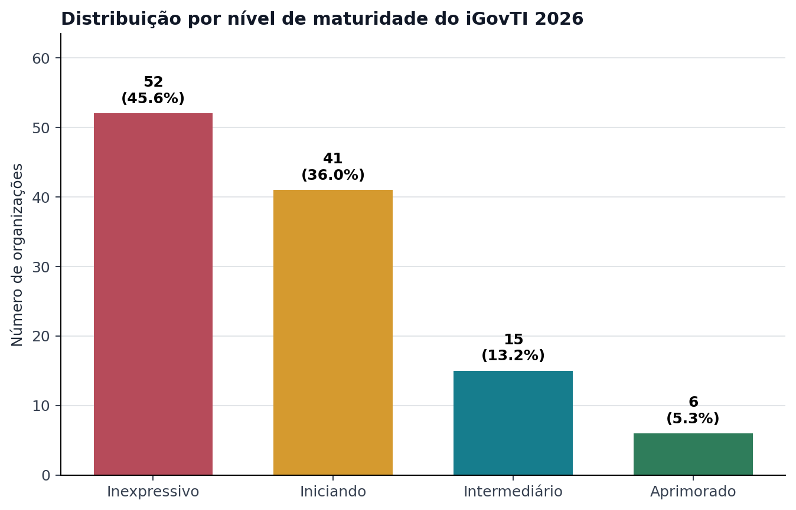
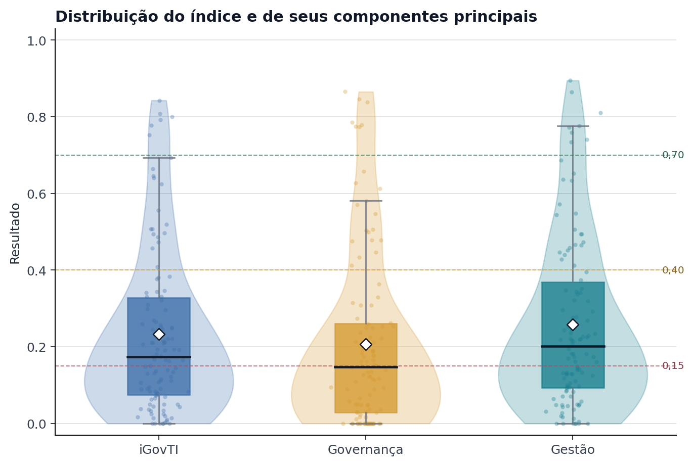
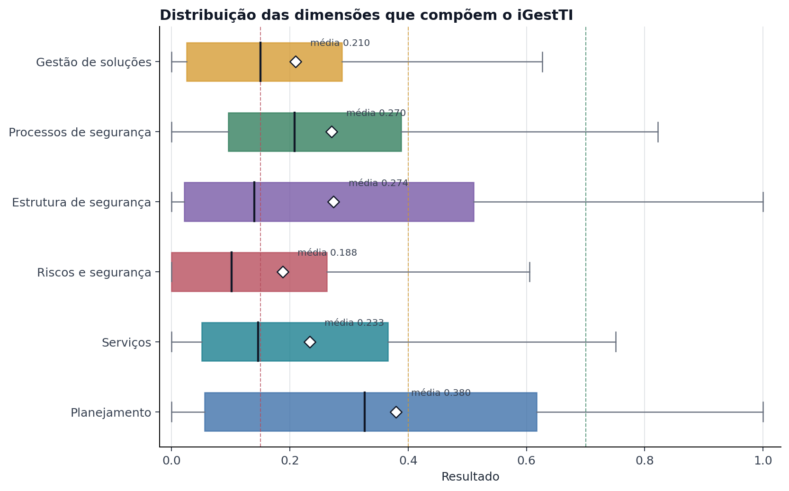

# 1. Introdução

Este relatório apresenta os resultados preliminares da organização **{{ auditado.sigla }}** relativos à Fiscalização TCE-RJ nº 18/2026, realizada pelo TCE-RJ entre fevereiro e julho de 2026 para avaliar o grau de adoção de práticas de governança e gestão de tecnologia da informação e comunicação pelas organizações jurisdicionadas.

O trabalho abrangeu órgãos e entidades de todos os poderes da Administração Pública Estadual e um conjunto de prefeituras municipais.



# 2. Ausência de resposta válida ao questionário

A organização **{{ auditado.sigla }}** integrou o universo da Fiscalização TCE-RJ nº 18/2026. Contudo, não foi identificada resposta válida ao questionário iGovTI 2026 nas bases processadas pela Equipe de Auditoria.

Em razão da ausência de informações declaradas e de documentação comprobatória, não foi possível calcular o índice individual, avaliar a consistência das práticas declaradas ou executar os procedimentos de auditoria individualizados previstos para as organizações respondentes.

Assim, este relatório registra a ausência de resposta válida e não contém achados decorrentes da avaliação de evidências. Na fase de comentários do gestor, a organização poderá utilizar seção própria do questionário eletrônico para apresentar esclarecimentos, comprovação de eventual resposta encaminhada ou justificativa para a ausência de resposta. Essa manifestação não corresponde à contestação de achados ou à reavaliação de evidências, pois não houve resposta válida e documentação comprobatória avaliadas para a organização.



# 2. iGovTI 2026



A avaliação das organizações jurisdicionadas baseia-se no método de autoavaliação de controles (*Control Self-Assessment* – CSA), operacionalizado mediante questionário eletrônico. A ferramenta permitiu aos gestores declarar o nível de adoção das práticas de tecnologia da informação avaliadas e encaminhar a documentação probatória correspondente. As evidências anexadas e as justificativas apresentadas foram submetidas à análise de consistência por esta Equipe de Auditoria, servindo de subsídio para eventuais ajustes na pontuação declarada e para a identificação de inconformidades ou achados de auditoria.

O questionário do iGovTI 2026 foi estruturado com o objetivo de diagnosticar aspectos essenciais de governança e gestão de TIC, abrangendo segurança da informação, gestão de riscos, continuidade de negócios, serviços de tecnologia, contratações de TIC, estrutura e força de trabalho, desenvolvimento de soluções, gestão de projetos e temas emergentes, a exemplo do uso de inteligência artificial. Para além do diagnóstico situacional de cada organização, o instrumento serve como referencial metodológico para futuras ações de melhoria de gestão.

O iGovTI 2026 constitui um índice composto, mensurado em uma escala de 0 a 1. A quantificação do índice inicia-se com a conversão das respostas categóricas declaradas em coeficientes numéricos, conforme os critérios de valoração estabelecidos na [@tbl:conversao_categorias].

: Critérios de valoração das respostas qualitativas do questionário iGovTI 2026 {#tbl:conversao_categorias#}

| Categoria de Resposta Declarada | Coeficiente Numérico |
|:--------------------------------------------------|:--------------------:|
| Não adota | 0,00 |
| Há decisão formal ou plano aprovado para adotá-lo | 0,05 |
| Adota em menor parte | 0,15 |
| Adota parcialmente | 0,50 |
| Adota em maior parte ou totalmente | 1,00 |

(Fonte: elaboração própria)

Nas questões que admitem itens de detalhamento, a pontuação da questão principal sofre deduções proporcionais à quantidade de itens não atendidos pela organização. Subsequentemente, os valores são consolidados por meio de agregação ponderada em uma estrutura hierárquica. O índice final é composto por dois blocos principais, conforme detalhado na [@fig:composicao_igovti_2026]: **Governança de TIC (peso de 47,8%)**, formado por 4 questões de agregação direta; **Gestão de TIC (iGestTI) (peso de 52,2%)**, estruturado em 6 dimensões operacionais que consolidam 20 questões principais ponderadas.

{#fig:composicao_igovti_2026#}

(Fonte: elaboração própria)

Com base na pontuação consolidada do iGovTI 2026, a organização é classificada em um de quatro níveis de maturidade, cujos intervalos de pontuação estão definidos na [@tbl:faixas_maturidade] e representados graficamente na parte inferior da [@fig:composicao_igovti_2026].

: Intervalos de pontuação para enquadramento nos níveis de maturidade {#tbl:faixas_maturidade#}

| Nível de Maturidade | Intervalo do Índice (iGovTI) |
|:--------------------------------------------------|:--------------------:|
| **Inexpressivo** | 0,00 ≤ iGovTI < 0,15 |
| **Iniciando** | 0,15 ≤ iGovTI < 0,40 |
| **Intermediário** | 0,40 ≤ iGovTI < 0,70 |
| **Aprimorado** | 0,70 ≤ iGovTI ≤ 1,00 |

(Fonte: elaboração própria)

## 2.1. Cenário Geral

A análise consolidada apresentada nesta seção fundamenta-se nos resultados calculados para as {{ universo_2026_n|int }} organizações com resposta válida e índice iGovTI 2026 calculado. A análise visa contextualizar o resultado individual da organização **{{ auditado.sigla }}**, identificar padrões de maturidade, assimetrias entre governança e gestão e capacidades desenvolvidas no conjunto avaliado.

A distribuição por nível de maturidade, apresentada na [@fig:distribuicao_maturidade_igovti_2026], evidencia concentração nos estágios iniciais. Das {{ universo_2026_n|int }} organizações, {{ maturidade_inexpressivo_n|int }} ({{ ('%0.1f' | format(maturidade_inexpressivo_pct|float)) | replace('.', ',') }}%) foram classificadas no nível **Inexpressivo** e {{ maturidade_iniciando_n|int }} ({{ ('%0.1f' | format(maturidade_iniciando_pct|float)) | replace('.', ',') }}%) no nível **Iniciando**. Assim, {{ igovti_abaixo_040_n|int }} organizações ({{ ('%0.1f' | format(igovti_abaixo_040_pct|float)) | replace('.', ',') }}%) obtiveram resultado inferior a 0,40. Somente {{ maturidade_intermediario_n|int }} organizações ({{ ('%0.1f' | format(maturidade_intermediario_pct|float)) | replace('.', ',') }}%) alcançaram o nível **Intermediário** e {{ maturidade_aprimorado_n|int }} ({{ ('%0.1f' | format(maturidade_aprimorado_pct|float)) | replace('.', ',') }}%) o nível **Aprimorado**.

{#fig:distribuicao_maturidade_igovti_2026#}

(Fonte: elaboração própria)

O iGovTI apresentou média de {{ ('%0.3f' | format(igovti_geral_media|float)) | replace('.', ',') }} e mediana de {{ ('%0.3f' | format(igovti_geral_mediana|float)) | replace('.', ',') }}. O primeiro quartil foi {{ ('%0.3f' | format(igovti_geral_q1|float)) | replace('.', ',') }} e o terceiro quartil, {{ ('%0.3f' | format(igovti_geral_q3|float)) | replace('.', ',') }}, o que evidencia a concentração de 50% das organizações avaliadas nesse intervalo, bem como a permanência de pelo menos 75% das entidades abaixo do nível Intermediário. A divergência positiva entre a média e a mediana, combinada com o valor máximo de {{ ('%0.3f' | format(igovti_geral_maximo|float)) | replace('.', ',') }} e com apenas {{ maturidade_aprimorado_n|int }} organizações no nível Aprimorado, caracteriza uma distribuição com assimetria à direita (positiva): um grupo reduzido de resultados elevados desloca a média para cima, sem alterar o quadro predominante de baixa maturidade. {{ igovti_geral_zeros_n|int }} organizações apresentaram valor igual a zero no índice calculado.

A distribuição contínua da [@fig:distribuicao_continua_igovti_2026] complementa a classificação por faixas e permite observar a concentração dos resultados, os limites de maturidade e a distância entre a mediana e os valores mais elevados.

{#fig:distribuicao_continua_igovti_2026#}

(Fonte: elaboração própria)

A posição específica da organização **{{ auditado.sigla }}** nessa distribuição pode ser observada na [@fig:comparativo_distribuicao_iGovTI]. Diferenças marginais de pontuação entre organizações adjacentes no ranking devem ser interpretadas com cautela analítica, visto que o modelo matemático de composição do índice não pressupõe estimativa de erro amostral e que os resultados estão sujeitos à qualidade e à fidedignidade declaratória do jurisdicionado.

## 2.2. Cenário atual - {{ auditado.sigla }}

Apresentado o panorama geral do universo fiscalizado, esta subseção detalha o desempenho específico da organização jurisdicionada. A organização **{{ auditado.sigla }}** obteve o **valor {{ ('%0.4f' | format(iGovTI|float)) | replace('.', ',') }} para o iGovTI 2026**, correspondente ao nível **{{ iGovTI_maturidade }}** de maturidade.

{#fig:comparativo_distribuicao_iGovTI#}

(Fonte: elaboração própria)

A [@fig:componentes_igovti] apresenta a composição do resultado da organização **{{ auditado.sigla }}** entre governança e gestão de TIC.

{#fig:componentes_igovti#}

(Fonte: elaboração própria)

: Resultado sintético do iGovTI 2026 da organização {{ auditado.sigla }} {#tbl:resultado_sintetico_igovti#}

| Componente | Peso no iGovTI 2026 | Valor |
|:--------------------------------------------------|------------------------------:|--------------------:|
| **Governança de TIC** | 0,4777 | {{ ('%0.4f' | format(GovernancaTI|float)) | replace('.', ',') }} |
| **Gestão de TIC** | 0,5223 | {{ ('%0.4f' | format(iGestTI|float)) | replace('.', ',') }} |
| **iGovTI 2026** | 1,0000 | {{ ('%0.4f' | format(iGovTI|float)) | replace('.', ',') }} |

(Fonte: elaboração própria)

### 2.2.1. Governança de TIC

A governança de TIC avalia a capacidade da alta administração de orientar, dirigir, monitorar e controlar o uso da tecnologia da informação, de modo alinhado aos objetivos institucionais, aos riscos relevantes e às necessidades das áreas finalísticas e administrativas.

No iGovTI 2026, a dimensão de governança consolida práticas relacionadas ao modelo de gestão de TIC, à atuação de comitês ou instâncias equivalentes, no monitoramento do desempenho, à participação da alta administração e ao alinhamento entre decisões de TIC, estratégia organizacional, orçamento, riscos e valor público.

A organização **{{ auditado.sigla }}** obteve o **valor {{ ('%0.4f' | format(GovernancaTI|float)) | replace('.', ',') }} no componente Governança de TIC**.

{#fig:comparativo_distribuicao_governancati#}

(Fonte: elaboração própria)

### 2.2.2. Gestão de TIC

A gestão de TIC avalia a capacidade da organização de planejar, executar, monitorar e aperfeiçoar processos, serviços, controles, recursos e contratações de tecnologia da informação, de forma compatível com suas necessidades institucionais.

No iGovTI 2026, o componente **Gestão de TIC (iGestTI)** consolida seis dimensões operacionais: planejamento de TIC, gestão de serviços de TIC, gestão de riscos de TI e segurança da informação, estrutura de segurança da informação, processos de segurança da informação e gestão de soluções de TIC.

A organização **{{ auditado.sigla }}** obteve o **valor {{ ('%0.4f' | format(iGestTI|float)) | replace('.', ',') }} no componente Gestão de TIC**.

{#fig:comparativo_distribuicao_igestti#}

(Fonte: elaboração própria)

## 2.3. Relação entre governança e gestão de TIC

Os indicadores descritivos da [@tbl:estatisticas_componentes_igovti] mostram que o componente de gestão apresentou resultados superiores aos de governança no conjunto avaliado. A média da Gestão de TIC foi {{ ('%0.3f' | format(igest_geral_media|float)) | replace('.', ',') }}, ante {{ ('%0.3f' | format(governanca_geral_media|float)) | replace('.', ',') }} para Governança de TIC; as medianas foram, respectivamente, {{ ('%0.3f' | format(igest_geral_mediana|float)) | replace('.', ',') }} e {{ ('%0.3f' | format(governanca_geral_mediana|float)) | replace('.', ',') }}. As duas médias situaram-se no nível Iniciando, enquanto a mediana de Governança de TIC permaneceu no limite superior do nível Inexpressivo e a mediana de Gestão de TIC, no nível Iniciando.

: Estatísticas descritivas do iGovTI 2026 e de seus componentes principais {#tbl:estatisticas_componentes_igovti#}

| Indicador | Média | 1º quartil | Mediana | 3º quartil | Organizações com valor >= 0,40 | Valor {{ auditado.sigla }} |
|---|---:|---:|---:|---:|---:|---:|
| **iGovTI** | {{ ('%0.3f' | format(igovti_geral_media|float)) | replace('.', ',') }} | {{ ('%0.3f' | format(igovti_geral_q1|float)) | replace('.', ',') }} | {{ ('%0.3f' | format(igovti_geral_mediana|float)) | replace('.', ',') }} | {{ ('%0.3f' | format(igovti_geral_q3|float)) | replace('.', ',') }} | {{ igovti_geral_a_partir_040_n|int }} ({{ ('%0.1f' | format(igovti_geral_a_partir_040_pct|float)) | replace('.', ',') }}%) | {{ ('%0.4f' | format((iGovTI|default(0))|float)) | replace('.', ',') }} |
| **Governança de TIC** | {{ ('%0.3f' | format(governanca_geral_media|float)) | replace('.', ',') }} | {{ ('%0.3f' | format(governanca_geral_q1|float)) | replace('.', ',') }} | {{ ('%0.3f' | format(governanca_geral_mediana|float)) | replace('.', ',') }} | {{ ('%0.3f' | format(governanca_geral_q3|float)) | replace('.', ',') }} | {{ governanca_geral_a_partir_040_n|int }} ({{ ('%0.1f' | format(governanca_geral_a_partir_040_pct|float)) | replace('.', ',') }}%) | {{ ('%0.4f' | format((GovernancaTI|default(0))|float)) | replace('.', ',') }} |
| **Gestão de TIC** | {{ ('%0.3f' | format(igest_geral_media|float)) | replace('.', ',') }} | {{ ('%0.3f' | format(igest_geral_q1|float)) | replace('.', ',') }} | {{ ('%0.3f' | format(igest_geral_mediana|float)) | replace('.', ',') }} | {{ ('%0.3f' | format(igest_geral_q3|float)) | replace('.', ',') }} | {{ igest_geral_a_partir_040_n|int }} ({{ ('%0.1f' | format(igest_geral_a_partir_040_pct|float)) | replace('.', ',') }}%) | {{ ('%0.4f' | format((iGestTI|default(0))|float)) | replace('.', ',') }} |

(Fonte: elaboração própria)

A [@fig:distribuicao_componentes_igovti_2026] permite comparar a dispersão dos três indicadores. O resultado em Gestão de TIC superou o de Governança de TIC em {{ gestao_maior_governanca_n|int }} organizações ({{ ('%0.1f' | format(gestao_maior_governanca_pct|float)) | replace('.', ',') }}%); o movimento inverso ocorreu em {{ governanca_maior_gestao_n|int }} ({{ ('%0.1f' | format(governanca_maior_gestao_pct|float)) | replace('.', ',') }}%); e houve igualdade em {{ governanca_gestao_iguais_n|int }} ({{ ('%0.1f' | format(governanca_gestao_iguais_pct|float)) | replace('.', ',') }}%). O padrão indica que, para a maior parte das organizações, as capacidades operacionais de gestão se situaram em patamar superior ao dos mecanismos de direção, monitoramento e controle exercidos pela alta administração. Essa diferença, contudo, não elimina a baixa maturidade da gestão: {{ igest_geral_abaixo_040_n|int }} organizações ({{ ('%0.1f' | format(igest_geral_abaixo_040_pct|float)) | replace('.', ',') }}%) também obtiveram resultado em Gestão de TIC inferior a 0,40.

{#fig:distribuicao_componentes_igovti_2026#}

(Fonte: elaboração própria)

A [@fig:governanca_vs_gestao_igovti_2026] mostra a posição simultânea das organizações nos dois componentes. Pontos abaixo da diagonal representam resultado de gestão superior ao de governança; pontos acima da diagonal representam a situação inversa.

{#fig:governanca_vs_gestao_igovti_2026#}

(Fonte: elaboração própria)






No caso da organização **{{ auditado.sigla }}**, tanto o componente de Governança de TIC quanto o de Gestão de TIC situam-se no nível **Inexpressivo** (valores abaixo de 0,1500). Esse cenário indica estágio inicial de estruturação institucional da tecnologia da informação. Nesse contexto, eventual diferença entre os componentes não configura assimetria operacional relevante, mas reforça a necessidade de implantação simultânea de mecanismos fundamentais de governança, direção, monitoramento e controle, bem como de processos operacionais básicos de gestão de TIC.


No caso da organização **{{ auditado.sigla }}**, os componentes de Governança de TIC e Gestão de TIC situam-se em patamar **Aprimorado**. Eventual diferença entre os componentes deve ser interpretada como variação relativa de perfil, e não como indicativo, por si só, de fragilidade estrutural. A leitura deve considerar os achados específicos, quando existentes, e as oportunidades pontuais de aperfeiçoamento identificadas nas dimensões avaliadas.


No caso da organização **{{ auditado.sigla }}**, os resultados de Governança de TIC e Gestão de TIC apresentaram valores próximos, sem indicar assimetria relevante entre os componentes principais. A análise deve considerar o nível de maturidade alcançado, a distribuição dos resultados nas dimensões avaliadas e as fragilidades específicas evidenciadas nos achados de auditoria.


No caso da organização **{{ auditado.sigla }}**, o resultado em Governança de TIC ficou abaixo do resultado em Gestão de TIC. Esse perfil indica oportunidade de fortalecer os mecanismos pelos quais a alta administração direciona, monitora e avalia a TIC, especialmente quanto à definição de responsabilidades, objetivos, indicadores, prioridades, riscos e acompanhamento de resultados. A leitura deve ser aprofundada à luz das evidências e dos achados relacionados à governança.


No caso da organização **{{ auditado.sigla }}**, o resultado em Gestão de TIC ficou abaixo do resultado em Governança de TIC. Esse perfil indica oportunidade de fortalecer a transformação das diretrizes de governança em processos, controles, serviços, capacidades operacionais e práticas de gestão de TIC. A leitura deve ser aprofundada à luz das evidências e dos achados correspondentes.


No caso da organização **{{ auditado.sigla }}**, Governança de TIC e Gestão de TIC apresentaram o mesmo valor. A igualdade dos componentes não implica, por si só, equilíbrio em nível adequado, razão pela qual a análise deve considerar o nível de maturidade alcançado e as fragilidades específicas evidenciadas em cada dimensão.

## 2.4. Dimensões da gestão de TIC

A decomposição da Gestão de TIC revela diferenças relevantes entre as seis dimensões avaliadas. Conforme a [@tbl:estatisticas_dimensoes_gestao], **{{ rotulos_dimensoes_gestao.get(dimensao_maior_media_nome, dimensao_maior_media_nome) }}** apresentou a maior média ({{ ('%0.3f' | format(dimensao_maior_media_valor|float)) | replace('.', ',') }}) e a maior mediana ({{ ('%0.3f' | format(dimensao_maior_mediana_valor|float)) | replace('.', ',') }})**{{ rotulos_dimensoes_gestao.get(dimensao_maior_media_nome, dimensao_maior_media_nome) }}** apresentou a maior média ({{ ('%0.3f' | format(dimensao_maior_media_valor|float)) | replace('.', ',') }}), enquanto **{{ rotulos_dimensoes_gestao.get(dimensao_maior_mediana_nome, dimensao_maior_mediana_nome) }}** apresentou a maior mediana ({{ ('%0.3f' | format(dimensao_maior_mediana_valor|float)) | replace('.', ',') }}). A dimensão com maior média também figurou como a de maior resultado em {{ dimensao_maior_media_maior_resultado_n|int }} organizações ({{ ('%0.1f' | format(dimensao_maior_media_maior_resultado_pct|float)) | replace('.', ',') }}%), considerados os empates. Esse padrão indica que algumas capacidades se encontram mais disseminadas do que outras no conjunto fiscalizado.

: Estatísticas descritivas das dimensões de Gestão de TIC {#tbl:estatisticas_dimensoes_gestao#}

| Dimensão | Média | Mediana | Resultados iguais a zero | Organizações com valor inferior a 0,40 | Valor {{ auditado.sigla }} |
|---|---:|---:|---:|---:|---:|
| **Planejamento de TIC** | {{ ('%0.3f' | format(planejamento_geral_media|float)) | replace('.', ',') }} | {{ ('%0.3f' | format(planejamento_geral_mediana|float)) | replace('.', ',') }} | {{ planejamento_geral_zeros_n|int }} ({{ ('%0.1f' | format(planejamento_geral_zeros_pct|float)) | replace('.', ',') }}%) | {{ planejamento_geral_abaixo_040_n|int }} ({{ ('%0.1f' | format(planejamento_geral_abaixo_040_pct|float)) | replace('.', ',') }}%) | {{ ('%0.4f' | format((PlanejamentoTI|default(0))|float)) | replace('.', ',') }} |
| **Gestão de Serviços de TIC** | {{ ('%0.3f' | format(servicos_geral_media|float)) | replace('.', ',') }} | {{ ('%0.3f' | format(servicos_geral_mediana|float)) | replace('.', ',') }} | {{ servicos_geral_zeros_n|int }} ({{ ('%0.1f' | format(servicos_geral_zeros_pct|float)) | replace('.', ',') }}%) | {{ servicos_geral_abaixo_040_n|int }} ({{ ('%0.1f' | format(servicos_geral_abaixo_040_pct|float)) | replace('.', ',') }}%) | {{ ('%0.4f' | format((ServicosTI|default(0))|float)) | replace('.', ',') }} |
| **Gestão de Riscos de TI e Segurança da Informação** | {{ ('%0.3f' | format(riscos_seguranca_geral_media|float)) | replace('.', ',') }} | {{ ('%0.3f' | format(riscos_seguranca_geral_mediana|float)) | replace('.', ',') }} | {{ riscos_seguranca_geral_zeros_n|int }} ({{ ('%0.1f' | format(riscos_seguranca_geral_zeros_pct|float)) | replace('.', ',') }}%) | {{ riscos_seguranca_geral_abaixo_040_n|int }} ({{ ('%0.1f' | format(riscos_seguranca_geral_abaixo_040_pct|float)) | replace('.', ',') }}%) | {{ ('%0.4f' | format((RiscosTISegInfo|default(0))|float)) | replace('.', ',') }} |
| **Estrutura de Segurança da Informação** | {{ ('%0.3f' | format(estrutura_seguranca_geral_media|float)) | replace('.', ',') }} | {{ ('%0.3f' | format(estrutura_seguranca_geral_mediana|float)) | replace('.', ',') }} | {{ estrutura_seguranca_geral_zeros_n|int }} ({{ ('%0.1f' | format(estrutura_seguranca_geral_zeros_pct|float)) | replace('.', ',') }}%) | {{ estrutura_seguranca_geral_abaixo_040_n|int }} ({{ ('%0.1f' | format(estrutura_seguranca_geral_abaixo_040_pct|float)) | replace('.', ',') }}%) | {{ ('%0.4f' | format((EstruturaSegInfo|default(0))|float)) | replace('.', ',') }} |
| **Processos de Segurança da Informação** | {{ ('%0.3f' | format(processos_seguranca_geral_media|float)) | replace('.', ',') }} | {{ ('%0.3f' | format(processos_seguranca_geral_mediana|float)) | replace('.', ',') }} | {{ processos_seguranca_geral_zeros_n|int }} ({{ ('%0.1f' | format(processos_seguranca_geral_zeros_pct|float)) | replace('.', ',') }}%) | {{ processos_seguranca_geral_abaixo_040_n|int }} ({{ ('%0.1f' | format(processos_seguranca_geral_abaixo_040_pct|float)) | replace('.', ',') }}%) | {{ ('%0.4f' | format((ProcessoSegInfo|default(0))|float)) | replace('.', ',') }} |
| **Gestão de Soluções de TIC** | {{ ('%0.3f' | format(gestao_solucoes_geral_media|float)) | replace('.', ',') }} | {{ ('%0.3f' | format(gestao_solucoes_geral_mediana|float)) | replace('.', ',') }} | {{ gestao_solucoes_geral_zeros_n|int }} ({{ ('%0.1f' | format(gestao_solucoes_geral_zeros_pct|float)) | replace('.', ',') }}%) | {{ gestao_solucoes_geral_abaixo_040_n|int }} ({{ ('%0.1f' | format(gestao_solucoes_geral_abaixo_040_pct|float)) | replace('.', ',') }}%) | {{ ('%0.4f' | format((GerirSoluçõesTI|default(0))|float)) | replace('.', ',') }} |

(Fonte: elaboração própria)

A distribuição completa das seis dimensões é apresentada na [@fig:distribuicao_dimensoes_gestao_2026], incluindo medianas, intervalos interquartis e médias.

{#fig:distribuicao_dimensoes_gestao_2026#}

(Fonte: elaboração própria)

A [@fig:maturidade_dimensoes_igovti_2026] explicita a composição de cada dimensão por nível de maturidade e permite verificar em quais capacidades se concentram as organizações nos estágios iniciais.

{#fig:maturidade_dimensoes_igovti_2026#}

(Fonte: elaboração própria)

As menores médias foram observadas em **{{ rotulos_dimensoes_gestao.get(dimensao_fragil_1_nome, dimensao_fragil_1_nome) }}** ({{ ('%0.3f' | format(dimensao_fragil_1_media|float)) | replace('.', ',') }}) e **{{ rotulos_dimensoes_gestao.get(dimensao_fragil_2_nome, dimensao_fragil_2_nome) }}** ({{ ('%0.3f' | format(dimensao_fragil_2_media|float)) | replace('.', ',') }}). A primeira registrou valor inferior a 0,40 em {{ dimensao_fragil_1_abaixo_040_n|int }} organizações ({{ ('%0.1f' | format(dimensao_fragil_1_abaixo_040_pct|float)) | replace('.', ',') }}%) e apareceu entre as dimensões de menor resultado de {{ dimensao_fragil_1_menor_resultado_n|int }} organizações ({{ ('%0.1f' | format(dimensao_fragil_1_menor_resultado_pct|float)) | replace('.', ',') }}%), considerados os empates. Para a segunda, esses quantitativos foram, respectivamente, {{ dimensao_fragil_2_abaixo_040_n|int }} ({{ ('%0.1f' | format(dimensao_fragil_2_abaixo_040_pct|float)) | replace('.', ',') }}%) e {{ dimensao_fragil_2_menor_resultado_n|int }} ({{ ('%0.1f' | format(dimensao_fragil_2_menor_resultado_pct|float)) | replace('.', ',') }}%). O quadro indica que a formalização do planejamento, quando existente, frequentemente não é acompanhada, na mesma intensidade, pelas demais capacidades operacionais e de segurança.

A dimensão Estrutura de Segurança da Informação apresentou média de {{ ('%0.3f' | format(estrutura_seguranca_geral_media|float)) | replace('.', ',') }} e mediana de {{ ('%0.3f' | format(estrutura_seguranca_geral_mediana|float)) | replace('.', ',') }}. Essa diferença, associada à ampla dispersão observada na [@fig:distribuicao_dimensoes_gestao_2026], evidencia heterogeneidade: um grupo de organizações possui estruturas de segurança mais consolidadas, enquanto parcela expressiva permanece próxima dos níveis inferiores. A dimensão Processos de Segurança da Informação mostrou mediana superior à de Estrutura de Segurança da Informação, mas {{ ('%0.1f' | format(processos_seguranca_geral_abaixo_040_pct|float)) | replace('.', ',') }}% das organizações ainda permaneceram abaixo de 0,40, o que recomenda examinar separadamente a existência da estrutura formal e a execução contínua dos processos de segurança.

## 2.5. Leitura integrada do resultado individual

A [@fig:perfil_dimensoes_gestao_auditado] apresenta o perfil da organização **{{ auditado.sigla }}** nas seis dimensões de gestão e o compara com as medianas observadas nas {{ universo_2026_n|int }} organizações com resposta válida e índice calculado. A comparação linear da [@fig:comparacao_dimensoes_gestao_auditado] permite identificar com maior precisão a distância entre o resultado individual e a mediana geral em cada dimensão.

{#fig:perfil_dimensoes_gestao_auditado#}{width=90%}

(Fonte: elaboração própria)

{#fig:comparacao_dimensoes_gestao_auditado#}

(Fonte: elaboração própria)




O resultado em Planejamento de TIC ({{ ('%0.4f' | format(planejamento_val))|replace('.', ',') }}) situa-se nos níveis iniciais de maturidade. Esse resultado indica oportunidade de priorizar a estruturação do planejamento de TIC, de modo a fortalecer a definição de diretrizes, prioridades, responsáveis, recursos, contratações e mecanismos de acompanhamento.


A [@fig:percentis_indicadores_auditado] compara a posição da organização **{{ auditado.sigla }}** com as demais organizações avaliadas em cada indicador. A letra "P" indica a posição relativa (percentil) no conjunto: **P50** representa posição próxima ao centro da distribuição; **P90** indica que a organização obteve resultado igual ou superior ao de aproximadamente 90% das organizações avaliadas; e **P20** indica que apenas cerca de 20% das organizações tiveram resultado igual ou inferior. Assim, quanto maior o valor de "P", melhor é a posição relativa da organização naquele indicador.

Essa comparação deve ser interpretada com cautela. A posição relativa não substitui o valor do índice, o nível de maturidade nem a análise de conformidade realizada nos achados de auditoria. Ela serve apenas para indicar se o resultado da organização ficou relativamente abaixo, próximo ou acima do conjunto avaliado.

{#fig:percentis_indicadores_auditado#}

(Fonte: elaboração própria)

A composição declarada da força de trabalho de TIC e de segurança da informação é apresentada na [@fig:forca_trabalho_auditado]. Os quantitativos não compõem o índice e não medem, isoladamente, suficiência de pessoal; sua avaliação depende do porte, da complexidade, da terceirização, dos serviços mantidos e dos riscos da organização.

{#fig:forca_trabalho_auditado#}

(Fonte: elaboração própria)


### 2.5.1. Evolução comparável entre 2023 e 2026

A análise longitudinal foi realizada exclusivamente para organizações com correspondência institucional validada nas bases de 2023 e 2026. Para reduzir os efeitos das alterações promovidas no questionário e na estrutura de cálculo, foram utilizados, em ambos os anos, índices ajustados formados por práticas e agregados comparáveis. Esses valores têm finalidade analítica e não substituem os resultados oficiais divulgados em cada ciclo.

No caso da organização **{{ auditado.sigla }}**, o iGovTI ajustado comparável passou de {{ ('%0.4f' | format(comparacao_igovti_2023|float)) | replace('.', ',') }}, em 2023, para {{ ('%0.4f' | format(comparacao_igovti_2026|float)) | replace('.', ',') }}, em 2026, com variação absoluta de {{ ('%+0.4f' | format(comparacao_delta_igovti|float)) | replace('.', ',') }}.



O resultado indica avanço no conjunto harmonizado de práticas avaliadas, embora a organização tenha permanecido no nível **{{ comparacao_nivel_2026 }}** de maturidade.

O resultado indica avanço no conjunto harmonizado de práticas avaliadas, acompanhado da passagem do nível **{{ comparacao_nivel_2023 }}** para o nível **{{ comparacao_nivel_2026 }}** de maturidade.



O resultado indica regressão no conjunto harmonizado de práticas avaliadas, embora a organização tenha permanecido no nível **{{ comparacao_nivel_2026 }}** de maturidade.

O resultado indica regressão no conjunto harmonizado de práticas avaliadas, acompanhada da passagem do nível **{{ comparacao_nivel_2023 }}** para o nível **{{ comparacao_nivel_2026 }}** de maturidade.


Não foi observada variação material no conjunto harmonizado de práticas avaliadas, e a organização permaneceu no nível **{{ comparacao_nivel_2026 }}**.


: Evolução dos componentes ajustados comparáveis da organização {{ auditado.sigla }} {#tbl:evolucao_componentes_comparaveis#}

| Indicador | 2023 | 2026 | Variação absoluta |
|---|---:|---:|---:|
| **iGovTI ajustado comparável** | {{ ('%0.4f' | format(comparacao_igovti_2023|float)) | replace('.', ',') }} | {{ ('%0.4f' | format(comparacao_igovti_2026|float)) | replace('.', ',') }} | {{ ('%+0.4f' | format(comparacao_delta_igovti|float)) | replace('.', ',') }} |
| **Governança de TIC** | {{ ('%0.4f' | format(comparacao_governanca_2023|float)) | replace('.', ',') }} | {{ ('%0.4f' | format(comparacao_governanca_2026|float)) | replace('.', ',') }} | {{ ('%+0.4f' | format(comparacao_delta_governanca|float)) | replace('.', ',') }} |
| **Gestão de TIC** | {{ ('%0.4f' | format(comparacao_igest_2023|float)) | replace('.', ',') }} | {{ ('%0.4f' | format(comparacao_igest_2026|float)) | replace('.', ',') }} | {{ ('%+0.4f' | format(comparacao_delta_igest|float)) | replace('.', ',') }} |

(Fonte: elaboração própria)


Os principais avanços foram observados em {{ comparacao_principais_avancos }}.


As principais regressões foram observadas em {{ comparacao_principais_regressoes }}.


A [@fig:evolucao_individual_igovti_comparavel] apresenta a trajetória dos três indicadores. A variação deve ser interpretada como mudança nas respostas às práticas harmonizadas, e não como comprovação isolada de melhora ou piora da efetividade da TIC. A leitura deve considerar eventuais alterações institucionais, a qualidade das informações declaradas e os achados de auditoria apresentados neste relatório.

{#fig:evolucao_individual_igovti_comparavel#}

(Fonte: elaboração própria)



A priorização de melhorias não deve buscar apenas a elevação numérica do índice. Recomenda-se concentrar esforços nas capacidades com menor resultado que, simultaneamente, estejam associadas a riscos relevantes, serviços críticos, obrigações normativas e necessidades institucionais da organização **{{ auditado.sigla }}**.

\newpage

# 3. Resultados da Auditoria

No âmbito desta fiscalização, foram definidas questões de auditoria para orientar a avaliação da governança e da gestão de TIC. Para fins deste relatório individual preliminar, os possíveis achados decorrem da verificação das Questões 1 a 6.

: Questões de auditoria com avaliação individual preliminar {#tbl:questoes_avaliadas_individualmente#}

| Questão | Tema | Síntese do objeto avaliado |
|---|---|---|
| **Q1** | Estrutura de TIC | Existência formal, atribuições e posicionamento organizacional da área, unidade, setor ou função responsável pela TIC. |
| **Q2** | Governança e comitê de TIC | Modelo de governança e gestão de TIC, objetivos, indicadores, metas e atuação do comitê ou instância equivalente. |
| **Q3** | Planejamento de TIC | Processo de planejamento, plano de TIC vigente, aprovação, alinhamento institucional, integração orçamentária e acompanhamento. |
| **Q4** | Capacidade institucional de TIC e segurança da informação | Força de trabalho, perfis, competências, funções, vínculos e capacidade interna para sustentar a TIC e a segurança da informação. |
| **Q5** | Gestão de serviços de TIC | Catálogo de serviços, níveis mínimos de serviço, inventário de ativos, gestão de configuração e tratamento de incidentes. |
| **Q6** | Contratações de TIC | Fluxo de contratação, papéis, modelos orientativos, aprovação técnica, alinhamento ao planejamento e equipe de planejamento. |

(Fonte: elaboração própria)












__Não foram identificados achados individuais preliminares relacionados à Questãoàs Questões {{ questao }} e {{ questao }}, {{ questao }} para esta organização__. Por essa razão, os achados apresentados a seguir preservam a numeração vinculada às questões de auditoria que lhes deram origem.


Os achados de auditoria decorrem da avaliação preliminar das respostas da organização **{{ auditado.sigla }}** ao questionário iGovTI 2026 e da correspondente análise de consistência documental realizada por esta Equipe de Auditoria. O trabalho consistiu no confronto sistemático entre as práticas de governança e gestão autodeclaradas pela organização e as evidências comprobatórias efetivamente encaminhadas, à luz da legislação aplicável e de padrões técnicos de referência internacional.

O presente relatório individual adota uma estrutura analítica de apresentação voltada a conferir clareza, rastreabilidade e utilidade diagnóstica às constatações. Desse modo, cada achado de auditoria está estruturado a partir dos seguintes elementos fundamentais:

* **Critérios**: as referências normativas, legais, regulamentares ou de boas práticas de gestão (como os objetivos do COBIT 2019 e normas da série ABNT NBR ISO/IEC) que estabelecem o padrão esperado de conformidade;
* **Evidências**: a relação das informações e dos documentos anexados pela organização que serviram de suporte factual para as constatações;
* **Situação Encontrada**: a descrição detalhada da realidade operacional e documental identificada no jurisdicionado, destacando-se as fragilidades e lacunas específicas em relação aos critérios adotados;
* **Conclusão da Equipe de Auditoria**: a análise técnica e o juízo profissional formulado a partir da correlação entre a situação factual e as regras de controle estabelecidas no mapa de verificação;
* **Propostas de Encaminhamento**: as recomendações preliminares propostas com o intuito de orientar a organização na correção de fragilidades e no aprimoramento de suas capacidades de governança e gestão de TIC.

Cumpre ressaltar o caráter preliminar das constatações ora apresentadas. A disponibilização deste relatório visa subsidiar a fase de comentários do gestor, permitindo à organização apresentar esclarecimentos adicionais, correções de fato ou novas informações que possam orientar a manifestação final desta Corte de Contas.













\newpage

# 4. Plano de ação

Para facilitar o atendimento das propostas constantes da Seção 3, a Equipe de Auditoria elaborou modelo preliminar de plano de ação contendo os encaminhamentos propostos à organização. O quadro não antecipa decisão final desta Corte de Contas e poderá ser revisto após a análise dos comentários do gestor.

Cumpre registrar que, em conformidade com o art. 4º, incisos I e II, da Deliberação TCE-RJ nº 346/2024, cabe à unidade jurisdicionada avaliar a conveniência e a oportunidade de implementar as recomendações. Ressalta-se, contudo, que a eventual decisão pela não aderência deve ser motivada: o gestor deve apresentar justificativa formal que demonstre, à luz das circunstâncias do caso concreto, as razões da decisão e, quando cabível, as medidas alternativas adotadas para tratar a situação que ensejou a recomendação.

: Plano de ação contendo os encaminhamentos preliminarmente propostos {#tbl:plano_acao#}

| Achado | Medida proposta | Avaliação de Viabilidade | Quem? | Quando? |
|---|---|---|---|---|

| **{{ item.achado_num }}** | {{ item.encaminhamento }} | | | |

(Fonte: elaboração própria)



Com base na avaliação preliminar das respostas e das evidências da organização **{{ auditado.sigla }}**, nos limites dos procedimentos executados e das evidências analisadas, não foram identificadas situações que ensejassem achado individual nas Questões 1 a 6.



\newpage

# Apêndice A. Comparabilidade com o ciclo anterior (iGovTI 2023 vs. iGovTI 2026)

A estrutura de 2026 preservou a escala de 0 a 1, as categorias de resposta e as quatro faixas de maturidade empregadas em 2023, mas alterou de forma relevante a composição dos agregados e seus pesos. As principais diferenças estão sintetizadas na [@tbl:diferencas_igovti_2023_2026].

: Principais diferenças entre as estruturas do iGovTI 2023 e do iGovTI 2026 {#tbl:diferencas_igovti_2023_2026#}

| Aspecto | iGovTI 2023 | iGovTI 2026 | Implicação analítica |
|---|---|---|---|
| **Composição do índice final** | Governança de TIC e Gestão de TIC com pesos iguais de 0,50. | Governança de TIC com peso 0,4777 e Gestão de TIC com peso 0,5223. | A gestão passou a ter participação ligeiramente superior no índice final. |
| **Governança de TIC** | Agregação hierárquica de ModeloTI, MonitorAvaliaTI e ResultadoTI. | Agregação direta de quatro práticas relativas ao modelo de gestão, monitoramento, auditoria interna e simplificação de serviços públicos. | O componente tornou-se mais direto e incorporou práticas com escopo distinto da estrutura anterior. |
| **Gestão de TIC** | Agregação de Planejamento de TIC, Pessoas e Processos de TIC; este último reunia serviços, níveis de serviço, riscos, segurança, software, projetos e contratos. | Agregação direta das seis dimensões de Gestão de TIC descritas neste relatório. | O índice passou a evidenciar separadamente seis capacidades operacionais e de segurança. |
| **Pessoas e contratações** | Pessoas e contratações de TIC integravam o cálculo da Gestão de TIC. | Não integram a árvore de cálculo do iGovTI 2026, embora continuem relevantes para o diagnóstico e para a auditoria. | Mudanças nessas matérias não explicam diretamente a variação do índice de 2026. |
| **Serviços, software e projetos** | Serviços e níveis de serviço eram agregados distintos; software e projetos integravam Processos de TIC. | Serviços foram consolidados na dimensão Gestão de Serviços de TIC; software e projetos foram reunidos na dimensão Gestão de Soluções de TIC. | A leitura deve considerar a nova delimitação conceitual dos componentes. |

(Fonte: elaboração própria)

Em razão dessas alterações, a diferença entre os valores nominais de 2023 e 2026 não deve ser interpretada automaticamente como evolução ou retrocesso institucional. Uma análise temporal válida exige a harmonização das questões e dos agregados comparáveis, além da consideração de mudanças de escopo, pesos, respondentes e qualidade das evidências.

Para viabilizar a análise longitudinal, foram elaboradas estruturas ajustadas comparáveis para 2023 e 2026, com a manutenção apenas das práticas passíveis de correspondência entre os instrumentos e a aplicação de uma estrutura comum de agregação. Após a normalização das siglas e a validação das correspondências institucionais, foram identificadas {{ comparacao_pareados_n|int }} organizações presentes nos dois ciclos, equivalentes a {{ ('%0.1f' | format(comparacao_cobertura_2026_pct|float)) | replace('.', ',') }}% das organizações com respostas completas em 2026. A comparação individual foi apresentada somente para esse conjunto pareado.

Os resultados ajustados comparáveis têm finalidade exclusivamente analítica. Eles não substituem os índices oficiais de cada ciclo, não eliminam integralmente os efeitos de alterações de respondentes ou de contexto institucional e não constituem, isoladamente, evidência de conformidade ou de inconformidade.



\newpage

# Apêndice B. Ajustes nas respostas declaradas

A Equipe de Auditoria, em busca da melhor representação do cenário atual de governança e gestão de TIC, ajustou resposta(s) declarada(s) pela organização **{{ auditado.sigla }}** ao questionário iGovTI 2026.

Para tanto, foram utilizadas as justificativas e evidências fornecidas pelo jurisdicionado quando do envio das respostas ao questionário. Ressalta-se que a verificação dessa documentação foi realizada nos termos dos procedimentos definidos para a fiscalização, de modo que nem todas as evidências encaminhadas foram, necessariamente, objeto de análise exaustiva pela Equipe de Auditoria.

Seguem as alterações realizadas após a avaliação das respostas e da amostra de evidências, bem como as justificativas apresentadas pela Equipe:

: Relação de respostas ajustadas pela Equipe após validação {#tbl:ajuste_respostas#}

| Questão | Resposta original | Resposta ajustada | Justificativa |
|---|---|---|---|

| **{{ ajuste.codigo_questao }}** | {{ ajuste.de }} | {{ ajuste.para }} | {{ ajuste.justificativa }} |

(Fonte: elaboração própria)




