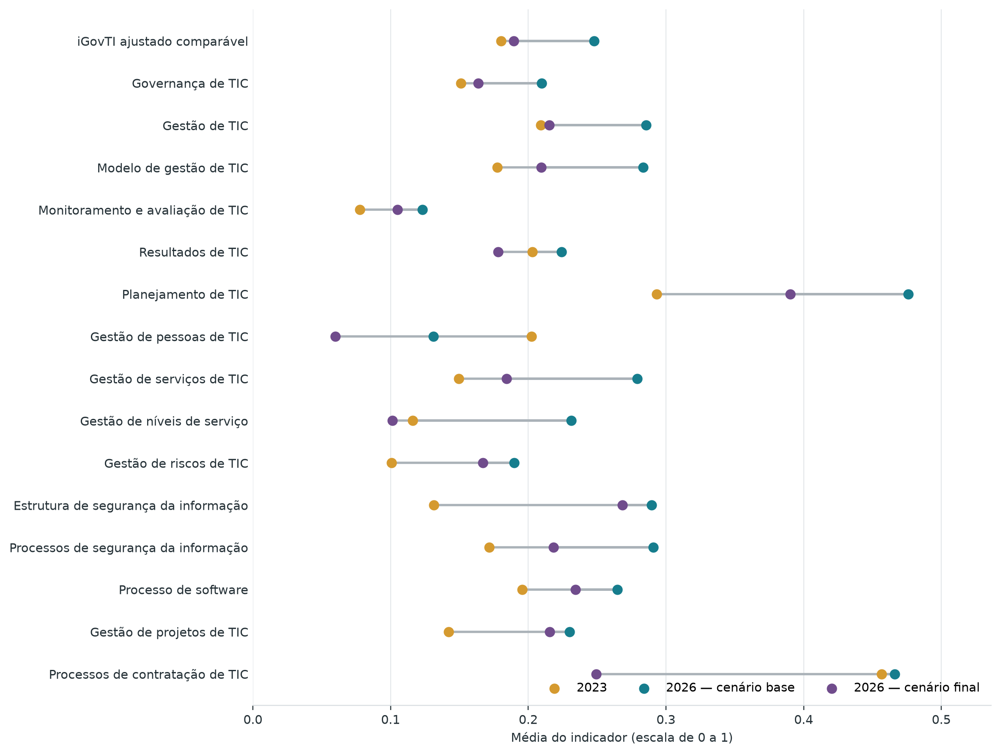
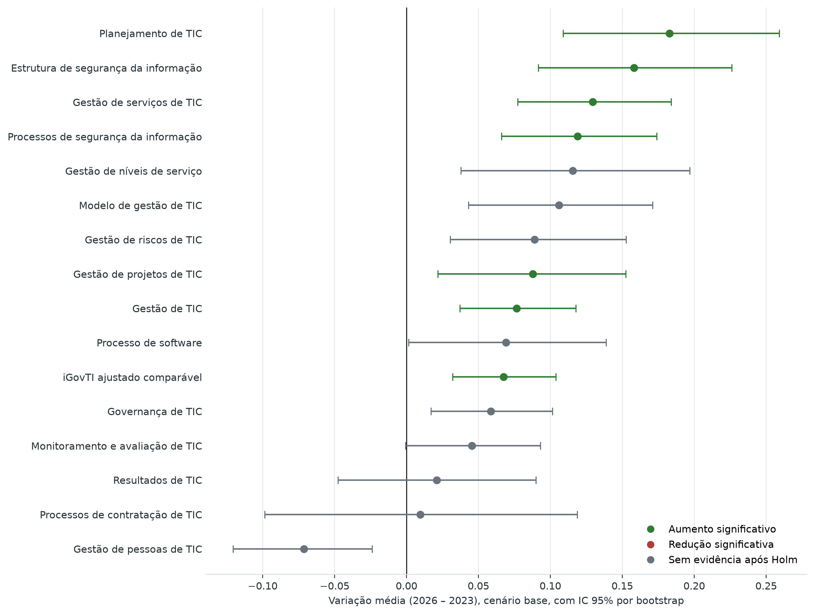
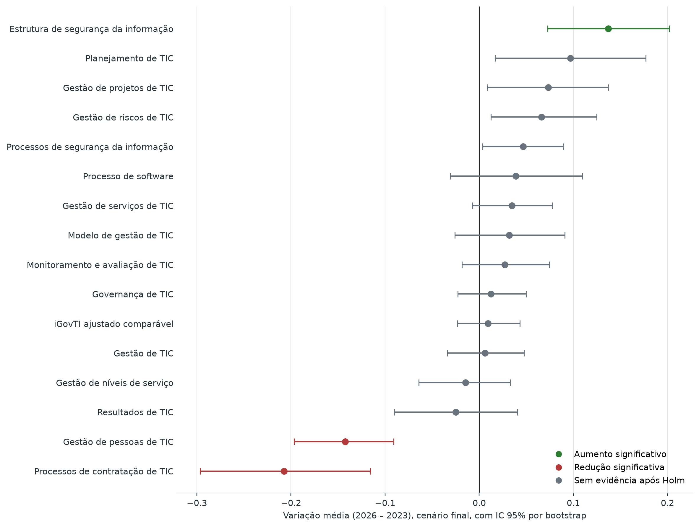
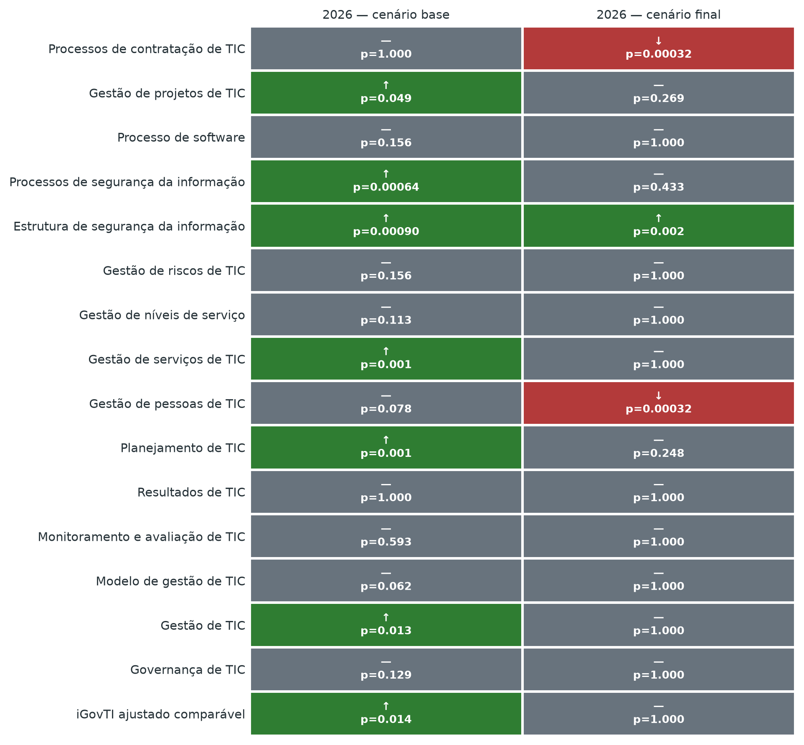

\newpage

# 1. Objetivo

Este anexo examina se os resultados das organizações presentes nas avaliações de 2023 e 2026 permitem afirmar que houve mudança estatisticamente significativa no iGovTI ajustado comparável e em seus componentes.

A análise considera dois cenários de 2026. O **cenário base** utiliza as respostas autodeclaradas após ajustes iniciais de saneamento e solicitações de retificação por parte dos gestores. O **cenário final** incorpora os ajustes decorrentes da avaliação das evidências e dos comentários dos gestores. A apresentação conjunta é necessária porque os ciclos de 2023 e 2026 tiveram níveis de asseguração distintos.

Em 2026, foram solicitadas evidências para todas as práticas passíveis de comprovação e essas evidências foram avaliadas de forma abrangente. Em 2023, embora o questionário também contivesse campos de evidência e a equipe tenha realizado análises críticas, a exigência de anexos e o exame direto concentraram-se em subconjunto menor de práticas. A comparação exclusiva com o cenário final de 2026 pode, portanto, produzir um viés negativo nas pontuações de 2026 em relação a 2023, por combinar eventual mudança das práticas com o efeito de verificação mais rigorosa.

O cenário base reduz essa assimetria, mas está sujeito ao viés oposto: práticas declaradas podem não estar suficientemente comprovadas. Por esse motivo, os dois cenários são tratados como análise de sensibilidade. Nenhum deles, isoladamente, constitui estimativa isenta de limitações.

# 2. Base analisada e diferença de asseguração

## 2.1. Amostra pareada

A unidade de análise foi a organização com resultado comparável nos dois anos. Dos 78 registros de 2023, 68 puderam ser associados a uma organização avaliada em 2026. A amostra compreende 64 organizações estaduais e quatro municípios. Sessenta e um pares foram formados por identificador normalizado e sete por correspondências institucionais previamente validadas.

Não foram incluídas dez organizações avaliadas em 2023 sem correspondência em 2026 nem 45 organizações de 2026 sem histórico em 2023.

: Síntese da base longitudinal {#tbl:longitudinal_base#}

| Elemento | Resultado |
|---|---:|
| Organizações pareadas | 68 |
| Organizações estaduais | 64 |
| Municípios | 4 |
| Pareamentos por identificador normalizado | 61 |
| Pareamentos por correspondência institucional validada | 7 |
| Organizações de 2023 sem par em 2026 | 10 |
| Organizações de 2026 sem histórico em 2023 | 45 |
| Indicadores submetidos a teste em cada cenário | 16 |

(Fonte: elaboração própria)

Foram testados o iGovTI, os agregados Governança de TIC e Gestão de TIC e 13 componentes: modelo de gestão; monitoramento e avaliação; resultados; planejamento; pessoas; serviços; níveis de serviço; riscos; estrutura de segurança da informação; processos de segurança da informação; processo de software; projetos; e processos de contratação de TIC.

## 2.2. Cenários de 2026

O questionário de 2026 contém solicitação de evidência em 43 das 48 questões-raiz. As cinco restantes correspondem principalmente a informações quantitativas, de perfil ou de contexto, e não a práticas convencionais de adoção. Assim, todas as práticas avaliativas passíveis de comprovação documental foram alcançadas pela solicitação de evidências.[^cobertura_evidencias_2026]

No trabalho de 2023, foram identificados controles de envio de anexos em 13 questões do questionário do SETIC e em 15 questões do questionário municipal. Outros campos permitiam registrar informações ou justificativas, e houve análise crítica pela equipe, mas o procedimento não teve a mesma abrangência documental aplicada em 2026. Os estudos preliminares do trabalho atual também registram que, em 2023, as notas ajustadas decorreram da análise das evidências e de subconjunto de práticas examinadas diretamente.[^cobertura_evidencias_2023]

[^cobertura_evidencias_2026]: Contagem realizada no questionário da fiscalização corrente.

[^cobertura_evidencias_2023]: Contagem dos campos de solicitação de evidência dos questionários do SETIC e dos municípios.

: Diferenças entre os cenários considerados {#tbl:longitudinal_cenarios#}

| Referência | Tratamento das respostas | Principal vantagem | Principal limitação |
|---|---|---|---|
| **2023 ajustado comparável** | Resultado harmonizado para a estrutura comum de itens, com o nível de análise documental realizado no ciclo de 2023 | Preserva a referência histórica disponível | Não recebeu asseguração documental com a mesma abrangência de 2026 |
| **2026 — Cenário base** | Respostas autodeclaradas com ajustes de pedidos de retificação do gestor, correção de erros e saneamento do survey | Aproxima o nível autodeclaratório predominante na referência de 2023 | Pode superestimar práticas declaradas, mas não comprovadas |
| **2026 — Cenário final** | Respostas após avaliação das evidências e apreciação dos comentários dos gestores | Representa o resultado com maior asseguração documental | Pode apresentar viés negativo na comparação com 2023, devido à assimetria de verificação |

(Fonte: elaboração própria)

# 3. Método estatístico

## 3.1. Teste principal

Para cada indicador e cenário, calculou-se a diferença entre a pontuação de 2026 e a de 2023 para a mesma organização. Valores positivos representam avanço; valores negativos, regressão; e valores iguais a zero, estabilidade.

O teste principal foi o Wilcoxon dos postos sinalizados para amostras pareadas, bilateral. O teste avalia se a distribuição das diferenças pareadas é simétrica em torno de zero e não exige normalidade das diferenças.[^wilcoxon_scipy] A escolha considerou a escala limitada entre zero e um e a presença de empates e diferenças nulas[^dif_nula].

[^dif_nula]: As diferenças nulas foram tratadas pelo método de Pratt: os zeros participam do ranqueamento, mas seus postos não integram as somas positiva ou negativa.[^pratt_zeros]

Como 16 hipóteses (16 variáveis diferentes, como iGovTI, iGestTI etc) foram testadas em cada cenário, os p-valores foram ajustados separadamente pelo método sequencial de Holm, que controla a probabilidade de ao menos uma rejeição indevida no conjunto de testes.[^holm_multiplos] Adotou-se nível de significância de 5% após o ajuste.

[^wilcoxon_scipy]: SCIPY. *wilcoxon — SciPy Manual*. Disponível em: <https://docs.scipy.org/doc/scipy/reference/generated/scipy.stats.wilcoxon.html>. Acesso em: 11 ago. 2026.

[^pratt_zeros]: PRATT, John W. Remarks on zeros and ties in the Wilcoxon signed rank procedures. *Journal of the American Statistical Association*, v. 54, n. 287, p. 655–667, 1959. Disponível em: <https://doi.org/10.1080/01621459.1959.10501526>. Acesso em: 11 ago. 2026.

[^holm_multiplos]: HOLM, Sture. A simple sequentially rejective multiple test procedure. *Scandinavian Journal of Statistics*, v. 6, p. 65–70, 1979. Disponível em: <https://doi.org/10.2307/4615733>. Acesso em: 11 ago. 2026.

## 3.2. Estimativas complementares

Para qualificar a relevância dos resultados, foram calculados: a diferença média e diferença mediana entre 2026 e 2023; o intervalo de 95% por *bootstrap* pareado[^explica_bootstrap], com 50.000 reamostragens, para a diferença média; as quantidades de organizações com avanço, regressão e estabilidade; a correlação bisserial de postos, calculada sobre as diferenças não nulas; e o teste t pareado e tamanho de efeito de Cohen (*d*~z~), como análise de sensibilidade.[^ttest_scipy]

[^explica_bootstrap]: Método computacional que utiliza repetidas seleções, com reposição, dos pares de organizações observados para verificar quanto a diferença média pode variar. Neste anexo, o procedimento foi repetido 50.000 vezes, produzindo uma faixa de valores plausíveis para a variação média. O método não cria novas evidências nem elimina limitações decorrentes do tamanho ou da composição da amostra.

[^ttest_scipy]: SCIPY. *ttest_rel — SciPy Manual*. Disponível em: <https://docs.scipy.org/doc/scipy/reference/generated/scipy.stats.ttest_rel.html>. Acesso em: 11 ago. 2026.

No cenário final, o teste t identificou o mesmo conjunto de três componentes significativos do teste principal. No cenário base, houve divergências em resultados próximos ao limiar: o teste t incluiu Modelo de gestão de TIC e Gestão de pessoas de TIC, mas não Gestão de projetos de TIC. O iGovTI global e os demais resultados centrais do cenário base permaneceram significativos nos dois métodos. A divergência reforça a necessidade de cautela com componentes limítrofes e preserva o Wilcoxon como critério principal previamente definido.

## 3.3. Regra de interpretação

Um componente foi classificado como aumento estatisticamente significativo quando o p-valor do Wilcoxon ajustado por Holm foi inferior a 0,05 e a diferença média foi positiva. A classificação redução estatisticamente significativa exigiu o mesmo critério, com diferença média negativa. Nos demais casos, adotou-se a expressão sem evidência estatística de mudança.

A ausência de significância não demonstra igualdade entre os anos. Indica apenas que os dados não fornecem evidência suficiente de mudança segundo o método e o nível de significância adotados.

# 4. Resultados

## 4.1. Sensibilidade do iGovTI global ao cenário de 2026

O cenário escolhido altera a conclusão sobre o iGovTI global. No cenário base[^definicao_cenario_base] de 2026, a média passou de 0,1801 para 0,2477, aumento de 0,0676 ponto. Quarenta e três organizações avançaram e 25 regrediram. O aumento foi significativo após a correção de Holm (*p* ajustado = 0,01408), com intervalo de 95% da variação média integralmente positivo, de 0,0322 a 0,1037.

[^definicao_cenario_base]: Cenário em que as respostas coletadas do questionário do iGovTI 2026 foram ajustadas a pedidos de retificação do gestor, para correção de erros e saneamento do survey.

No cenário final[^definicao_cenario_final] de 2026, a média foi 0,1895, apenas 0,0094 ponto acima da referência de 2023. Houve 32 avanços e 36 regressões. O teste não indicou mudança do conjunto (*p* ajustado = 1,0000), e o intervalo de 95% compreendeu valores negativos e positivos, de -0,0231 a 0,0431.

[^definicao_cenario_final]: Cenário em que as respostas coletadas do questionário do iGovTI 2026 foram ajustadas após avaliação das evidências e apreciação dos comentários dos gestores.

: Resultado longitudinal do iGovTI nos dois cenários de 2026 {#tbl:longitudinal_igovti_cenarios#}

| Cenário de 2026 | Média 2023 | Média 2026 | Variação média | Variação mediana | IC 95% da variação média | Avanço | Regressão | *p* ajustado | Conclusão |
|---|---:|---:|---:|---:|---:|---:|---:|---:|---|
| Base | 0,180 | 0,248 | +0,068 | +0,045 | +0,032 a +0,104 | 43 | 25 | 0,01408 | Aumento significativo |
| Final | 0,180 | 0,189 | +0,009 | -0,004 | -0,023 a +0,043 | 32 | 36 | 1,000 | Sem evidência de mudança |

(Fonte: elaboração própria)

Entre o cenário base e o cenário final de 2026, a média do iGovTI diminui 0,0582 ponto entre as 68 organizações pareadas. Essa diferença quantifica o efeito líquido dos ajustes posteriores à autodeclaração, inclusive as revisões acolhidas após os comentários dos gestores. Ela não deve ser interpretada automaticamente como erro do auditado: a redução pode decorrer de evidência ausente, insuficiente, incompatível ou incapaz de assegurar o nível de adoção declarado.

Assim, a formulação mais precisa é: **as respostas autodeclaradas indicam evolução do iGovTI global, mas essa evolução não permanece estatisticamente demonstrada após a avaliação abrangente das evidências**.

A [@fig:longitudinal_medias_cenarios] apresenta as médias de 2023 e dos dois cenários de 2026. A distância entre os pontos do cenário base e do cenário final evidencia quais componentes foram mais afetados pelo maior nível de asseguração.

{#fig:longitudinal_medias_cenarios#}

(Fonte: elaboração própria)

## 4.2. Cenário base de 2026

No cenário base, sete dos 16 indicadores apresentaram aumento estatisticamente significativo. Além do iGovTI global, houve aumento em Gestão de TIC, Planejamento de TIC, Gestão de serviços de TIC, Estrutura de segurança da informação, Processos de segurança da informação e Gestão de projetos de TIC.

: Indicadores com aumento significativo no cenário base {#tbl:longitudinal_significativos_base#}

| Indicador | Média 2023 | Média 2026 | Variação média | IC 95% | Avanço | Regressão | Estável | *p* ajustado | Correlação bisserial de postos |
|---|---:|---:|---:|---:|---:|---:|---:|---:|---:|
| iGovTI ajustado comparável | 0,180 | 0,248 | +0,068 | +0,032 a +0,104 | 43 | 25 | 0 | 0,01408 | +0,445 |
| Gestão de TIC | 0,209 | 0,286 | +0,077 | +0,037 a +0,118 | 43 | 25 | 0 | 0,01296 | +0,451 |
| Planejamento de TIC | 0,293 | 0,476 | +0,183 | +0,109 a +0,259 | 43 | 18 | 7 | 0,00140 | +0,610 |
| Gestão de serviços de TIC | 0,150 | 0,279 | +0,129 | +0,077 a +0,184 | 45 | 20 | 3 | 0,00140 | +0,560 |
| Estrutura de segurança da informação | 0,131 | 0,289 | +0,158 | +0,092 a +0,226 | 43 | 19 | 6 | 0,00090 | +0,584 |
| Processos de segurança da informação | 0,172 | 0,291 | +0,119 | +0,066 a +0,174 | 46 | 20 | 2 | 0,00064 | +0,565 |
| Gestão de projetos de TIC | 0,142 | 0,230 | +0,088 | +0,022 a +0,153 | 34 | 15 | 19 | 0,04880 | +0,443 |

(Fonte: elaboração própria)

Os aumentos do cenário base representam evolução das práticas declaradas. A evidência estatística demonstra consistência do movimento autodeclarado na amostra, mas não assegura que as práticas tenham sido implementadas no nível informado por cada organização.

A [@fig:longitudinal_variacoes_base] apresenta as variações e os intervalos do cenário base.

{#fig:longitudinal_variacoes_base#}

(Fonte: elaboração própria)

## 4.3. Cenário final de 2026

No cenário final, três componentes apresentaram mudança significativa. Houve aumento em Estrutura de segurança da informação e reduções em Gestão de pessoas de TIC e Processos de contratação de TIC. O iGovTI global e os outros 12 componentes não apresentaram evidência estatística de mudança.

: Componentes com mudança significativa no cenário final {#tbl:longitudinal_significativos_final#}

| Componente | Média 2023 | Média 2026 | Variação média | IC 95% | Avanço | Regressão | Estável | *p* ajustado | Correlação bisserial de postos |
|---|---:|---:|---:|---:|---:|---:|---:|---:|---:|
| Estrutura de segurança da informação | 0,131 | 0,268 | +0,137 | +0,073 a +0,202 | 43 | 19 | 6 | 0,00168 | +0,557 |
| Gestão de pessoas de TIC | 0,202 | 0,060 | -0,142 | -0,197 a -0,091 | 13 | 51 | 4 | 0,00032 | -0,739 |
| Processos de contratação de TIC | 0,457 | 0,249 | -0,207 | -0,296 a -0,116 | 17 | 48 | 3 | 0,00032 | -0,605 |

(Fonte: elaboração própria)

A redução média entre os cenários base e final foi de 0,0711 ponto em Gestão de pessoas de TIC e de 0,2170 ponto em Processos de contratação de TIC. No cenário base, nenhum desses componentes apresentava redução significativa. Consequentemente, não é possível atribuir as reduções do cenário final exclusivamente à deterioração das práticas. Elas são inseparáveis, nesta comparação, do efeito da avaliação documental mais abrangente aplicada em 2026.

A [@fig:longitudinal_variacoes_final] apresenta as variações e os intervalos do cenário final.

{#fig:longitudinal_variacoes_final#}

(Fonte: elaboração própria)

## 4.4. Comparação das conclusões

Apenas um resultado foi significativo e manteve a mesma direção nos dois cenários: o aumento em Estrutura de segurança da informação. Esse é o resultado longitudinal mais robusto da análise, pois aparece tanto na autodeclaração saneada quanto no cenário de maior asseguração.

O aumento do iGovTI global e os aumentos em Gestão de TIC, Planejamento de TIC, Gestão de serviços de TIC, Processos de segurança da informação e Gestão de projetos de TIC aparecem apenas no cenário base. As reduções em Gestão de pessoas de TIC e Processos de contratação de TIC aparecem apenas no cenário final.

Os demais sete indicadores não apresentaram evidência de mudança em nenhum dos cenários: Governança de TIC, Modelo de gestão de TIC, Monitoramento e avaliação de TIC, Resultados de TIC, Gestão de níveis de serviço, Gestão de riscos de TIC e Processo de software.

: Conclusões dos testes nos dois cenários de 2026 {#tbl:longitudinal_comparacao_conclusoes#}

| Indicador | *p* ajustado — base | Conclusão — base | *p* ajustado — final | Conclusão — final |
|---|---:|---|---:|---|
| iGovTI ajustado comparável | 0,014 | Aumento | 1,000 | Sem evidência de mudança |
| Governança de TIC | 0,129 | Sem evidência de mudança | 1,000 | Sem evidência de mudança |
| Gestão de TIC | 0,013 | Aumento | 1,000 | Sem evidência de mudança |
| Modelo de gestão de TIC | 0,062 | Sem evidência de mudança | 1,000 | Sem evidência de mudança |
| Monitoramento e avaliação de TIC | 0,593 | Sem evidência de mudança | 1,000 | Sem evidência de mudança |
| Resultados de TIC | 1,000 | Sem evidência de mudança | 1,000 | Sem evidência de mudança |
| Planejamento de TIC | 0,001 | Aumento | 0,248 | Sem evidência de mudança |
| Gestão de pessoas de TIC | 0,078 | Sem evidência de mudança | 0,00032 | Redução |
| Gestão de serviços de TIC | 0,001 | Aumento | 1,000 | Sem evidência de mudança |
| Gestão de níveis de serviço | 0,113 | Sem evidência de mudança | 1,000 | Sem evidência de mudança |
| Gestão de riscos de TIC | 0,156 | Sem evidência de mudança | 1,000 | Sem evidência de mudança |
| Estrutura de segurança da informação | 0,00090 | Aumento | 0,00168 | Aumento |
| Processos de segurança da informação | 0,00064 | Aumento | 0,433 | Sem evidência de mudança |
| Processo de software | 0,156 | Sem evidência de mudança | 1,000 | Sem evidência de mudança |
| Gestão de projetos de TIC | 0,049 | Aumento | 0,269 | Sem evidência de mudança |
| Processos de contratação de TIC | 1,000 | Sem evidência de mudança | 0,00032 | Redução |

(Fonte: elaboração própria)

A [@fig:longitudinal_conclusoes_cenarios] sintetiza essas conclusões. As células cinzas não significam igualdade; indicam ausência de evidência suficiente segundo o critério adotado.

{#fig:longitudinal_conclusoes_cenarios#}

(Fonte: elaboração própria)

## 4.5. Leitura preliminar por esfera

Como a amostra pareada reúne 64 organizações estaduais e apenas quatro municípios, a separação por esfera tem caráter descritivo. Ela permite identificar onde se concentram os movimentos observados, mas não fundamenta conclusão geral sobre o conjunto dos municípios fluminenses.

: Variação do iGovTI comparável por esfera e cenário {#tbl:longitudinal_por_esfera#}

| Cenário de 2026 | Esfera | Organizações | Média 2023 | Média 2026 | Variação média | Avanço | Regressão |
|---|---|---:|---:|---:|---:|---:|---:|
| Base | Estaduais | 64 | 0,185 | 0,255 | +0,070 | 41 | 23 |
| Base | Municípios | 4 | 0,095 | 0,131 | +0,035 | 2 | 2 |
| Final | Estaduais | 64 | 0,185 | 0,194 | +0,009 | 30 | 34 |
| Final | Municípios | 4 | 0,095 | 0,111 | +0,016 | 2 | 2 |

(Fonte: elaboração própria)

No cenário base, a elevação do iGovTI não ficou restrita, em termos de média, às organizações estaduais: a média dos quatro municípios também aumentou. Entretanto, dois municípios avançaram e dois regrediram, enquanto 41 das 64 organizações estaduais avançaram. O aumento verificado no conjunto decorre, portanto, predominantemente das organizações estaduais e não caracteriza melhora municipal disseminada.

A abertura por componentes reforça essa leitura. No cenário base, as organizações estaduais apresentaram aumento médio em todos os componentes cuja melhora foi identificada na análise principal. Entre os quatro municípios, houve resultados mistos: as médias diminuíram em Gestão de TIC, Planejamento, Gestão de serviços e Gestão de projetos; ficaram praticamente estáveis em Estrutura de segurança da informação; e aumentaram em Processos de segurança da informação, embora com dois avanços e duas regressões.

No cenário final, as duas esferas apresentaram pequena elevação da média do iGovTI, mas o número de organizações com avanço não superou o de organizações com regressão em nenhuma delas. A melhora de Estrutura de segurança da informação, único resultado positivo confirmado nos dois cenários para o conjunto das 68 organizações, também se concentrou nas estaduais: nesse componente, 41 estaduais avançaram e 17 regrediram, enquanto, entre os municípios, houve dois avanços e duas regressões e variação média próxima de zero.

Em síntese, a análise preliminar indica que os avanços do conjunto foram principalmente estaduais. Os quatro municípios apresentaram trajetórias divididas, insuficientes para afirmar melhora ou piora geral desse grupo.

# 5. Limitações e cautelas de interpretação

Os resultados devem ser interpretados com as seguintes ressalvas:

* **Assimetria de asseguração:** a avaliação documental de 2026 alcançou todas as práticas passíveis de comprovação e foi mais abrangente que a realizada em 2023. O cenário final pode, por isso, apresentar viés negativo na comparação longitudinal.
* **Viés autodeclaratório:** o cenário base mitiga a assimetria de asseguração, mas pode conter viés positivo quando a prática declarada não está suficientemente implementada ou comprovada.
* **Análise por cenários, não intervalo estatístico:** os cenários base e final não constituem limites probabilísticos de um intervalo de confiança. Eles representam duas formas substantivamente distintas de mensurar 2026.
* **Amostra pareada:** a análise descreve as 68 organizações presentes nos dois anos. Ela não representa as dez organizações de 2023 sem par, as 45 organizações de 2026 sem histórico nem, necessariamente, todo o universo jurisdicionado. A presença de apenas quatro municípios limita a análise por esfera à descrição dos casos observados e impede sua generalização para os demais municípios.
* **Ausência de amostragem probabilística:** as organizações não constituem amostra aleatória. Os testes medem a consistência das diferenças na amostra sob a hipótese nula e não fundamentam extrapolação irrestrita a outras organizações.
* **Comparabilidade de mensuração:** o cálculo ajustado comparável reduz diferenças de estrutura entre os questionários, mas não assegura identidade completa de redação, contexto, respondente, documentação disponível ou processo de coleta.
* **Ausência de inferência causal:** o desenho com duas observações temporais não isola efeitos de mudanças normativas, reorganizações administrativas, alterações do instrumento, disponibilidade de evidências ou outras condições externas. Os resultados demonstram associação temporal, não causalidade.
* **Significância e materialidade:** um resultado significativo pode ter importância prática distinta conforme o componente. Um resultado não significativo pode conter variações relevantes em organizações específicas. A leitura deve combinar p-valores, magnitude, intervalos e distribuição dos pares.
* **Sensibilidade ao método:** algumas conclusões do cenário base próximas ao limiar variaram entre Wilcoxon e teste t. Essas diferenças não alteraram a conclusão do iGovTI global, mas desaconselham interpretação categórica de componentes limítrofes.
* **Permutações e bootstrap:** os p-valores por permutação e os intervalos por bootstrap são estimativas numéricas. A semente fixa torna a execução reproduzível.

Em razão dessas limitações, as expressões “aumento” e “redução” estatisticamente significativos referem-se ao comportamento das pontuações comparáveis na amostra e no cenário indicado. Elas não devem ser convertidas, sem análise adicional, em afirmação causal de melhora ou deterioração das práticas de todas as organizações.

# 6. Conclusão

A resposta à questão sobre evolução do iGovTI depende do cenário de 2026 utilizado.

No **cenário base**, formado pelas respostas autodeclaradas após os ajustes iniciais, houve aumento estatisticamente significativo do iGovTI global: a média passou de 0,180 para 0,248, com avanço em 43 das 68 organizações. Esse resultado indica evolução da maturidade **declarada** entre os ciclos.

No **cenário final**, posterior à avaliação abrangente das evidências e dos comentários dos gestores, a média foi 0,189 e não houve evidência estatística de mudança do iGovTI global. Esse resultado possui maior asseguração para 2026, mas sua comparação com 2023 está sujeita a viés negativo, porque o ciclo anterior não recebeu verificação documental de igual abrangência.

Consequentemente, não é adequado concluir, de forma isolada, que “não houve evolução” nem que “houve evolução comprovada” do iGovTI global. A conclusão sustentada pelos dois cenários é que **houve evolução nas respostas autodeclaradas, mas essa evolução não permaneceu demonstrada no índice global após a avaliação documental mais abrangente de 2026**.

No nível dos componentes, o aumento em Estrutura de segurança da informação foi o único resultado significativo nos dois cenários e constitui a evidência longitudinal mais robusta. Os aumentos em Gestão de TIC, Planejamento, Serviços, Processos de segurança da informação e Projetos dependem do cenário base. As reduções em Pessoas e Contratações aparecem apenas no cenário final e não devem ser atribuídas exclusivamente a deterioração institucional, pois são fortemente influenciadas pela diferença de asseguração.

A leitura preliminar por esfera indica que os avanços se concentraram principalmente nas organizações estaduais. Entre os quatro municípios pareados, dois avançaram e dois regrediram no iGovTI em ambos os cenários, resultado que não permite afirmar uma tendência municipal comum.

A interpretação institucional deve, portanto, apresentar simultaneamente os dois cenários e reservar afirmações categóricas de evolução ou regressão às conclusões que se mantenham após o exame da comparabilidade dos critérios e do nível de comprovação aplicado em cada ciclo.
