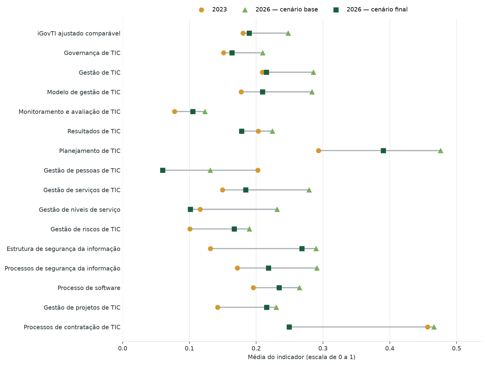
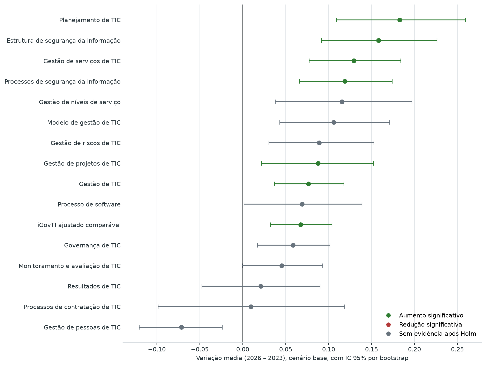
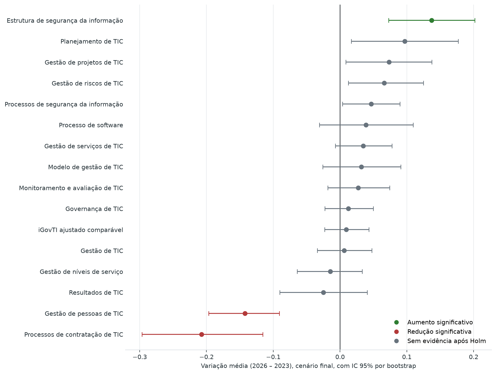
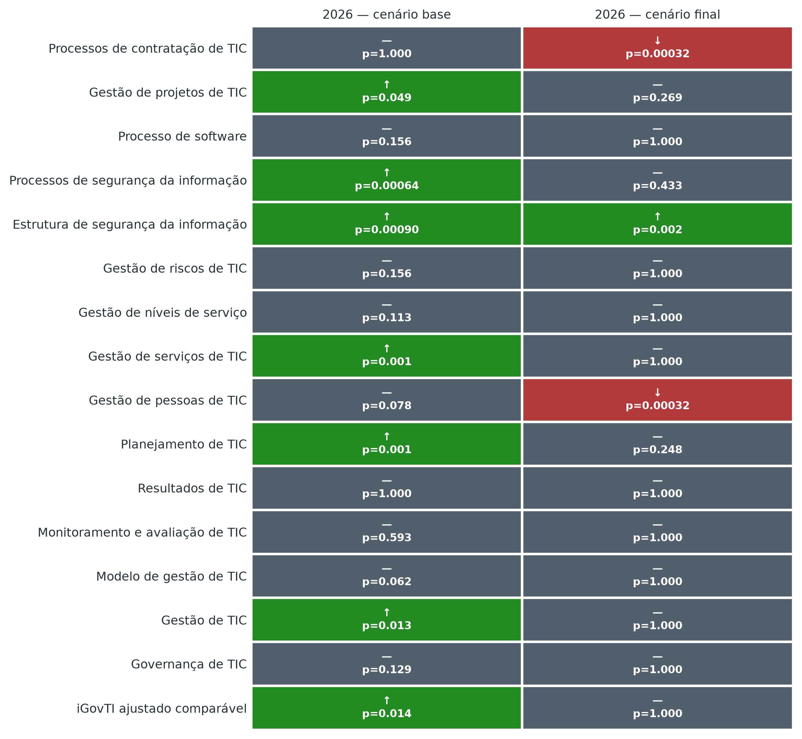

\newpage

# 1. Objetivo

Este anexo examina se os resultados das organizações presentes nas avaliações de 2023 e 2026 permitem afirmar que houve mudança estatisticamente significativa no iGovTI ajustado comparável e em seus componentes.

A análise considera dois cenários de 2026. O **cenário base** utiliza as respostas declaradas pelas organizações, após as correções iniciais de preenchimento e as retificações solicitadas pelos gestores. O **cenário final** incorpora também os ajustes decorrentes da avaliação das evidências e dos comentários do gestor.

Em 2026, a solicitação e a avaliação de evidências abrangeram um conjunto maior de práticas que em 2023. O cenário final considera os ajustes realizados pela equipe após examinar os documentos enviados com o questionário e os comentários do gestor.

Em 2023, também houve solicitação de documentos e análise pela equipe, mas o exame direto abrangeu menos práticas. Por isso, uma pontuação menor no cenário final de 2026 pode refletir tanto mudanças nas práticas quanto uma verificação documental mais rigorosa.

O cenário base reduz essa diferença de verificação entre os anos, mas pode apresentar pontuações maiores quando as práticas declaradas não estão suficientemente comprovadas. Os dois cenários são apresentados para verificar quanto essa diferença de tratamento das respostas afeta as conclusões.

# 2. Base analisada e diferença de verificação documental

## 2.1. Amostra pareada

Foram comparados os resultados das mesmas organizações nos dois anos. Em 61 casos, a correspondência foi identificada pelo nome ou pela sigla, considerando as diferenças de escrita. Nos outros sete, a equipe confirmou a correspondência entre as organizações.

O relatório estadual de 2023 apresentou resultados de 68 organizações, incluindo o PRODERJ, cujo resultado veio da fiscalização de 2022. Para a comparação atual, foram utilizadas as respostas disponíveis de 2023 de 74 organizações estaduais e quatro municípios. Dessas 78 organizações, 68 também responderam ao questionário de 2026, sendo 64 estaduais e quatro municípios. Esse é o grupo considerado na análise longitudinal.

A comparação inclui organizações que não participaram da análise estatística publicada em 2023. É o caso da SETD, excluída naquele trabalho pelo elevado percentual de respostas “Não se aplica”. Nesta análise, suas respostas foram incluídas, e seu índice foi calculado novamente, considerando os itens comparáveis entre os questionários de 2023 e 2026. Nesse cálculo, a resposta “Não se aplica” recebe o valor 0,5. Essa inclusão deve ser considerada na interpretação dos resultados e não altera as conclusões do relatório anterior.

Ficaram fora da comparação dez organizações com respostas disponíveis de 2023 que não responderam em 2026 e 45 organizações que responderam em 2026, mas não possuíam respostas disponíveis de 2023.

: Síntese da base longitudinal {#tbl:longitudinal_base#}

| Elemento | Resultado |
|---|---:|
| Organizações comparadas nos dois anos | 68 |
| Organizações estaduais | 64 |
| Municípios | 4 |
| Correspondências identificadas pelo nome ou pela sigla | 61 |
| Correspondências confirmadas pela equipe | 7 |
| Organizações com respostas de 2023 sem resposta em 2026 | 10 |
| Organizações com resposta em 2026 sem respostas disponíveis de 2023 | 45 |
| Indicadores submetidos a teste em cada cenário | 16 |

(Fonte: elaboração própria)

Foram testados o iGovTI, os agregados Governança de TIC e Gestão de TIC e 13 componentes: modelo de gestão; monitoramento e avaliação; resultados; planejamento; pessoas; serviços; níveis de serviço; riscos; estrutura de segurança da informação; processos de segurança da informação; processo de software; projetos; e processos de contratação de TIC.

## 2.2. Cenários de 2026

O questionário de 2026 solicita evidências em 43 das 48 questões principais. Há também solicitação específica para o subitem A da questão 2804, relativo à análise prévia e à aprovação técnica das contratações pela área de TIC.[^cobertura_evidencias_2026] A base final incorpora os ajustes decorrentes da avaliação das evidências e dos comentários do gestor, conforme os acolhimentos da equipe. A solicitação de documentos não equivale à comprovação de todas as práticas declaradas.

Os questionários de 2023 permitiam anexar documentos em 13 questões do SETIC e em 15 questões dos municípios. Outros campos permitiam apresentar informações ou justificativas. A equipe analisou as respostas e examinou diretamente um conjunto de práticas, mas a verificação documental foi menos abrangente que em 2026.[^cobertura_evidencias_2023]

[^cobertura_evidencias_2026]: Contagem realizada no questionário da fiscalização corrente.

[^cobertura_evidencias_2023]: Contagem dos campos de solicitação de evidência dos questionários do SETIC e dos municípios.

: Diferenças entre os cenários considerados {#tbl:longitudinal_cenarios#}

| Referência | Tratamento das respostas | Principal vantagem | Principal limitação |
|---|---|---|---|
| **2023 ajustado comparável** | Índices calculados novamente a partir das respostas de 2023, considerando os itens comparáveis entre os questionários | Permite utilizar as respostas disponíveis de 2023 | A verificação documental foi menos abrangente que em 2026 |
| **2026 — Cenário base** | Respostas declaradas, após correções iniciais e retificações solicitadas pelos gestores | Reduz a diferença de verificação documental entre os anos | Pode apresentar pontuações maiores para práticas declaradas, mas não comprovadas |
| **2026 — Cenário final** | Respostas ajustadas após a avaliação das evidências e dos comentários do gestor | Incorpora os resultados da verificação documental de 2026 | A verificação mais rigorosa pode reduzir as pontuações em relação a 2023 |

(Fonte: elaboração própria)

# 3. Método estatístico

## 3.1. Teste principal

Para cada indicador e cenário, calculou-se a diferença entre a pontuação de 2026 e a de 2023 para a mesma organização. Valores positivos representam avanço; valores negativos, regressão; e valores iguais a zero, estabilidade.

Foi utilizado o teste de Wilcoxon dos postos sinalizados para comparar os resultados das mesmas organizações nos dois anos. O teste considera tanto aumentos quanto reduções e verifica se as diferenças se distribuem de forma simétrica em torno de zero. Não exige que as diferenças sigam uma distribuição normal.[^wilcoxon_scipy] A escolha considerou a escala dos índices, de zero a um, e a existência de diferenças iguais ou nulas.[^dif_nula]

[^dif_nula]: As diferenças nulas foram tratadas pelo método de Pratt: os zeros participam do ranqueamento, mas seus postos não integram as somas positiva ou negativa.[^pratt_zeros]

Foram testados 16 indicadores em cada cenário. Os p-valores foram ajustados pelo método de Holm para controlar o risco de concluir que houve mudança apenas porque vários testes foram realizados.[^holm_multiplos] Considerou-se estatisticamente significativo o resultado com p-valor ajustado inferior a 0,05.

[^wilcoxon_scipy]: SCIPY. *wilcoxon — SciPy Manual*. Disponível em: <https://docs.scipy.org/doc/scipy/reference/generated/scipy.stats.wilcoxon.html>. Acesso em: 11 ago. 2026.

[^pratt_zeros]: PRATT, John W. Remarks on zeros and ties in the Wilcoxon signed rank procedures. *Journal of the American Statistical Association*, v. 54, n. 287, p. 655–667, 1959. Disponível em: <https://doi.org/10.1080/01621459.1959.10501526>. Acesso em: 11 ago. 2026.

[^holm_multiplos]: HOLM, Sture. A simple sequentially rejective multiple test procedure. *Scandinavian Journal of Statistics*, v. 6, p. 65–70, 1979. Disponível em: <https://doi.org/10.2307/4615733>. Acesso em: 11 ago. 2026.

## 3.2. Estimativas complementares

Para qualificar a relevância dos resultados, foram calculados: a diferença média e diferença mediana entre 2026 e 2023; o intervalo de 95% por *bootstrap* pareado[^explica_bootstrap], com 50.000 reamostragens, para a diferença média; as quantidades de organizações com avanço, regressão e estabilidade; a correlação bisserial de postos, calculada sobre as diferenças não nulas; e o teste t pareado e tamanho de efeito de Cohen (*d*~z~), como análise de sensibilidade.[^ttest_scipy]

[^explica_bootstrap]: Método computacional que utiliza repetidas seleções, com reposição, dos pares de organizações observados para verificar quanto a diferença média pode variar. Neste anexo, o procedimento foi repetido 50.000 vezes, produzindo uma faixa de valores plausíveis para a variação média. O método não cria novas evidências nem elimina limitações decorrentes do tamanho ou da composição da amostra.

[^ttest_scipy]: SCIPY. *ttest_rel — SciPy Manual*. Disponível em: <https://docs.scipy.org/doc/scipy/reference/generated/scipy.stats.ttest_rel.html>. Acesso em: 11 ago. 2026.

No cenário final, o teste t e o Wilcoxon identificaram os mesmos três componentes com mudança significativa. No cenário base, houve diferenças: o teste t apontou mudança significativa em Modelo de gestão de TIC e Gestão de pessoas de TIC, mas não em Gestão de projetos de TIC. Os dois métodos confirmaram o aumento do iGovTI global. Essas diferenças recomendam cautela na interpretação dos componentes cujo resultado depende do método utilizado. O Wilcoxon foi mantido como teste principal.

## 3.3. Regra de interpretação

Um componente foi classificado como aumento estatisticamente significativo quando o p-valor do Wilcoxon ajustado por Holm foi inferior a 0,05 e a diferença média foi positiva. A classificação redução estatisticamente significativa exigiu o mesmo critério, com diferença média negativa. Nos demais casos, adotou-se a expressão sem evidência estatística de mudança.

A ausência de significância não demonstra igualdade entre os anos. Indica apenas que os dados não fornecem evidência suficiente de mudança segundo o método e o nível de significância adotados.

# 4. Resultados

## 4.1. Sensibilidade do iGovTI global ao cenário de 2026

O cenário escolhido altera a conclusão sobre o iGovTI global. No cenário base[^definicao_cenario_base] de 2026, a média passou de 0,1801 para 0,2477, aumento de 0,0676 ponto. Quarenta e três organizações avançaram e 25 regrediram. O aumento foi significativo após a correção de Holm (*p* ajustado = 0,01408), com intervalo de 95% da variação média integralmente positivo, de 0,0322 a 0,1037.

[^definicao_cenario_base]: Cenário em que as respostas coletadas do questionário do iGovTI 2026 foram ajustadas a pedidos de retificação do gestor, para correção de erros e saneamento do survey.

No cenário final[^definicao_cenario_final] de 2026, a média foi 0,1895, apenas 0,0094 ponto acima da referência de 2023. Houve 32 avanços e 36 regressões. O teste não indicou mudança do conjunto (*p* ajustado = 1,0000), e o intervalo de 95% compreendeu valores negativos e positivos, de -0,0231 a 0,0431.

[^definicao_cenario_final]: Cenário em que as respostas coletadas do questionário do iGovTI 2026 foram ajustadas após avaliação das evidências e apreciação dos comentários dos gestores.

: Resultado longitudinal do iGovTI nos dois cenários de 2026 {#tbl:longitudinal_igovti_cenarios#}

| Cenário de 2026 | Média 2023 | Média 2026 | Variação média | Variação mediana | IC 95% da variação média | Avanço | Regressão | *p* ajustado | Conclusão |
|---|---:|---:|---:|---:|---:|---:|---:|---:|---|
| Base | 0,180 | 0,248 | +0,068 | +0,045 | +0,032 a +0,104 | 43 | 25 | 0,01408 | Aumento significativo |
| Final | 0,180 | 0,189 | +0,009 | -0,004 | -0,023 a +0,043 | 32 | 36 | 1,000 | Sem evidência de mudança |

(Fonte: elaboração própria)

Entre os cenários base e final, a média do iGovTI das 68 organizações diminuiu 0,0582 ponto. Essa diferença resulta dos ajustes feitos após a avaliação das evidências e dos comentários do gestor. A redução não significa, por si só, que o auditado respondeu incorretamente. Ela pode decorrer da ausência de documentos ou da apresentação de evidências insuficientes para comprovar o nível de adoção declarado.

Assim, a formulação mais precisa é: **as respostas autodeclaradas indicam evolução do iGovTI global, mas essa evolução não permanece estatisticamente demonstrada após a avaliação das evidências e dos comentários do gestor**.

A [@fig:longitudinal_medias_cenarios] apresenta as médias de 2023 e dos dois cenários de 2026. A distância entre os pontos dos cenários base e final mostra quais componentes tiveram maior alteração após os ajustes das respostas.

{#fig:longitudinal_medias_cenarios#}

(Fonte: elaboração própria)

## 4.2. Cenário base de 2026

No cenário base, sete dos 16 indicadores apresentaram aumento estatisticamente significativo. Além do iGovTI global, houve aumento em Gestão de TIC, Planejamento de TIC, Gestão de serviços de TIC, Estrutura de segurança da informação, Processos de segurança da informação e Gestão de projetos de TIC.

: Indicadores com aumento significativo no cenário base {#tbl:longitudinal_significativos_base#}

| Indicador | Média 2023 | Média 2026 | Variação média | IC 95% | Avanço | Regressão | Estável | *p* ajustado | Correlação bisserial de postos |
|---|---:|---:|---:|---:|---:|---:|---:|---:|---:|
| iGovTI ajustado comparável | 0,180 | 0,248 | +0,068 | +0,032 a +0,104 | 43 | 25 | 0 | 0,01408 | +0,445 |
| Gestão de TIC | 0,209 | 0,286 | +0,077 | +0,037 a +0,118 | 43 | 25 | 0 | 0,01296 | +0,451 |
| Planejamento de TIC | 0,293 | 0,476 | +0,183 | +0,109 a +0,259 | 43 | 18 | 7 | 0,00140 | +0,610 |
| Gestão de serviços de TIC | 0,150 | 0,279 | +0,129 | +0,077 a +0,184 | 45 | 20 | 3 | 0,00140 | +0,560 |
| Estrutura de segurança da informação | 0,131 | 0,289 | +0,158 | +0,092 a +0,226 | 43 | 19 | 6 | 0,00090 | +0,584 |
| Processos de segurança da informação | 0,172 | 0,291 | +0,119 | +0,066 a +0,174 | 46 | 20 | 2 | 0,00064 | +0,565 |
| Gestão de projetos de TIC | 0,142 | 0,230 | +0,088 | +0,022 a +0,153 | 34 | 15 | 19 | 0,04880 | +0,443 |

(Fonte: elaboração própria)

Os aumentos do cenário base representam evolução das práticas declaradas. A evidência estatística demonstra consistência do movimento autodeclarado na amostra, mas não assegura que as práticas tenham sido implementadas no nível informado por cada organização.

A [@fig:longitudinal_variacoes_base] apresenta as variações e os intervalos do cenário base.

{#fig:longitudinal_variacoes_base#}

(Fonte: elaboração própria)

## 4.3. Cenário final de 2026

No cenário final, três componentes apresentaram mudança significativa. Houve aumento em Estrutura de segurança da informação e reduções em Gestão de pessoas de TIC e Processos de contratação de TIC. O iGovTI global e os outros 12 componentes não apresentaram evidência estatística de mudança.

: Componentes com mudança significativa no cenário final {#tbl:longitudinal_significativos_final#}

| Componente | Média 2023 | Média 2026 | Variação média | IC 95% | Avanço | Regressão | Estável | *p* ajustado | Correlação bisserial de postos |
|---|---:|---:|---:|---:|---:|---:|---:|---:|---:|
| Estrutura de segurança da informação | 0,131 | 0,268 | +0,137 | +0,073 a +0,202 | 43 | 19 | 6 | 0,00168 | +0,557 |
| Gestão de pessoas de TIC | 0,202 | 0,060 | -0,142 | -0,197 a -0,091 | 13 | 51 | 4 | 0,00032 | -0,739 |
| Processos de contratação de TIC | 0,457 | 0,249 | -0,207 | -0,296 a -0,116 | 17 | 48 | 3 | 0,00032 | -0,605 |

(Fonte: elaboração própria)

Entre os cenários base e final, a média diminuiu 0,0711 ponto em Gestão de pessoas de TIC e 0,2170 ponto em Processos de contratação de TIC. No cenário base, nenhum desses componentes apresentou redução estatisticamente significativa. Por isso, as reduções do cenário final não podem ser atribuídas apenas à piora das práticas. A comparação também reflete os ajustes decorrentes da verificação documental de 2026.

A [@fig:longitudinal_variacoes_final] apresenta as variações e os intervalos do cenário final.

{#fig:longitudinal_variacoes_final#}

(Fonte: elaboração própria)

## 4.4. Comparação das conclusões

O aumento em Estrutura de segurança da informação foi o único resultado estatisticamente significativo nos dois cenários. Por isso, é a conclusão menos dependente do tratamento das respostas de 2026.

O aumento do iGovTI global e os aumentos em Gestão de TIC, Planejamento de TIC, Gestão de serviços de TIC, Processos de segurança da informação e Gestão de projetos de TIC aparecem apenas no cenário base. As reduções em Gestão de pessoas de TIC e Processos de contratação de TIC aparecem apenas no cenário final.

Os demais sete indicadores não apresentaram evidência de mudança em nenhum dos cenários: Governança de TIC, Modelo de gestão de TIC, Monitoramento e avaliação de TIC, Resultados de TIC, Gestão de níveis de serviço, Gestão de riscos de TIC e Processo de software.

: Conclusões dos testes nos dois cenários de 2026 {#tbl:longitudinal_comparacao_conclusoes#}

| Indicador | *p* ajustado — base | Conclusão — base | *p* ajustado — final | Conclusão — final |
|---|---:|---|---:|---|
| iGovTI ajustado comparável | 0,014 | Aumento | 1,000 | Sem evidência de mudança |
| Governança de TIC | 0,129 | Sem evidência de mudança | 1,000 | Sem evidência de mudança |
| Gestão de TIC | 0,013 | Aumento | 1,000 | Sem evidência de mudança |
| Modelo de gestão de TIC | 0,062 | Sem evidência de mudança | 1,000 | Sem evidência de mudança |
| Monitoramento e avaliação de TIC | 0,593 | Sem evidência de mudança | 1,000 | Sem evidência de mudança |
| Resultados de TIC | 1,000 | Sem evidência de mudança | 1,000 | Sem evidência de mudança |
| Planejamento de TIC | 0,001 | Aumento | 0,248 | Sem evidência de mudança |
| Gestão de pessoas de TIC | 0,078 | Sem evidência de mudança | 0,00032 | Redução |
| Gestão de serviços de TIC | 0,001 | Aumento | 1,000 | Sem evidência de mudança |
| Gestão de níveis de serviço | 0,113 | Sem evidência de mudança | 1,000 | Sem evidência de mudança |
| Gestão de riscos de TIC | 0,156 | Sem evidência de mudança | 1,000 | Sem evidência de mudança |
| Estrutura de segurança da informação | 0,00090 | Aumento | 0,00168 | Aumento |
| Processos de segurança da informação | 0,00064 | Aumento | 0,433 | Sem evidência de mudança |
| Processo de software | 0,156 | Sem evidência de mudança | 1,000 | Sem evidência de mudança |
| Gestão de projetos de TIC | 0,049 | Aumento | 0,269 | Sem evidência de mudança |
| Processos de contratação de TIC | 1,000 | Sem evidência de mudança | 0,00032 | Redução |

(Fonte: elaboração própria)

A [@fig:longitudinal_conclusoes_cenarios] sintetiza essas conclusões. As células cinzas não significam igualdade, mas indicam ausência de evidência suficiente segundo o critério adotado.

{#fig:longitudinal_conclusoes_cenarios#}

(Fonte: elaboração própria)

## 4.5. Leitura preliminar por esfera

Como a amostra pareada reúne 64 organizações estaduais e apenas quatro municípios, a separação por esfera tem caráter descritivo. Ela permite identificar onde se concentram os movimentos observados, mas não fundamenta conclusão geral sobre o conjunto dos municípios fluminenses.

: Variação do iGovTI comparável por esfera e cenário {#tbl:longitudinal_por_esfera#}

| Cenário de 2026 | Esfera | Organizações | Média 2023 | Média 2026 | Variação média | Avanço | Regressão |
|---|---|---:|---:|---:|---:|---:|---:|
| Base | Estaduais | 64 | 0,185 | 0,255 | +0,070 | 41 | 23 |
| Base | Municípios | 4 | 0,095 | 0,131 | +0,035 | 2 | 2 |
| Final | Estaduais | 64 | 0,185 | 0,194 | +0,009 | 30 | 34 |
| Final | Municípios | 4 | 0,095 | 0,111 | +0,016 | 2 | 2 |

(Fonte: elaboração própria)

No cenário base, a elevação do iGovTI não ficou restrita, em termos de média, às organizações estaduais: a média dos quatro municípios também aumentou. Entretanto, dois municípios avançaram e dois regrediram, enquanto 41 das 64 organizações estaduais avançaram. O aumento verificado no conjunto decorre, portanto, predominantemente das organizações estaduais e não caracteriza melhora municipal disseminada.

A abertura por componentes reforça essa leitura. No cenário base, as organizações estaduais apresentaram aumento médio em todos os componentes cuja melhora foi identificada na análise principal. Entre os quatro municípios, houve resultados mistos: as médias diminuíram em Gestão de TIC, Planejamento, Gestão de serviços e Gestão de projetos; ficaram praticamente estáveis em Estrutura de segurança da informação; e aumentaram em Processos de segurança da informação, embora com dois avanços e duas regressões.

No cenário final, as duas esferas apresentaram pequena elevação da média do iGovTI, mas o número de organizações com avanço não superou o de organizações com regressão em nenhuma delas. A melhora de Estrutura de segurança da informação, único resultado positivo confirmado nos dois cenários para o conjunto das 68 organizações, também se concentrou nas estaduais: nesse componente, 41 estaduais avançaram e 17 regrediram, enquanto, entre os municípios, houve dois avanços e duas regressões e variação média próxima de zero.

Em síntese, a análise preliminar indica que os avanços do conjunto foram principalmente estaduais. Os quatro municípios apresentaram trajetórias divididas, insuficientes para afirmar melhora ou piora geral desse grupo.

# 5. Limitações e cautelas de interpretação

Os resultados devem ser interpretados com as seguintes ressalvas:

* **Diferença de verificação documental:** a avaliação documental de 2026 abrangeu um conjunto maior de práticas que a realizada em 2023. O cenário final incorpora os ajustes acolhidos pela equipe, mas não atesta a comprovação de todas as práticas declaradas. O cenário final pode, por isso, apresentar viés negativo na comparação longitudinal.
* **Limitação das respostas declaradas:** o cenário base reduz a diferença de verificação entre os anos, mas pode apresentar pontuações maiores quando a prática declarada não está suficientemente implementada ou comprovada.
* **Comparação entre cenários:** os cenários base e final mostram os resultados antes e depois dos ajustes das respostas de 2026. Eles não constituem um intervalo de confiança.
* **Amostra pareada:** a análise descreve as 68 organizações presentes nos dois anos. Ela não representa as dez organizações de 2023 sem par, as 45 organizações de 2026 sem histórico nem, necessariamente, todo o universo jurisdicionado. A presença de apenas quatro municípios limita a análise por esfera à descrição dos casos observados e impede sua generalização para os demais municípios.
* **Seleção das organizações:** as organizações comparadas não foram escolhidas por sorteio. Foram incluídas aquelas com resultados disponíveis e comparáveis nos dois anos. Os testes não permitem estender automaticamente as conclusões às demais organizações.
* **Diferenças entre os questionários:** o cálculo ajustado comparável reduz diferenças de estrutura entre os questionários, mas não assegura identidade completa de redação, contexto, respondente, documentação disponível ou processo de coleta.
* **Limites para explicar as causas das mudanças:** a comparação entre dois anos não permite separar os efeitos de mudanças normativas, reorganizações administrativas, alterações do questionário ou diferenças na documentação disponível. Assim, os resultados mostram mudanças nas pontuações, mas não identificam, por si só, suas causas.
* **Significância e materialidade:** um resultado significativo pode ter importância prática distinta conforme o componente. Um resultado não significativo pode conter variações relevantes em organizações específicas. A leitura deve combinar p-valores, magnitude, intervalos e distribuição dos pares.
* **Influência do método estatístico:** algumas conclusões do cenário base próximas ao limiar variaram entre Wilcoxon e teste t. Essas diferenças não alteraram a conclusão do iGovTI global, mas desaconselham interpretação categórica de componentes limítrofes.
* **Permutações e bootstrap:** os p-valores e os intervalos foram estimados por procedimentos computacionais. Foi utilizada uma configuração fixa de geração dos números aleatórios para permitir a reprodução dos resultados.

Em razão dessas limitações, as expressões “aumento” e “redução” estatisticamente significativos referem-se ao comportamento das pontuações comparáveis na amostra e no cenário indicado. Elas não devem ser convertidas, sem análise adicional, em afirmação causal de melhora ou deterioração das práticas de todas as organizações.

# 6. Conclusão

A resposta à questão sobre evolução do iGovTI depende do cenário de 2026 utilizado.

No **cenário base**, formado pelas respostas autodeclaradas após os ajustes iniciais, houve aumento estatisticamente significativo do iGovTI global: a média passou de 0,180 para 0,248, com avanço em 43 das 68 organizações. Esse resultado indica evolução da maturidade **declarada** entre os ciclos.

No **cenário final**, que incorpora os ajustes acolhidos após a avaliação das evidências e dos comentários dos gestores, a média foi 0,189 e não houve evidência estatística de mudança do iGovTI global. Esse resultado incorpora uma verificação documental mais abrangente em 2026. Por isso, a comparação com 2023 deve considerar que parte da diferença nas pontuações pode decorrer do maior rigor dessa verificação.

Consequentemente, não é adequado concluir, de forma isolada, que “não houve evolução” nem que “houve evolução comprovada” do iGovTI global. A conclusão sustentada pelos dois cenários é que **houve evolução nas respostas autodeclaradas, mas essa evolução não permaneceu demonstrada no índice global após a avaliação documental mais abrangente de 2026**.

No nível dos componentes, o aumento em Estrutura de segurança da informação foi o único resultado significativo nos dois cenários e constitui a evidência longitudinal mais robusta. Os aumentos em Gestão de TIC, Planejamento, Serviços, Processos de segurança da informação e Projetos dependem do cenário base. As reduções em Pessoas e Contratações aparecem apenas no cenário final e não devem ser atribuídas exclusivamente a deterioração institucional, pois são fortemente influenciadas pela diferença de verificação documental.

A leitura preliminar por esfera indica que os avanços se concentraram principalmente nas organizações estaduais. Entre os quatro municípios pareados, dois avançaram e dois regrediram no iGovTI em ambos os cenários, resultado que não permite afirmar uma tendência municipal comum.

Os dois cenários devem ser apresentados em conjunto. As conclusões sobre evolução ou regressão devem considerar tanto as diferenças entre os questionários quanto a abrangência da verificação documental em cada ano.
