\newpage

## 1. Objetivo e escopo

Este anexo consolida a metodologia e os resultados da análise da etapa de comentários do gestor apresentados no âmbito da Fiscalização n.º 18/2026 - iGovTI 2026.

O exame abrangeu: (i) as manifestações sobre as situações encontradas e os encaminhamentos constantes dos relatórios individuais preliminares; (ii) os pedidos de reavaliação de respostas anteriormente ajustadas em razão da análise das evidências; e (iii) os esclarecimentos solicitados às organizações que não apresentaram resposta válida ao questionário iGovTI 2026.

A análise teve dois referenciais temporais complementares. O primeiro foi a data-base da auditoria, utilizada para decidir se a situação descrita no relatório preliminar estava ou não caracterizada no período examinado. O segundo foi 16/07/2026, data de referência adotada para reconhecer providências posteriores, atualizar a base de respostas, recalcular o iGovTI e reexecutar os procedimentos de auditoria.

Essa distinção impede que uma correção posterior apague indevidamente uma deficiência efetivamente existente na data-base, sem deixar de reconhecer a evolução promovida pelo gestor.

## 2. Metodologia de avaliação

### 2.1. Preparação e delimitação das manifestações

Foram consideradas as submissões concluídas e mais recentes de cada organização. Havendo reenvio, a manifestação anterior foi desconsiderada, mas permaneceu registrada na memória de tratamento. Das 88 submissões recebidas, oito haviam sido substituídas por reenvios posteriores, resultando em 80 submissões válidas de 80 organizações.

Cada manifestação foi associada à situação encontrada, à questão ou ao item do questionário e aos critérios de auditoria correspondentes. Os comentários e os documentos apresentados foram examinados em conjunto. Anexos corrompidos, ilegíveis ou sem conteúdo aproveitável não foram utilizados como evidência; nesses casos, o comentário do gestor foi avaliado por seu próprio conteúdo, sem atribuição de força probatória a documento que não pudesse ser verificado.

A simples concordância, discordância ou solicitação de reavaliação não determinou o resultado. A conclusão considerou a aderência da manifestação ao critério avaliado, a pertinência, a suficiência e a vigência dos elementos apresentados, bem como sua capacidade de demonstrar a prática afirmada.

### 2.2. Avaliação das situações encontradas

A primeira seção permitiu ao gestor declarar, para cada situação encontrada apresentada no relatório individual preliminar, que: já havia atendido ao encaminhamento; estava adotando providências; ainda não havia adotado medida; ou discordava do apontamento.

As manifestações de concordância inequívoca sem medida adotada e sem elementos adicionais foram resolvidas por regra objetiva, pois confirmavam a manutenção da situação. Os demais casos foram submetidos a avaliações independentes e, em seguida, a uma consolidação. A consolidação considerou todas as avaliações válidas disponíveis para cada caso, observado o mínimo de três opiniões válidas.

O resultado de cada avaliação foi classificado em uma das seguintes categorias:

- **Acolhida**: os elementos demonstraram que a situação não estava caracterizada na data-base;

- **Parcialmente acolhida**: os elementos justificaram alteração parcial dos fundamentos, sem afastar integralmente a situação;

- **Não acolhida**: a situação permaneceu caracterizada, inclusive quando os elementos apresentados foram insuficientes para afastá-la ou para alterar com segurança seus fundamentos.

Separadamente, foi identificado o estado temporal da situação. Assim, uma manifestação poderia não ser acolhida como contestação ao diagnóstico da data-base e, ainda assim, comprovar que a deficiência havia sido corrigida posteriormente. Nessa hipótese, manteve-se a conclusão histórica e reconheceu-se a melhoria na posição atual.

### 2.3. Reavaliação das respostas e evidências

A segunda seção foi destinada às organizações cujas respostas haviam sido ajustadas após a avaliação das evidências originalmente encaminhadas. Cada pedido foi confrontado com os critérios específicos do item questionado e submetido ao mesmo processo de avaliações independentes e consolidação, considerando-se todas as opiniões válidas disponíveis e o quórum mínimo de três.

Antes dessa etapa, foram retirados do exame os itens já saneados de modo seguro pela análise da primeira seção, evitando dupla avaliação e decisões contraditórias. Os pedidos remanescentes foram classificados como acolhidos, parcialmente acolhidos ou não acolhidos. O acolhimento parcial foi utilizado quando apenas parte dos itens agrupados na solicitação recebeu comprovação suficiente.

Nenhum ajuste elevou a resposta além do nível originalmente declarado pelo gestor.

### 2.4. Aplicação dos ajustes e mensuração dos impactos

Os ajustes tecnicamente sustentados foram aplicados sobre a base de respostas do questionário posterior à avaliação das evidências. Em seguida, foram recalculados os índices, reexecutados os procedimentos de auditoria e comparados os estados anterior e posterior aos comentários do gestor. A comparação abrangeu respostas ajustadas, situações encontradas, achados e iGovTI.

A quantidade de manifestações acolhidas não corresponde diretamente à quantidade de respostas alteradas. Uma única manifestação pode repercutir em vários itens, uma situação pode depender de mais de uma resposta e diferentes manifestações podem alcançar o mesmo item. Por essa razão, sobreposições foram consolidadas antes da aplicação dos ajustes.

## 3. Participação e cenário declarado pelos gestores

Participaram da etapa de comentários do gestor 80 das 119 organizações abrangidas, correspondentes a 67,2% do universo. Entre as 113 organizações que haviam apresentado resposta válida ao questionário iGovTI 2026, 78 se manifestaram sobre os relatórios preliminares, equivalentes a 69,0%. Entre as seis organizações sem resposta válida, duas utilizaram a seção específica destinada a esse grupo.

A participação nos diferentes recortes da etapa é apresentada na [@fig:comentarios_participacao]. Entre as 103 organizações habilitadas a solicitar reavaliação de respostas e evidências, 72 responderam à etapa e 56 formularam ao menos um pedido.

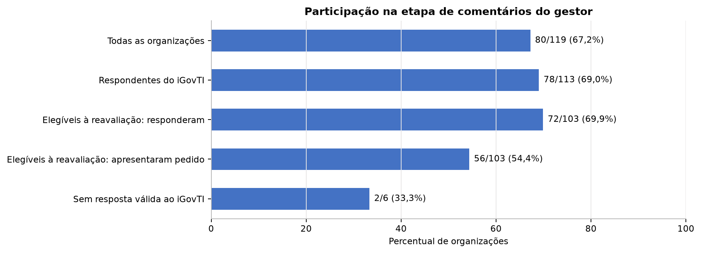{#fig:comentarios_participacao#}

(Fonte: elaboração própria a partir das manifestações dos gestores)

Em relação aos achados e situações encontradas apontadas no relatório individual preliminar foram registradas 1.471 manifestações. Houve concordância com o diagnóstico em 1.235 casos (84,0%) e discordância em 236 (16,0%). A concordância predominou em todos os seis achados.

: Posição declarada pelos gestores sobre as situações encontradas {#tbl:comentarios_posicao_declarada#}

| Posição declarada | Quantidade | Percentual |
|---|---:|---:|
| Concorda e declara atendimento concluído | 25 | 1,7% |
| Concorda e declara providências em curso | 584 | 39,7% |
| Concorda, sem medida adotada | 626 | 42,6% |
| Discorda da situação encontrada | 236 | 16,0% |
| **Total** | **1.471** | **100,0%** |

(Fonte: elaboração própria a partir das manifestações dos gestores)

A distribuição das quatro posições declaradas consta da [@fig:comentarios_panorama_geral].

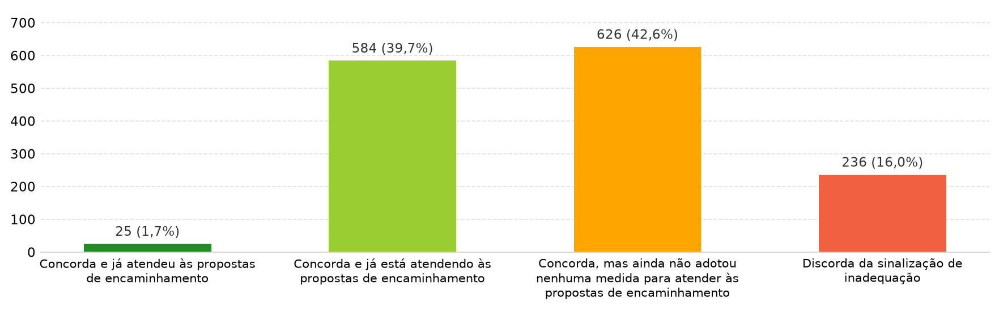{#fig:comentarios_panorama_geral#}

(Fonte: elaboração própria a partir das manifestações dos gestores)

Os dados evidenciam expressiva convergência com o diagnóstico preliminar, mas também revelam estágio ainda incipiente de correção. Somente 1,7% das manifestações declarou atendimento concluído, enquanto 42,6% reconheceu a situação sem qualquer medida adotada e 39,7% informou providências ainda em curso. Portanto, concordância com o apontamento e intenção de agir não se confundem com saneamento comprovado.

: Posição declarada por achado {#tbl:comentarios_posicao_por_achado#}

| Achado | Total | Atendimento concluído | Providências em curso | Sem medida | Discordância | Discordância (%) |
|---:|---:|---:|---:|---:|---:|---:|
| 1 | 52 | 4 | 25 | 20 | 3 | 5,8% |
| 2 | 148 | 6 | 63 | 55 | 24 | 16,2% |
| 3 | 321 | 8 | 131 | 128 | 54 | 16,8% |
| 4 | 339 | 1 | 130 | 174 | 34 | 10,0% |
| 5 | 375 | 1 | 156 | 158 | 60 | 16,0% |
| 6 | 236 | 5 | 79 | 91 | 61 | 25,8% |
| **Total** | **1.471** | **25** | **584** | **626** | **236** | **16,0%** |

(Fonte: elaboração própria a partir das manifestações dos gestores)

A composição proporcional das respostas em cada achado é apresentada na [@fig:comentarios_por_achado].

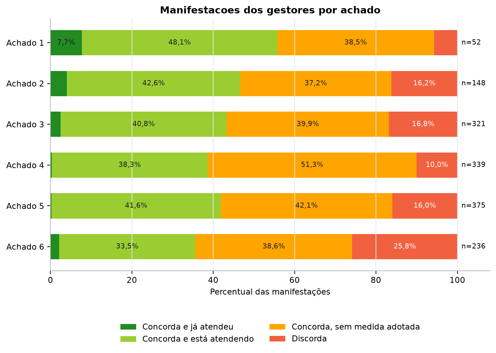{#fig:comentarios_por_achado#}

(Fonte: elaboração própria a partir das manifestações dos gestores)

O Achado 6, relativo à governança técnica das contratações de TIC, apresentou a maior proporção de discordâncias, seguido dos Achados 3, 2 e 5. As contestações concentraram-se em situações nas quais os gestores alegaram a existência de práticas, documentos gerais ou rotinas administrativas, mas os critérios exigiam demonstração adicional de formalização, abrangência, participação da área de TIC, integração ao planejamento ou funcionamento efetivo.

### 3.1. Distribuição das manifestações por situação encontrada

As figuras a seguir detalham as manifestações em cada situação que compõe os seis achados. A categoria "Situação encontrada inexistente" representa as organizações participantes cujo relatório individual não continha a situação correspondente; não se trata de alternativa selecionada pelo gestor. As quantidades e os percentuais de cada barra têm como referência as 78 organizações que receberam relatório preliminar e participaram da etapa.

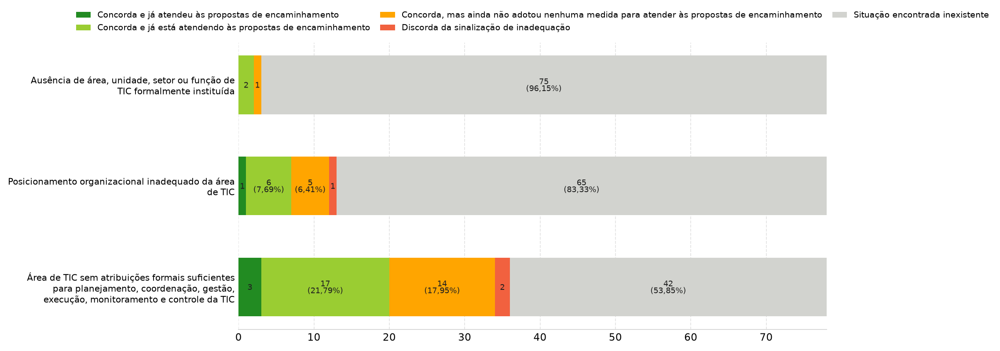{#fig:comentarios_achado_1#}

(Fonte: elaboração própria a partir das manifestações dos gestores)

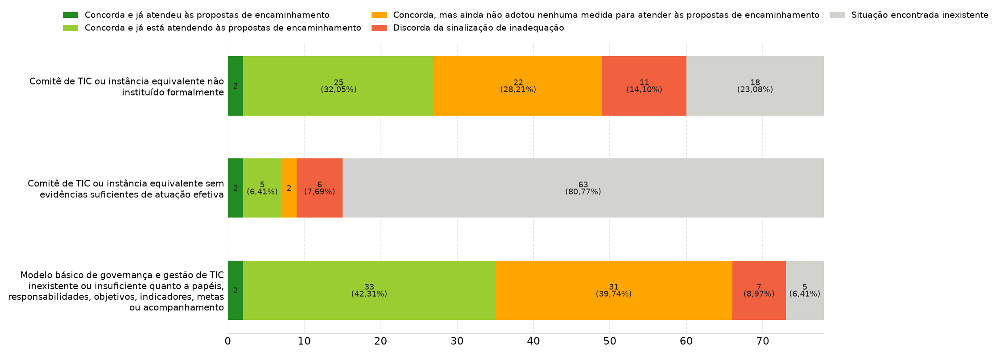{#fig:comentarios_achado_2#}

(Fonte: elaboração própria a partir das manifestações dos gestores)

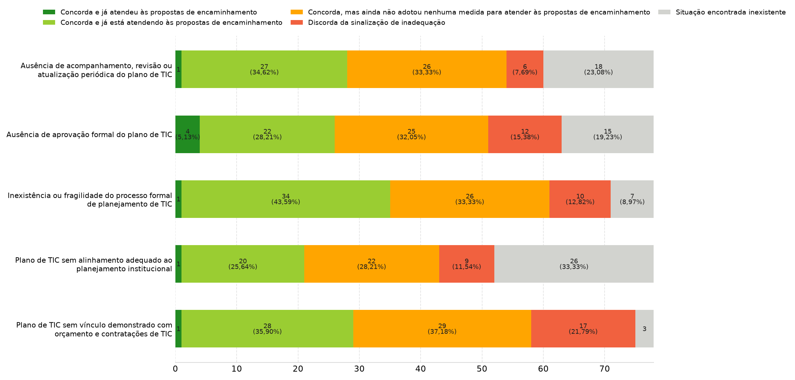{#fig:comentarios_achado_3#}

(Fonte: elaboração própria a partir das manifestações dos gestores)

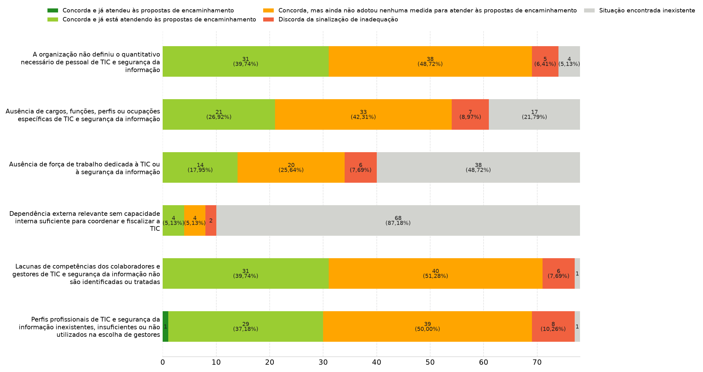{#fig:comentarios_achado_4#}

(Fonte: elaboração própria a partir das manifestações dos gestores)

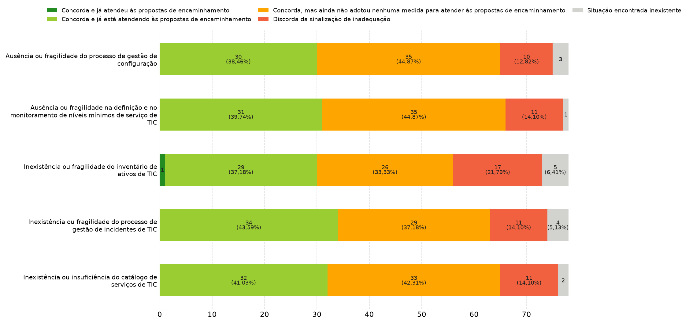{#fig:comentarios_achado_5#}

(Fonte: elaboração própria a partir das manifestações dos gestores)

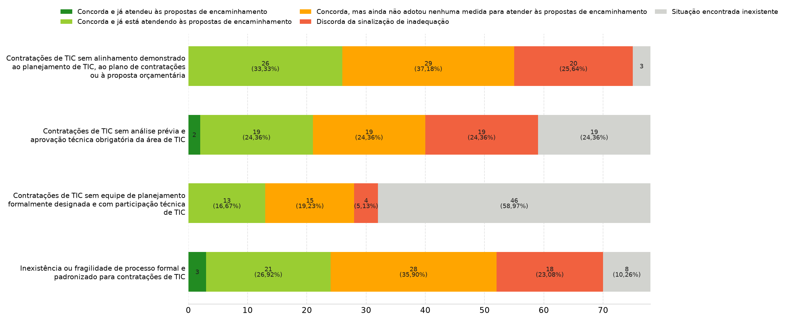{#fig:comentarios_achado_6#}

(Fonte: elaboração própria a partir das manifestações dos gestores)

## 4. Resultado da avaliação técnica

### 4.1. Manifestações sobre as situações encontradas

Das 1.471 manifestações avaliadas na primeira seção, 52 foram acolhidas integralmente, das quais oito afastaram a situação na data-base e 44 reconheceram correção posterior; 15 foram parcialmente acolhidas e alteraram parte dos fundamentos, sem afastamento integral; e 1.404 não foram acolhidas.

: Resultado da avaliação das situações encontradas {#tbl:comentarios_resultado_secao_1#}

| Resultado | Efeito sobre a situação da data-base | Quantidade | Percentual |
|---|---|---:|---:|
| Acolhida | Situação não caracterizada | 52 | 3,5% |
| Parcialmente acolhida | Situação mantida com alteração parcial de fundamentos | 15 | 1,0% |
| Não acolhida | Situação mantida | 1.404 | 95,4% |
| **Total** |  | **1.471** | **100,0%** |

(Fonte: elaboração própria a partir da avaliação consolidada)

O cruzamento entre a resposta declarada pelo gestor e o resultado da análise consta da [@tbl:comentarios_cruzamento_manifestacao_resultado]. Os percentuais foram calculados dentro de cada tipo de manifestação, permitindo distinguir a posição do gestor da suficiência técnica dos elementos apresentados.

: Resposta do gestor e resultado da análise das situações encontradas {#tbl:comentarios_cruzamento_manifestacao_resultado#}

| Resposta do gestor | Acolhida | Parcialmente acolhida | Não acolhida | Total |
|---|---:|---:|---:|---:|
| Concorda e já fez | 5 (20,0%) | 1 (4,0%) | 19 (76,0%) | 25 |
| Concorda e está fazendo | 16 (2,7%) | 9 (1,5%) | 559 (95,7%) | 584 |
| Concorda e ainda não adotou medida[^comentarios_concorda_sem_medida] | 0 | 1 (0,2%) | 625 (99,8%) | 626 |
| Discorda | 31 (13,1%) | 4 (1,7%) | 201 (85,2%) | 236 |
| **Total** | **52** | **15** | **1.404** | **1.471** |

(Fonte: elaboração própria a partir da avaliação consolidada)

[^comentarios_concorda_sem_medida]: Corresponde à opção original “Concorda, mas ainda não adotou nenhuma medida para atender às propostas de encaminhamento”.

Das 1.235 manifestações concordantes, 21 foram acolhidas integralmente, 11 parcialmente e 1.203 não foram acolhidas. Entre os 25 gestores que declararam atendimento concluído, seis manifestações foram acolhidas integral ou parcialmente, enquanto 19 não apresentaram elementos suficientes para alterar a conclusão. Entre as 584 manifestações que informaram providências em andamento, 25 foram acolhidas integral ou parcialmente. No grupo de 626 manifestações sem medida adotada, apenas uma foi parcialmente acolhida.

Esses resultados não representam contradição entre concordância e acolhimento. A resposta declarada registra a posição do gestor sobre o diagnóstico, enquanto a análise técnica verifica se os esclarecimentos e as evidências modificam a situação na data-base, demonstram correção posterior ou alteram seus fundamentos. Assim, a concordância desacompanhada de comprovação suficiente tende a manter a situação, ao passo que a concordância acompanhada de evidência de saneamento pode justificar o reconhecimento de correção posterior sem invalidar o diagnóstico histórico.

Entre as 236 discordâncias, 31 foram acolhidas integralmente, quatro parcialmente e 201 não foram acolhidas. O conjunto de acolhimentos integrais e parciais alcançou 67 manifestações, ou 4,6% dos casos.

As correções posteriores não invalidaram o diagnóstico histórico, mas foram consideradas na atualização das respostas e na mensuração do estado atual.

### 4.2. Pedidos de reavaliação de respostas e evidências

Foram apresentados 343 pedidos de reavaliação por 56 organizações. Após a validação e a exclusão do que já havia sido saneado de forma segura na primeira seção, 340 casos de 55 organizações foram submetidos à decisão técnica. Desses, 22 foram acolhidos integralmente, 22 parcialmente e 296 não foram acolhidos.

A [@fig:comentarios_reavaliacoes] apresenta as questões-base com maior número de pedidos antes da retirada dos casos já saneados pela primeira seção.

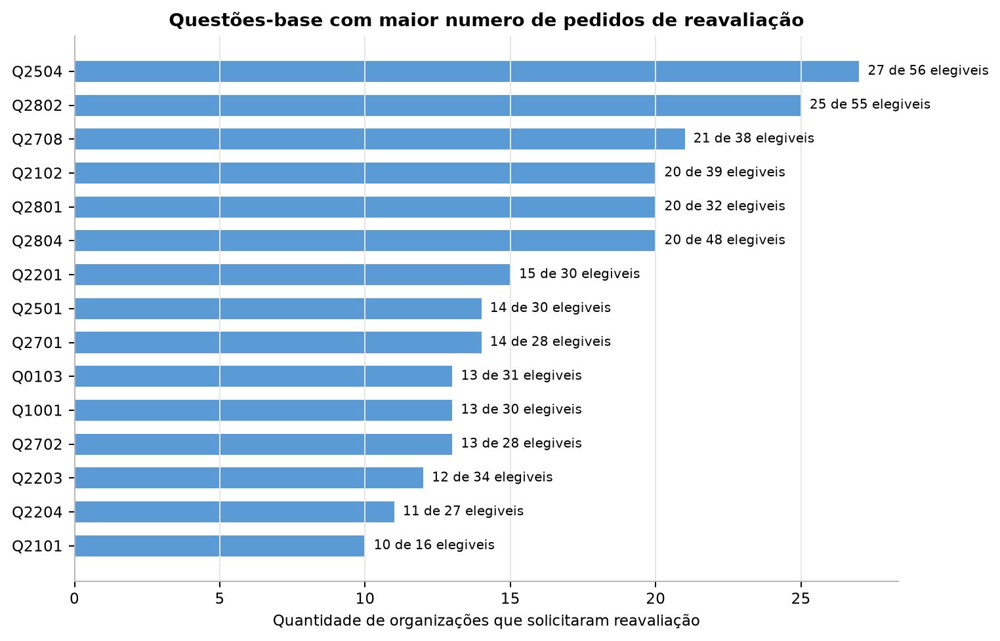{ width=85% }{#fig:comentarios_reavaliacoes#}

(Fonte: elaboração própria a partir das manifestações dos gestores)

: Resultado dos pedidos de reavaliação {#tbl:comentarios_resultado_secao_2#}

| Resultado | Quantidade | Percentual |
|---|---:|---:|
| Acolhida | 22 | 6,5% |
| Parcialmente acolhida | 22 | 6,5% |
| Não acolhida | 296 | 87,1% |
| **Total** | **340** | **100,0%** |

(Fonte: elaboração própria a partir da avaliação consolidada)

Os 44 acolhimentos integrais ou parciais correspondem a 12,9% dos casos reavaliados. Como cada caso podia reunir diversos itens do questionário, o acolhimento parcial permitiu restaurar somente os itens efetivamente comprovados, mantendo os demais como não conformes.

A comparação visual entre os resultados das duas seções consta da [@fig:comentarios_resultados_avaliacao]. Os percentuais foram calculados separadamente sobre os 1.471 casos da primeira seção e os 340 casos da segunda.

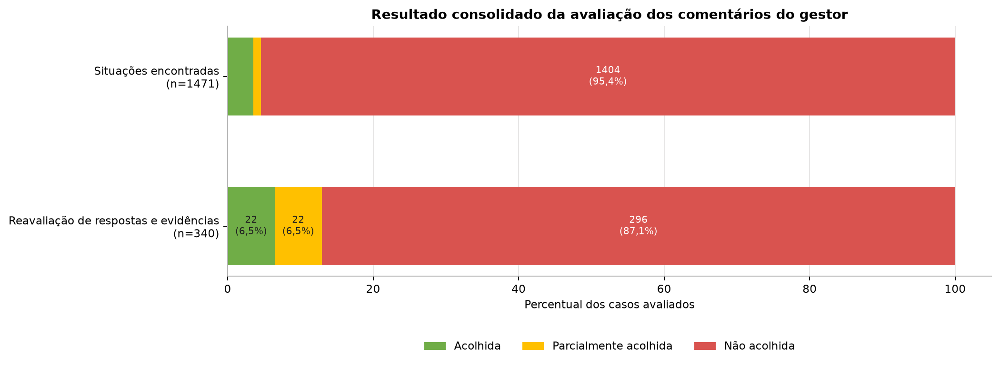{#fig:comentarios_resultados_avaliacao#}

(Fonte: elaboração própria a partir da avaliação consolidada)

### 4.3. Razões predominantes para o não acolhimento

O elevado número de manifestações não acolhidas não decorreu de desconsideração do contraditório. Em grande parte, foi consequência do próprio teor das respostas e da necessidade de separar reconhecimento do problema, providência posterior e comprovação de conformidade na data-base.

Primeiro, 626 manifestações reconheceram expressamente a situação e informaram que nenhuma medida havia sido adotada. Outras 584 declararam providências em curso. Esses dois grupos representam 82,3% das manifestações da primeira seção e, salvo quando acompanhados de elementos capazes de demonstrar que o diagnóstico original estava equivocado, confirmaram a manutenção da situação. Planos em elaboração, processos iniciados, intenção de regulamentar, compromisso de contratar e expectativa de implantação demonstram iniciativa, mas não comprovam atendimento concluído.

Segundo, parte das providências comprovadas ocorreu depois da data-base. Nesses casos, a manifestação foi relevante e produziu reconhecimento da melhoria atual, porém não afastou a situação que existia no período auditado. Esse tratamento preserva simultaneamente a exatidão histórica do relatório e o reconhecimento das ações corretivas adotadas pelo gestor.

Terceiro, diversas manifestações consistiram em declarações sem documentação verificável ou apresentaram elementos insuficientes, ilegíveis, incompletos, sem data, sem aprovação, sem demonstração de vigência ou sem vínculo direto com o critério questionado. A afirmação de que uma prática existe, desacompanhada de evidência pertinente e suficiente, não basta para comprovar sua institucionalização ou execução.

Quarto, documentos gerais ou exemplos pontuais nem sempre demonstraram todos os atributos avaliados. A existência de plano, contrato, inventário, sistema, comissão, ato normativo ou procedimento isolado não comprova, por si só, aprovação formal, abrangência institucional, atualização periódica, monitoramento, definição de responsabilidades, funcionamento efetivo ou aplicação sistemática. Da mesma forma, a regularidade jurídica de uma contratação não substitui a comprovação de sua governança técnica.

Quinto, limitações de pessoal, orçamento, estrutura, dependência de terceiros ou apoio de unidade central contextualizam a dificuldade de implementação, mas não eliminam o risco nem demonstram conformidade. Tais circunstâncias são relevantes para a definição de prazos e medidas proporcionais, e não para afastar automaticamente a deficiência.

Por fim, nos pedidos da segunda seção, o ajuste anterior somente poderia ser revertido quando os novos elementos comprovassem o item específico. Documentos relacionados ao tema, mas incapazes de demonstrar integralmente a prática afirmada, justificaram manutenção da resposta ajustada ou acolhimento apenas parcial.

## 5. Ajustes e impactos nos resultados da auditoria

### 5.1. Ajustes aplicados às respostas

A avaliação da primeira seção originou 89 propostas de ajuste: 13 referentes a situações afastadas na data-base e 76 a correções posteriores. A segunda seção originou 71 propostas. Após a consolidação de três sobreposições, foram aplicados 157 ajustes distintos, distribuídos por 42 organizações e 71 itens do questionário. Não restaram pendências de valor a serem resolvidas antes da aplicação.

Os ajustes restauraram somente valores anteriormente declarados e tecnicamente sustentados, sem atribuir nível de adoção superior ao informado pelo gestor. Nem todo ajuste repercute diretamente em situação, achado ou iGovTI, pois alguns itens não integram determinado cálculo, podem ser redundantes em uma regra composta ou podem não ser suficientes, isoladamente, para alterar a conclusão de um procedimento.

### 5.2. Redução de situações e achados

Na comparação por identidade, 64 situações deixaram de subsistir em 32 organizações. Como a reexecução integral também atualizou as combinações de condições que formam cada situação, o estoque agregado apresentou redução líquida de 57 registros, passando de 2.140 para 2.083, queda de 2,7%.

Seis achados foram afastados, cada um em uma organização distinta. O total agregado passou de 625 para 619 achados, redução de 1,0%. A redução de situações foi superior à de achados porque um achado pode permanecer caracterizado por outras situações inconformes ainda existentes na mesma organização.

### 5.3. Melhoria do iGovTI

O iGovTI aumentou em 22 das 113 organizações com resposta válida, sem redução do índice em qualquer organização. A média do grupo passou de 0,1841 para 0,1877, acréscimo de 0,0036, equivalente a 0,36 ponto percentual na escala de zero a um. Entre as 22 organizações cujo índice foi alterado, o aumento médio foi de 0,0184, ou 1,84 ponto percentual, e o maior acréscimo individual foi de 0,0604, ou 6,04 pontos percentuais.

: Síntese dos impactos dos comentários do gestor {#tbl:comentarios_sintese_impactos#}

| Dimensão | Resultado apurado |
|---|---:|
| Ajustes distintos aplicados | 157 |
| Organizações com respostas ajustadas | 42 |
| Situações removidas por identidade | 64, em 32 organizações |
| Redução líquida do estoque de situações | 57, de 2.140 para 2.083 |
| Achados afastados | 6, em 6 organizações |
| Redução do estoque de achados | de 625 para 619 |
| Organizações com aumento do iGovTI | 22 |
| Variação da média do iGovTI | de 0,1841 para 0,1877 |
| Organizações com algum impacto em situação, achado ou iGovTI | 37 |

(Fonte: elaboração própria a partir da comparação dos resultados anterior e posterior aos comentários do gestor)

Em 37 das 119 organizações houve impacto em pelo menos uma das três dimensões finais: situação encontrada, achado ou iGovTI. O alcance foi, portanto, material e individualizável, embora não tenha alterado de forma ampla o diagnóstico consolidado da fiscalização.

Esse alcance organizacional é apresentado na [@fig:comentarios_impactos_organizacoes].

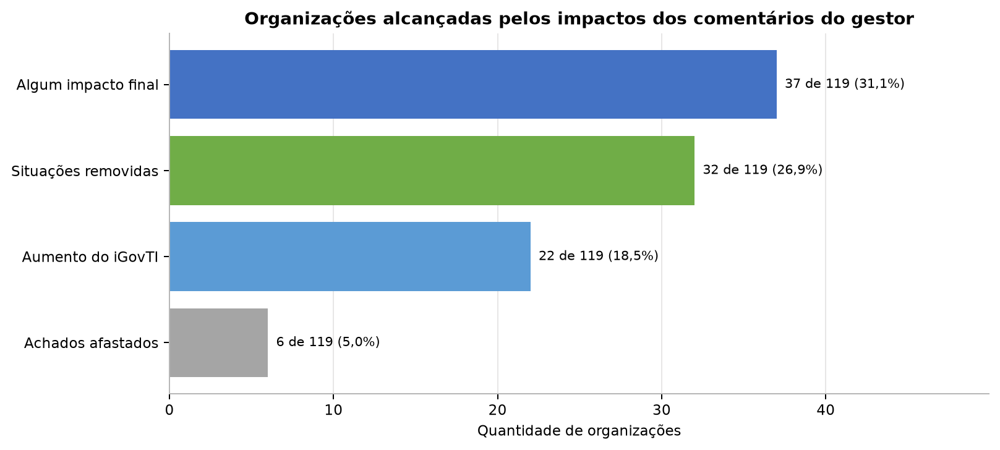{ width=85% }{#fig:comentarios_impactos_organizacoes#}

(Fonte: elaboração própria a partir da comparação dos resultados anterior e posterior aos comentários do gestor)

A [@fig:comentarios_saldo_situacoes_achados] evidencia a redução líquida dos estoques de situações e achados após a aplicação dos ajustes e a reexecução dos procedimentos de auditoria.

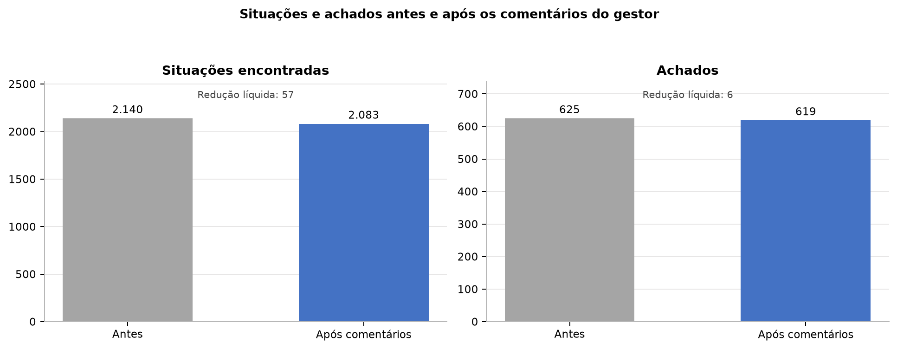{#fig:comentarios_saldo_situacoes_achados#}

(Fonte: elaboração própria a partir da comparação dos resultados anterior e posterior aos comentários do gestor)

A variação da média do iGovTI é apresentada na [@fig:comentarios_evolucao_igovti]. A escala do gráfico parte de zero, de modo a não ampliar visualmente a variação de 0,36 ponto percentual.

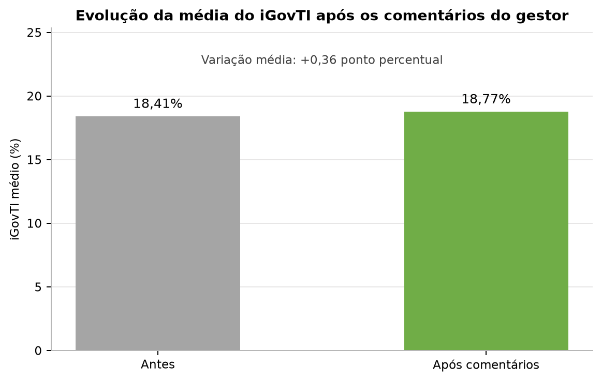{ width=70% }{#fig:comentarios_evolucao_igovti#}

(Fonte: elaboração própria a partir do recálculo do iGovTI)

## 6. Organizações sem resposta válida ao iGovTI 2026 - seção 3

A terceira seção do questionário foi destinada exclusivamente às seis organizações sem resposta válida ao iGovTI 2026: CEHAB, EMOP, PESAGRO, SEDCON, SEPOL e SESP. A finalidade foi permitir que confirmassem a ausência de resposta, prestassem esclarecimentos ou apresentassem elementos sobre as circunstâncias da não participação.

EMOP e PESAGRO responderam e confirmaram a inexistência de resposta válida ao questionário, sem apresentar justificativa ou documento comprobatório. CEHAB, SEDCON, SEPOL e SESP não se manifestaram nessa etapa.

: Manifestação das organizações sem resposta válida {#tbl:comentarios_nao_respondentes#}

| Organização | Manifestação na seção 3 | Resultado |
|---|---|---|
| CEHAB | Não | Ausência de esclarecimentos nesta etapa |
| EMOP | Sim | Confirmou a ausência de resposta válida, sem justificativa adicional |
| PESAGRO | Sim | Confirmou a ausência de resposta válida, sem justificativa adicional |
| SEDCON | Não | Ausência de esclarecimentos nesta etapa |
| SEPOL | Não | Ausência de esclarecimentos nesta etapa |
| SESP | Não | Ausência de esclarecimentos nesta etapa |

(Fonte: elaboração própria a partir das manifestações dos gestores)

Essas organizações não integraram o cálculo do iGovTI nem a apuração dos achados derivados do questionário. As duas confirmações corroboram a ausência de resposta válida, mas não constituem reconhecimento de responsabilidade. Para as quatro organizações que permaneceram silentes, não foram obtidos esclarecimentos adicionais. A eventual apuração das causas e responsabilidades deve ocorrer em procedimento próprio, com exame dos registros de comunicação e ciência, dos prazos concedidos e das circunstâncias individualizadas, assegurado o contraditório.

## 7. Saldo geral da etapa de comentários do gestor

A etapa cumpriu três funções. Em primeiro lugar, confirmou a aderência geral do diagnóstico, pois 84,0% das manifestações concordaram com as situações encontradas. Em segundo, permitiu corrigir conclusões específicas: houve 66 acolhimentos integrais ou parciais na análise das situações e 44 nos pedidos de reavaliação. Em terceiro, reconheceu providências posteriores sem reescrever a situação histórica da auditoria.

O saldo quantitativo foi de 157 ajustes em 42 organizações, com reflexo final em ao menos uma dimensão para 37 organizações. Foram removidas 64 situações por identidade, afastados seis achados e elevados os índices de 22 organizações. Apesar desses efeitos, permaneceram 2.083 situações e 619 achados no estado atualizado, e o aumento médio do iGovTI foi de 0,36 ponto percentual. Os resultados demonstram que o contraditório produziu correções concretas e rastreáveis, mas não alterou substancialmente o panorama de baixa maturidade identificado pela fiscalização.

As manifestações sobre medidas em curso e correções posteriores também possuem valor prospectivo. Ainda que não afastem a situação na data-base, fornecem subsídios para a elaboração e o acompanhamento dos planos de ação, especialmente quanto a responsáveis, prazos, produtos esperados e evidências de conclusão. O acompanhamento deverá verificar a implementação efetiva, e não apenas a existência de compromissos ou documentos preparatórios.

## 8. Conclusão

A análise dos comentários do gestor preservou o contraditório, corrigiu situações para as quais foram apresentados elementos suficientes e manteve os apontamentos cujo suporte probatório permaneceu válido. A predominância de não acolhimentos decorreu principalmente da concordância expressa com as deficiências, da ausência de medidas adotadas, da apresentação de providências ainda em curso ou posteriores à data-base e da insuficiência dos elementos para demonstrar todos os atributos exigidos pelos critérios de auditoria.

Os impactos verificados - 157 ajustes, 64 situações removidas, seis achados afastados e aumento do iGovTI em 22 organizações - confirmam que a etapa não foi meramente formal. Ao mesmo tempo, a permanência da maior parte das situações e dos achados demonstra que as manifestações acolhidas foram pontuais e não afastaram as conclusões estruturais do trabalho.

As decisões consolidadas, os ajustes e seus reflexos constituem papéis de trabalho rastreáveis e devem ser submetidos à validação final da Equipe de Auditoria antes da aprovação do relatório. Para as seis organizações sem resposta válida, a análise deve permanecer apartada dos resultados do iGovTI e dos achados derivados do questionário, sem prejuízo da apuração específica das circunstâncias da não participação.
