\newpage

## 1. Objetivo e escopo

Este anexo consolida a metodologia e os resultados da análise da etapa de comentários do gestor apresentados no âmbito da Fiscalização n.º 18/2026 - iGovTI 2026.

O exame abrangeu: (i) as manifestações sobre as situações encontradas e os encaminhamentos constantes dos relatórios individuais preliminares; (ii) os pedidos de reavaliação de respostas anteriormente ajustadas em razão da análise das evidências; e (iii) os esclarecimentos solicitados às organizações que não apresentaram resposta válida ao questionário iGovTI 2026.

A avaliação dos comentários do gestor teve por objetivo verificar a adoção das práticas mensuradas pelo questionário, considerando os esclarecimentos e as evidências complementares apresentados pelas organizações. A comprovação da prática fundamentou a atualização das respostas e das conclusões da auditoria.

## 2. Metodologia de avaliação

### 2.1. Preparação e delimitação das manifestações

Foram consideradas as submissões concluídas e mais recentes de cada organização. Havendo reenvio, a manifestação anterior foi desconsiderada, mas permaneceu registrada na memória de tratamento. Das 88 submissões recebidas, oito haviam sido substituídas por reenvios posteriores, resultando em 80 submissões válidas de 80 organizações.

Cada manifestação foi associada à situação encontrada, à questão ou ao item do questionário e aos critérios de auditoria correspondentes. Nos casos submetidos à avaliação individualizada, os comentários e os documentos foram examinados em conjunto. Anexos corrompidos, ilegíveis ou sem conteúdo aproveitável não foram utilizados como evidência.

A simples concordância, discordância ou solicitação de reavaliação não determinou o resultado. A conclusão considerou a aderência da manifestação ao critério avaliado, a pertinência, a suficiência e a vigência dos elementos apresentados, bem como sua capacidade de demonstrar a prática afirmada.

### 2.2. Avaliação das situações encontradas

A primeira seção do questionário permitiu ao gestor declarar, para cada situação encontrada apresentada no relatório individual preliminar, que: concordava e já havia atendido ao encaminhamento; concordava e estava adotando providências; concordava, mas ainda não havia adotado nenhuma medida; ou discordava do apontamento.

As 236 discordâncias e as 25 declarações de atendimento concluído foram submetidas a avaliações independentes e, em seguida, a uma consolidação. As 626 concordâncias sem medida adotada e as 584 concordâncias com providências em curso foram tratadas como manutenção da situação, sem exame individualizado de seus eventuais anexos.

O resultado de cada avaliação foi classificado em uma das seguintes categorias:

- **Acolhida**: os elementos comprovaram a prática avaliada ou afastaram os fundamentos da situação apontada;

- **Parcialmente acolhida**: os elementos justificaram alteração parcial dos fundamentos, sem afastar integralmente a situação;

- **Não acolhida**: a situação permaneceu caracterizada, inclusive quando os elementos apresentados foram insuficientes para afastá-la ou para alterar com segurança seus fundamentos.

A avaliação considerou a comprovação da prática segundo os critérios aplicáveis. Compromissos futuros ou providências ainda insuficientes não comprovaram o atendimento à prática.

### 2.3. Reavaliação das respostas e evidências

A segunda seção do questionário foi destinada às organizações cujas respostas haviam sido ajustadas após a avaliação das evidências originalmente encaminhadas. Cada pedido foi confrontado com os critérios específicos do item questionado e submetido ao mesmo processo de avaliações independentes e consolidação.

Antes dessa etapa, foram retirados do exame os itens já saneados de modo seguro pela análise da primeira seção, evitando dupla avaliação e decisões contraditórias. Os pedidos remanescentes foram classificados como acolhidos, parcialmente acolhidos ou não acolhidos. O acolhimento parcial foi utilizado quando apenas parte dos itens agrupados na solicitação recebeu comprovação suficiente.

Nessa seção, foram restaurados apenas os valores anteriormente declarados que receberam comprovação suficiente.

### 2.4. Aplicação dos ajustes e mensuração dos impactos

As respostas do questionário foram atualizadas conforme os acolhimentos registrados na análise dos comentários do gestor. Em seguida, foram recalculados os agregados e índices do iGovTI e reexecutados os procedimentos de auditoria. Para medir os efeitos dos ajustes, foram comparadas as respostas, as situações encontradas, os achados e o iGovTI antes e depois dessa etapa.

A quantidade de manifestações acolhidas não corresponde diretamente à quantidade de respostas alteradas. Uma única manifestação pode repercutir em vários itens, uma situação pode depender de mais de uma resposta e diferentes manifestações podem alcançar o mesmo item. Por essa razão, sobreposições foram consolidadas antes da aplicação dos ajustes.

## 3. Participação e cenário declarado pelos gestores

Participaram da etapa de comentários do gestor 80 das 119 organizações abrangidas (67,2%). Esse total compreende 78 das 113 organizações que haviam apresentado resposta válida ao questionário iGovTI 2026 (69,0%) e duas das seis organizações sem resposta válida (33,3%).

Das 113 organizações que responderam ao iGovTI 2026, 103 tiveram pelo menos um item ou subitem da resposta ajustado porque a evidência apresentada não comprovou a declaração correspondente. Para essas organizações, o questionário de comentários disponibilizou campos específicos para a apresentação de esclarecimentos ou evidências complementares e eventual reavaliação do ajuste. Entre as 103 organizações, 72 participaram da etapa e 56 apresentaram pelo menos um pedido de reavaliação. Esses recortes são apresentados na [@fig:comentarios_participacao].

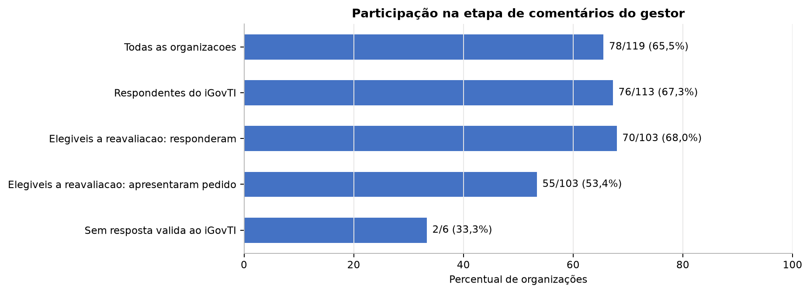{#fig:comentarios_participacao#}

(Fonte: elaboração própria a partir das manifestações dos gestores)

Em relação aos achados e situações encontradas apontadas no relatório individual preliminar foram registradas 1.471 manifestações. Houve concordância com o diagnóstico em 1.235 casos (84,0%) e discordância em 236 (16,0%). A concordância predominou em todos os seis achados.

: Posição declarada pelos gestores sobre as situações encontradas {#tbl:comentarios_posicao_declarada#}

| Posição declarada | Quantidade | Percentual |
|---|---:|---:|
| Concorda e declara atendimento concluído | 25 | 1,7% |
| Concorda e declara providências em curso | 584 | 39,7% |
| Concorda, sem medida adotada | 626 | 42,6% |
| Discorda da situação encontrada | 236 | 16,0% |
| **Total** | **1.471** | **100,0%** |

(Fonte: elaboração própria a partir das manifestações dos gestores)

A distribuição das quatro posições declaradas consta da [@fig:comentarios_panorama_geral].

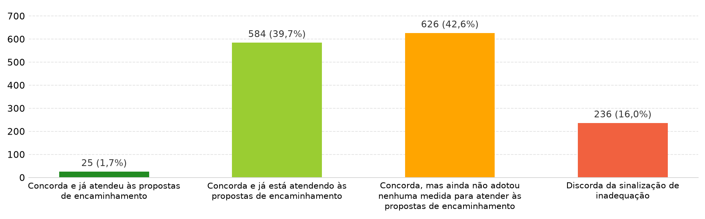{#fig:comentarios_panorama_geral#}

(Fonte: elaboração própria a partir das manifestações dos gestores)

Os dados evidenciam expressiva convergência com o diagnóstico preliminar, mas também revelam estágio ainda incipiente de correção. Somente 1,7% das manifestações declarou atendimento concluído, enquanto 42,6% reconheceu a situação sem qualquer medida adotada e 39,7% informou providências ainda em curso. Portanto, concordância com o apontamento e intenção de agir não se confundem com saneamento comprovado.

: Posição declarada por achado {#tbl:comentarios_posicao_por_achado#}

| Achado | Total | Atendimento concluído | Providências em curso | Sem medida | Discordância | Discordância (%) |
|---:|---:|---:|---:|---:|---:|---:|
| 1 | 52 | 4 | 25 | 20 | 3 | 5,8% |
| 2 | 148 | 6 | 63 | 55 | 24 | 16,2% |
| 3 | 321 | 8 | 131 | 128 | 54 | 16,8% |
| 4 | 339 | 1 | 130 | 174 | 34 | 10,0% |
| 5 | 375 | 1 | 156 | 158 | 60 | 16,0% |
| 6 | 236 | 5 | 79 | 91 | 61 | 25,8% |
| **Total** | **1.471** | **25** | **584** | **626** | **236** | **16,0%** |

(Fonte: elaboração própria a partir das manifestações dos gestores)

A composição proporcional das respostas em cada achado é apresentada na [@fig:comentarios_por_achado].

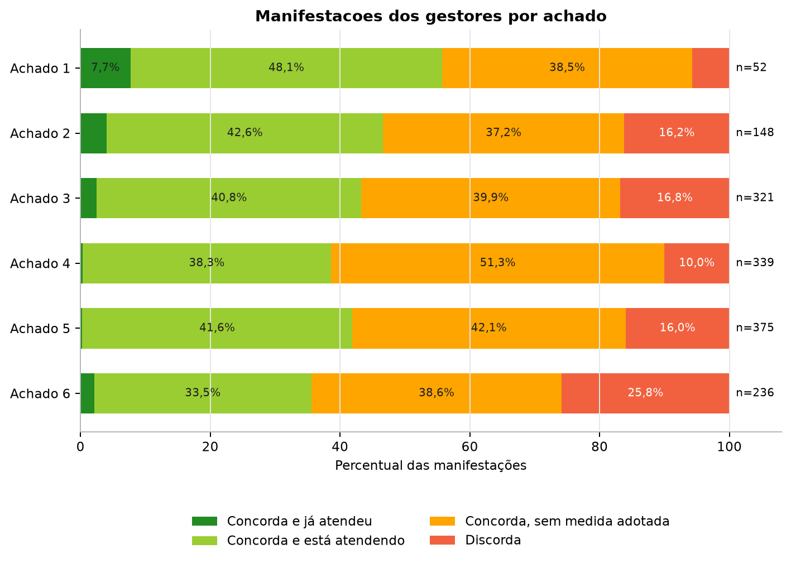{#fig:comentarios_por_achado#}

(Fonte: elaboração própria a partir das manifestações dos gestores)

O Achado 6, relativo à governança técnica das contratações de TIC, apresentou a maior proporção de discordâncias, seguido dos Achados 3, 2 e 5. As contestações concentraram-se em situações nas quais os gestores alegaram a existência de práticas, documentos gerais ou rotinas administrativas, mas os critérios exigiam demonstração adicional de formalização, abrangência, participação da área de TIC, integração ao planejamento ou funcionamento efetivo.

### 3.1. Distribuição das manifestações por situação encontrada

As figuras a seguir detalham as manifestações em cada situação que compõe os seis achados. A categoria "Situação encontrada inexistente" representa as organizações participantes cujo relatório individual não continha a situação correspondente. As quantidades e os percentuais de cada barra têm como referência as 78 organizações que receberam relatório preliminar e participaram da etapa.

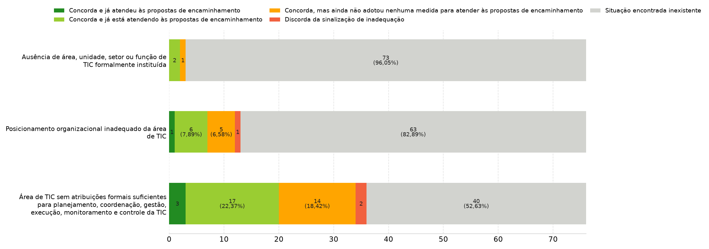{#fig:comentarios_achado_1#}

(Fonte: elaboração própria a partir das manifestações dos gestores)

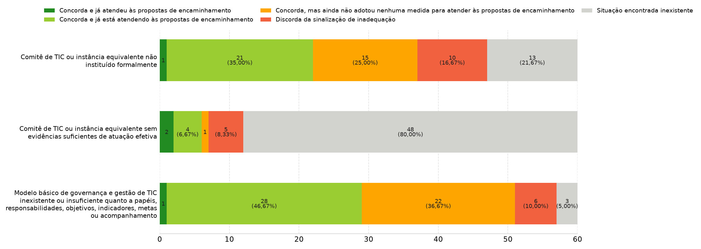{#fig:comentarios_achado_2#}

(Fonte: elaboração própria a partir das manifestações dos gestores)

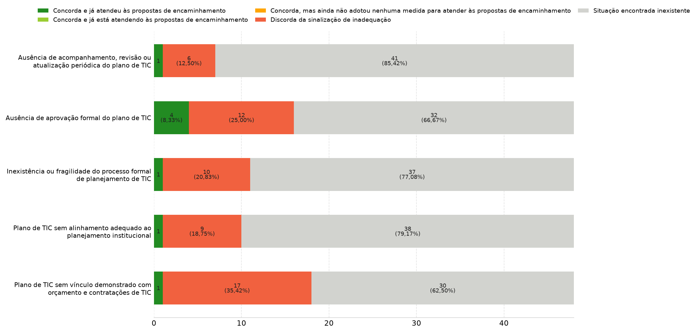{#fig:comentarios_achado_3#}

(Fonte: elaboração própria a partir das manifestações dos gestores)

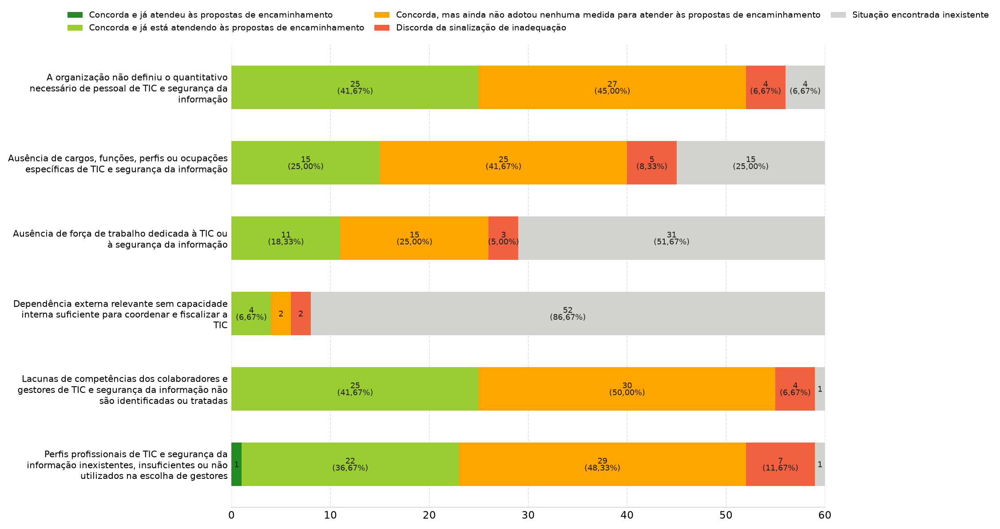{#fig:comentarios_achado_4#}

(Fonte: elaboração própria a partir das manifestações dos gestores)

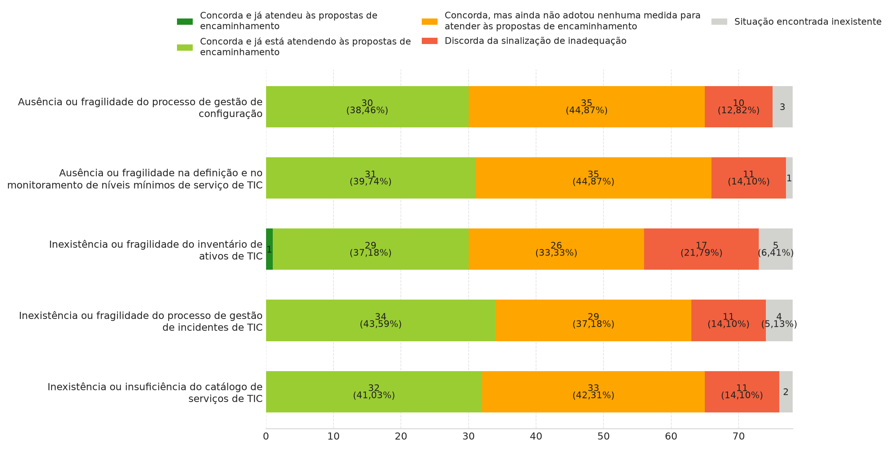{#fig:comentarios_achado_5#}

(Fonte: elaboração própria a partir das manifestações dos gestores)

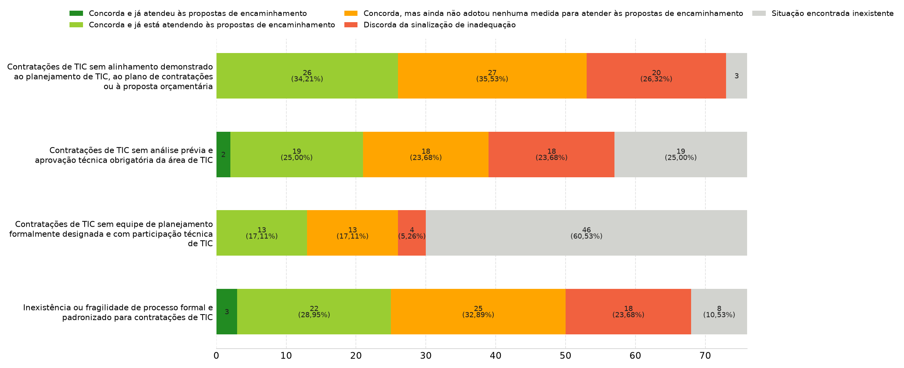{#fig:comentarios_achado_6#}

(Fonte: elaboração própria a partir das manifestações dos gestores)

## 4. Resultado da avaliação técnica

### 4.1. Manifestações sobre as situações encontradas

Das 1.471 manifestações da primeira seção, 261 demandaram avaliação individualizada: as 236 discordâncias e as 25 declarações de atendimento concluído. Nesse conjunto, 46 foram acolhidas integralmente, seis foram parcialmente acolhidas e alteraram parte dos fundamentos, sem afastamento integral, e 209 não foram acolhidas. As demais manifestações de concordância sem atendimento concluído confirmaram a permanência da situação e foram tratadas pelas regras objetivas do fluxo.

: Resultado da avaliação das situações encontradas {#tbl:comentarios_resultado_secao_1#}

| Resultado | Efeito sobre a situação avaliada | Quantidade | Percentual |
|---|---|---:|---:|
| Acolhida | Situação afastada no resultado final | 46 | 17,6% |
| Parcialmente acolhida | Situação mantida com alteração parcial de fundamentos | 6 | 2,3% |
| Não acolhida | Situação mantida | 209 | 80,1% |
| **Total submetido a decisão individualizada** |  | **261** | **100,0%** |

(Fonte: elaboração própria a partir da avaliação consolidada)

O cruzamento entre a resposta declarada pelo gestor e o resultado da análise consta da [@tbl:comentarios_cruzamento_manifestacao_resultado]. Os percentuais foram calculados dentro de cada tipo de manifestação, permitindo distinguir a posição do gestor da suficiência técnica dos elementos apresentados.

: Resposta do gestor e resultado da análise das situações encontradas {#tbl:comentarios_cruzamento_manifestacao_resultado#}

| Resposta do gestor | Acolhida | Parcialmente acolhida | Não acolhida | Total |
|---|---:|---:|---:|---:|
| Concorda e já fez | 5 (20,0%) | 1 (4,0%) | 19 (76,0%) | 25 |
| Discorda | 41 (17,4%) | 5 (2,1%) | 190 (80,5%) | 236 |
| **Total** | **46** | **6** | **209** | **261** |

(Fonte: elaboração própria a partir da avaliação consolidada)

Entre as 25 manifestações que declararam atendimento concluído, seis foram acolhidas integral ou parcialmente, enquanto 19 não apresentaram elementos suficientes para alterar a conclusão. As 1.210 concordâncias que informaram providências em andamento ou ausência de medida adotada não foram avaliada, ocasionando a permanência da situação, sem prejuízo do registro das providências para acompanhamento.

A posição declarada pelo gestor não determina o acolhimento. A análise técnica verifica se os esclarecimentos e as evidências comprovam a prática ou alteram os fundamentos do apontamento. Por isso, a declaração de atendimento concluído, sem comprovação suficiente, não afasta a situação.

Entre as 236 discordâncias, 41 foram acolhidas integralmente, cinco parcialmente e 190 não foram acolhidas. Consideradas também as declarações de atendimento concluído, o conjunto de acolhimentos integrais e parciais alcançou 52 das 261 manifestações submetidas a decisão individualizada, ou 19,9%.

### 4.2. Pedidos de reavaliação de respostas e evidências

Foram identificadas 707 combinações organização/questão-base elegíveis, correspondentes a 1.951 itens ou subitens originalmente avaliados como não conformes. Foram apresentados 340 pedidos de reavaliação por 56 organizações, acompanhados de 333 comentários e 116 anexos. Após a validação conjunta das duas seções, três casos já saneados de modo seguro pela primeira seção foram retirados da segunda para evitar dupla avaliação. Dos 337 casos remanescentes submetidos à avaliação técnica, 22 foram acolhidos integralmente, 24 parcialmente e 291 não foram acolhidos.

A [@fig:comentarios_reavaliacoes] apresenta as questões-base com maior número de pedidos antes da retirada dos casos já saneados pela primeira seção.

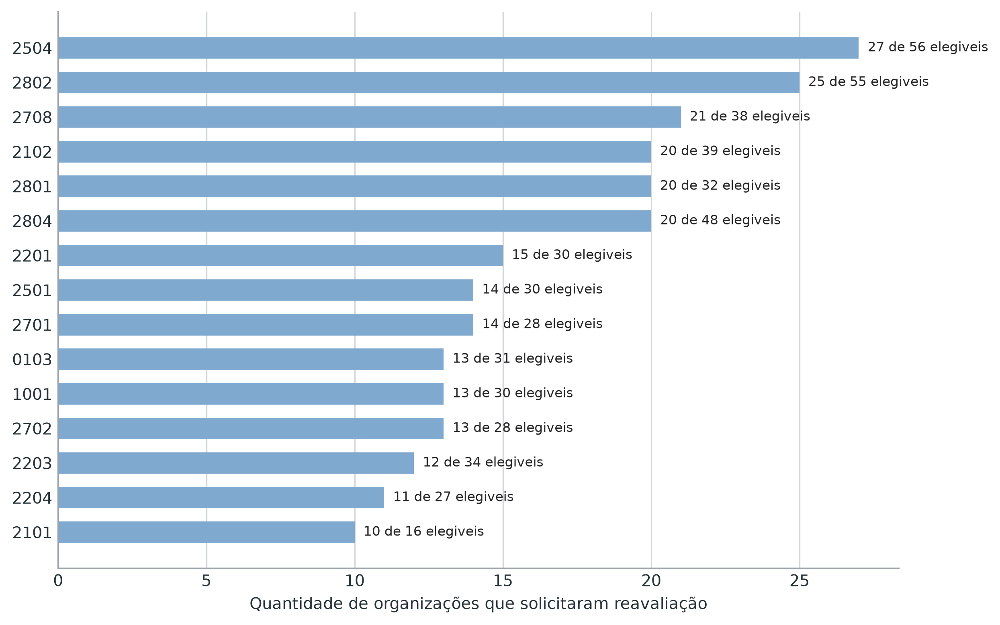{ width=85% }{#fig:comentarios_reavaliacoes#}

(Fonte: elaboração própria a partir das manifestações dos gestores)

: Resultado dos pedidos de reavaliação {#tbl:comentarios_resultado_secao_2#}

| Resultado | Quantidade | Percentual |
|---|---:|---:|
| Acolhida | 22 | 6,5% |
| Parcialmente acolhida | 24 | 7,1% |
| Não acolhida | 291 | 86,4% |
| **Total** | **337** | **100,0%** |

(Fonte: elaboração própria a partir da avaliação consolidada)

Os 46 acolhimentos integrais ou parciais correspondem a 13,6% dos casos reavaliados submetidos à decisão técnica. Como cada caso podia reunir diversos itens do questionário, o acolhimento parcial permitiu restaurar somente os itens efetivamente comprovados, mantendo os demais como não conformes.

A comparação visual entre os resultados das duas seções consta da [@fig:comentarios_resultados_avaliacao]. Os percentuais foram calculados separadamente sobre as 261 manifestações submetidas a decisão individualizada na primeira seção e os 337 casos remanescentes da segunda.

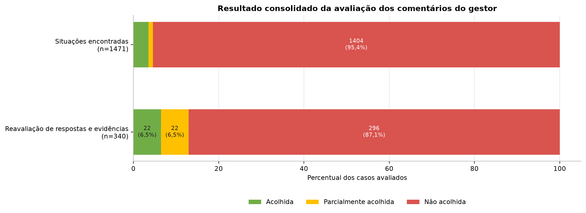{#fig:comentarios_resultados_avaliacao#}

(Fonte: elaboração própria a partir da avaliação consolidada)

### 4.3. Razões para o não acolhimento

Os não acolhimentos referem-se apenas aos casos submetidos à avaliação técnica individualizada. Na primeira seção, foram 209 dos 261 casos avaliados, ou 80,1%. Na segunda, foram 291 dos 337 pedidos, ou 86,4%. Esses denominadores são distintos do total de manifestações recebidas.

As 626 concordâncias sem medida adotada e as 584 concordâncias com declaração de providências em curso totalizaram 1.210 manifestações, ou 82,3% da primeira seção. Seus eventuais anexos não foram submetidos à avaliação individualizada. Esses grupos não integram os 209 não acolhimentos e não explicam a decisão técnica desses casos.

Diversas manifestações consistiram em declarações sem documentação verificável ou apresentaram elementos insuficientes, ilegíveis, incompletos, sem data, sem aprovação, sem demonstração de vigência ou sem vínculo direto com o critério questionado. A afirmação de que uma prática existe, desacompanhada de evidência pertinente e suficiente, não basta para comprovar sua institucionalização ou execução.

Documentos gerais ou exemplos pontuais nem sempre demonstraram todos os atributos avaliados. A existência de plano, contrato, inventário, sistema, comissão, ato normativo ou procedimento isolado não comprova, por si só, aprovação formal, abrangência institucional, atualização periódica, monitoramento, definição de responsabilidades, funcionamento efetivo ou aplicação sistemática. Da mesma forma, a regularidade jurídica de uma contratação não substitui a comprovação de sua governança técnica.

Limitações de pessoal, orçamento, estrutura, dependência de terceiros ou apoio de unidade central explicam dificuldades de implementação, mas não comprovam a adoção da prática. Essas circunstâncias podem orientar a definição de prazos e medidas proporcionais.

Por fim, nos pedidos da segunda seção, o ajuste anterior somente poderia ser revertido quando os novos elementos comprovassem o item específico. Documentos relacionados ao tema, mas incapazes de demonstrar integralmente a prática afirmada, justificaram manutenção da resposta ajustada ou acolhimento apenas parcial.

## 5. Impactos da etapa de Comentários do Gestor

Os ajustes decorrentes da comprovação das práticas foram incorporados às respostas e aos resultados finais. Seus efeitos sobre as situações encontradas, os achados e o iGovTI são apresentados a seguir.

### 5.1. Ajustes aplicados às respostas

A consolidação das duas seções e das revisões técnicas documentadas resultou em 153 alterações efetivas, em 41 organizações e 72 itens ou subitens do questionário.

Na segunda seção, foram restauradas respostas anteriores que receberam comprovação suficiente. Na primeira, a comprovação das práticas também fundamentou a atualização dos itens correspondentes. Nem toda alteração de resposta modifica uma situação, um achado ou o iGovTI, pois seu efeito depende dos itens incluídos no cálculo e dos procedimentos de auditoria aplicados.

### 5.2. Redução de situações e achados

Na comparação de cada situação por organização, 47 situações foram afastadas em 28 organizações e oito foram acrescentadas.[^acrescimos_comites] O total apresentou redução líquida de 39 situações, passando de 1.458 para 1.419, queda de 2,7%. A comparação utiliza os mesmos procedimentos revisados nos dois cenários, conforme descrito na seção 2.4.

[^acrescimos_comites]: As oito situações acrescentadas correspondem às organizações FSC, IPEM, IVB, JAPERI, LOTERJ, SEDEICS, SEINFRA e SEPM. Para elas a avaliação dos comentários do gestor reconheceu a instituição formal dos comitês de TIC. Com base nos atos apresentados ou verificados, o item do questionário sobre a existência do comitê foi ajustado, afastando a situação de comitê não instituído formalmente.

    O item sobre funcionamento do comitê não foi alterado, permaneceu como vazio em sete organizações e negativo ("Não") na SEINFRA. Nas sete organizações, os detalhamentos não haviam sido disponibilizados em razão do nível de adoção assinalado na questão principal. Portanto, representa um item não respondido e não uma declaração de ausência de funcionamento.

    Na reexecução dos procedimentos de auditoria, a combinação entre existência reconhecida e funcionamento não declarado ativou a regra de atuação efetiva não comprovada. Assim, foram retiradas oito situações relativas à instituição formal e acrescentadas oito relativas ao seu funcionamento.

Foram afastadas 11 marcações de achado em nove organizações. O total agregado passou de 602 para 591 marcações, redução de 1,8%. A redução de situações foi superior à de achados porque um achado pode permanecer caracterizado por outras situações inconformes ainda existentes na mesma organização.

### 5.3. Melhoria do iGovTI

O iGovTI aumentou em 23 das 113 organizações com resposta válida, sem redução do índice em qualquer organização. A média do grupo passou de 0,1841 para 0,1890, acréscimo de 0,0049, equivalente a 0,49 ponto percentual na escala de zero a um. Entre as 23 organizações cujo índice foi alterado, o aumento médio foi de 0,0242, ou 2,42 pontos percentuais, e o maior acréscimo individual foi de 0,1601, ou 16,01 pontos percentuais.

: Síntese dos impactos dos comentários do gestor {#tbl:comentarios_sintese_impactos#}

| Dimensão | Resultado apurado |
|---|---:|
| Registros de ajuste consolidados | 160 |
| Respostas efetivamente alteradas | 153 |
| Organizações com respostas ajustadas | 41 |
| Situações removidas por identidade | 47, em 28 organizações |
| Situações acrescentadas por identidade | 8 |
| Redução líquida do estoque de situações | 39, de 1.458 para 1.419 |
| Marcações de achado afastadas | 11, em 9 organizações |
| Redução do estoque de achados | de 602 para 591 |
| Organizações com aumento do iGovTI | 23 |
| Variação da média do iGovTI | de 0,1841 para 0,1890 |
| Organizações com algum impacto em situação, achado ou iGovTI | 34 |

(Fonte: elaboração própria a partir da comparação dos resultados anterior e posterior aos comentários do gestor)

Em 34 das 119 organizações houve impacto em pelo menos uma das três dimensões finais: situação encontrada, achado ou iGovTI. O alcance foi, portanto, material e individualizável, embora não tenha alterado de forma ampla o diagnóstico consolidado da fiscalização.

Esse alcance organizacional é apresentado na [@fig:comentarios_impactos_organizacoes].

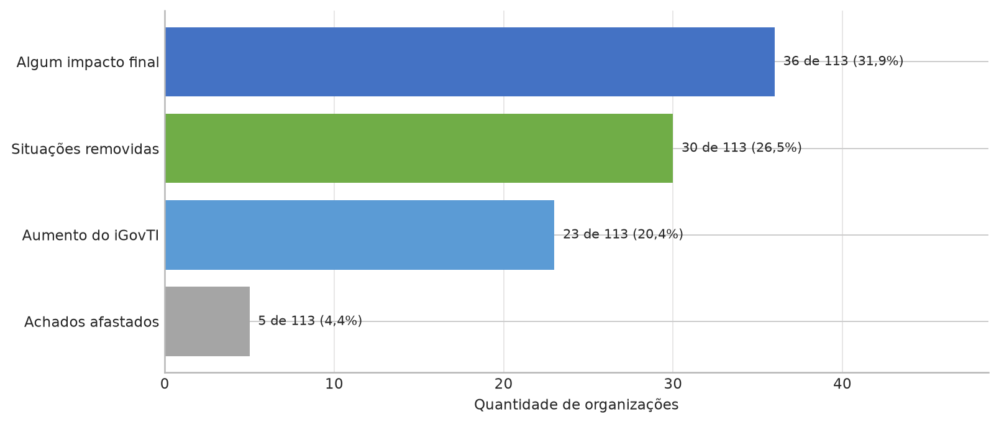{ width=85% }{#fig:comentarios_impactos_organizacoes#}

(Fonte: elaboração própria a partir da comparação dos resultados anterior e posterior aos comentários do gestor)

A [@fig:comentarios_saldo_situacoes_achados] evidencia a redução líquida das quantias de situações e achados após a aplicação dos ajustes e a reexecução dos procedimentos de auditoria.

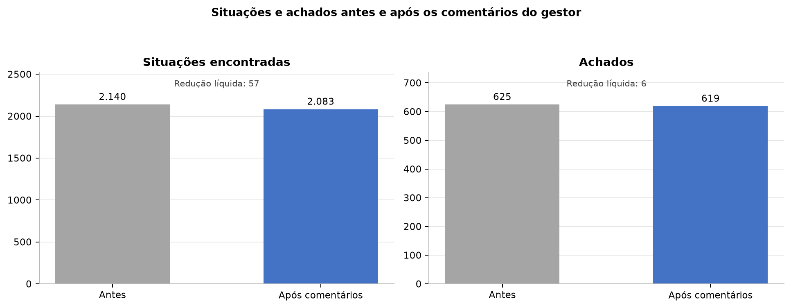{#fig:comentarios_saldo_situacoes_achados#}

(Fonte: elaboração própria a partir dos cenários anterior e posterior aos comentários do gestor, recalculados com os mesmos procedimentos revisados)

A variação da média do iGovTI é apresentada na [@fig:comentarios_evolucao_igovti]. A escala do gráfico parte de zero, de modo a não ampliar visualmente a variação de 0,49 ponto percentual.

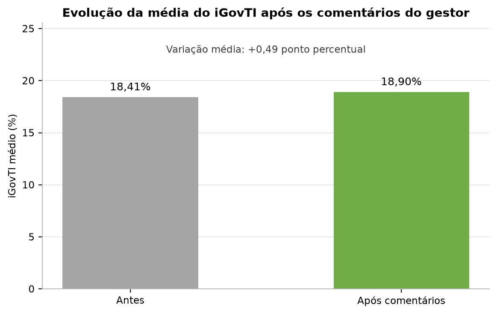{ width=70% }{#fig:comentarios_evolucao_igovti#}

(Fonte: elaboração própria a partir do recálculo do iGovTI)

## 6. Organizações sem resposta válida ao iGovTI 2026

A terceira seção do questionário foi destinada exclusivamente às seis organizações sem resposta válida ao iGovTI 2026: CEHAB, EMOP, PESAGRO, SEDCON, SEPOL e SESP. A finalidade foi permitir que confirmassem a ausência de resposta, prestassem esclarecimentos ou apresentassem elementos sobre as circunstâncias da não participação.

EMOP e PESAGRO concluíram a seção 3 e confirmaram a ausência de resposta válida ao iGovTI, sem justificativa ou documento nesse instrumento. CEHAB, SEDCON, SEPOL e SESP não concluíram essa seção. A EMOP também possuía preenchimento parcial do iGovTI, com cinco anexos, e pedido de reabertura de 23/06/2026 por afastamento de saúde. A SESP apresentou esclarecimentos por e-mail e pelo Ofício SESP-GABSEC nº 1.067, fora do LimeSurvey, sobre a substituição do ponto focal e o acesso expirado. Essas circunstâncias constam da Seção 4.5 do relatório de auditoria e devem ser consideradas na apuração individualizada.

: Manifestação das organizações sem resposta válida {#tbl:comentarios_nao_respondentes#}

| Organização | Manifestação na seção 3 | Resultado |
|---|---|---|
| CEHAB | Não | Ausência de esclarecimentos nesta etapa |
| EMOP | Sim | Confirmou a ausência de resposta válida, sem justificativa adicional |
| PESAGRO | Sim | Confirmou a ausência de resposta válida, sem justificativa adicional |
| SEDCON | Não | Ausência de esclarecimentos nesta etapa |
| SEPOL | Não | Ausência de esclarecimentos nesta etapa |
| SESP | Não | Esclarecimentos recebidos fora do questionário, considerados qualitativamente |

(Fonte: elaboração própria a partir das manifestações dos gestores)

Essas organizações não integraram o cálculo do iGovTI nem a apuração dos achados derivados do questionário. As duas confirmações corroboram a ausência de resposta válida, mas não constituem reconhecimento de responsabilidade. CEHAB, SEDCON e SEPOL não apresentaram esclarecimentos nessa etapa. A manifestação da SESP fora do questionário foi considerada na análise qualitativa. A eventual apuração das causas e responsabilidades deve ocorrer em procedimento próprio, com exame dos registros de comunicação e ciência, dos prazos concedidos e das circunstâncias individualizadas, assegurado o contraditório.

Os seis procedimentos de responsabilização foram autuados em 30/09/2026, por solicitação da CAD-TI à CGD. Os números e a natureza de autuação constam da Seção 4.5 do relatório de auditoria. A autuação não antecipa conclusão sobre obstrução, sonegação ou responsabilidade.

## 7. Saldo geral da etapa de comentários do gestor

A etapa permitiu esclarecer informações, comprovar práticas e atualizar as respostas e as conclusões da auditoria. Houve concordância com as situações encontradas em 84,0% das manifestações. Entre os casos avaliados individualmente, ocorreram 52 acolhimentos integrais ou parciais nas 261 manifestações da primeira seção e 46 nos 337 pedidos de reavaliação da segunda.

Os 160 registros de ajuste resultaram em 153 alterações de resposta em 41 organizações, com efeito sobre situações, achados ou iGovTI em 34 organizações. Foram afastadas 47 situações, acrescentadas oito, afastadas 11 marcações de achado e elevados os índices de 23 organizações. No resultado final, permaneceram 1.419 situações e 591 marcações por organização e achado. O aumento médio do iGovTI foi de 0,49 ponto percentual, sem alteração substancial do panorama de baixa maturidade identificado pela fiscalização.

As informações sobre medidas em curso podem subsidiar os planos de ação, mas não substituem a comprovação da adoção das práticas.

## 8. Conclusão

A análise dos comentários permitiu atualizar o diagnóstico conforme a comprovação da adoção das práticas. Nos casos não acolhidos, os elementos examinados foram insuficientes para demonstrar os atributos exigidos pelos critérios ou afastar os fundamentos dos apontamentos.

As 153 alterações efetivas de resposta, as 47 situações inconformes afastadas, as oito acrescentadas, as 11 marcações de achado afastadas e o aumento do iGovTI em 23 organizações demonstram os efeitos da avaliação. A permanência da maior parte das situações e dos achados indica que esses ajustes não modificaram as conclusões gerais da fiscalização.