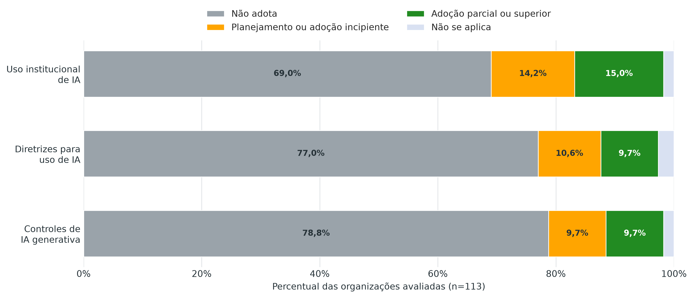

\newpage

# 1. Objetivo

Este anexo apresenta análise das respostas às questões do questionário iGovTI 2026 relacionadas à inteligência artificial, compreendendo as questões 3001 a 3006. O objetivo é oferecer visão consolidada sobre o grau de utilização de IA pelos auditados do TCE-RJ, os usos declarados, as contratações realizadas, as diretrizes existentes, os controles sobre IA generativa e os principais riscos identificados.

A análise tem caráter diagnóstico. Não substitui fiscalização específica sobre soluções de IA, contratos, bases de dados, modelos, algoritmos ou decisões automatizadas. As conclusões devem ser lidas como retrato consolidado das declarações dos auditados ao questionário aplicado na fiscalização.

# 2. Metodologia

Foram utilizadas as respostas do questionário iGovTI 2026, com data de referência de 16/07/2026. O universo analisado corresponde a **113 organizações**.

As questões avaliadas foram:

* **3001**: uso institucional de inteligência artificial;
* **3002**: diretrizes para o uso da inteligência artificial;
* **3003**: contratação de soluções ou serviços com IA;
* **3004**: dificuldades de planejamento e contratação de soluções de IA;
* **3005**: medidas para identificar e controlar uso não autorizado ou não mapeado de IA generativa;
* **3006**: descrição aberta dos principais usos existentes.

As contagens e os cruzamentos deste anexo foram calculados a partir da base final de respostas. Os resultados constituem diagnóstico das autodeclarações e não atestam a comprovação documental das práticas, contratações ou controles informados.

A questão 3006 possui natureza descritiva. Suas respostas foram categorizadas de forma interpretativa para identificar temas recorrentes. Essa categorização não equivale à validação independente da existência, maturidade, segurança ou efetividade das soluções descritas.

# 3. Cenário geral

O cenário geral indica baixa institucionalização do uso de inteligência artificial nos auditados. Embora existam iniciativas relevantes e organizações com sinais de maior maturidade, a maior parte do universo avaliado declarou não adotar IA de forma institucional, não possuir diretrizes específicas e não adotar medidas para identificar ou controlar o uso de IA generativa.

: Síntese do cenário de IA {#tbl:avaliacao_ia_resumo#}

| Indicador | Quantidade | Percentual |
|---|---:|---:|
| Organizações respondentes | 113 | 100,0% |
| Declararam algum grau de uso institucional, decisão formal ou plano para IA | 33 | 29,2% |
| Declararam adoção efetiva de IA, ainda que em menor parte | 30 | 26,5% |
| Declararam adoção parcial ou em maior parte/total de IA | 17 | 15,0% |
| Declararam diretrizes de IA em algum grau, decisão formal ou plano | 23 | 20,4% |
| Declararam diretrizes parciais ou em maior parte/totais | 11 | 9,7% |
| Declararam contratação de IA em ao menos uma categoria | 22 | 19,5% |
| Declararam controles de IA generativa em algum grau, decisão formal ou plano | 22 | 19,5% |
| Declararam controles de IA generativa parciais ou em maior parte/totais | 11 | 9,7% |

(Fonte: elaboração própria, com base nas respostas do questionário iGovTI 2026)

O dado mais relevante é o descompasso entre os usos declarados de IA e a adoção declarada de diretrizes e controles institucionais. Apenas **11 organizações (9,7%)** declararam diretrizes de IA em nível parcial ou superior, e apenas **11 organizações (9,7%)** declararam controles de IA generativa em nível parcial ou superior. Esse cenário sugere que, na maioria dos auditados, o tema ainda não foi incorporado de forma estruturada à governança de TI, à segurança da informação, à gestão de riscos ou às contratações.

A [@fig:institucionalizacao_ia] compara os estágios declarados de utilização institucional, diretrizes e controles de IA generativa. A visualização evidencia que a baixa adoção não se restringe ao uso da tecnologia, alcançando também os mecanismos necessários para governá-la e controlar seus riscos.

{#fig:institucionalizacao_ia#}

(Fonte: elaboração própria, com base nas respostas do questionário iGovTI 2026)

# 4. Grau de utilização institucional

Na questão 3001, **78 organizações (69,0%)** declararam não adotar inteligência artificial de forma institucional. Outras **2 organizações (1,8%)** indicaram que a questão não se aplica. Entre as demais, há diferentes estágios de maturidade: 13 declararam adoção em menor parte, 9 adoção parcial, 8 adoção em maior parte ou total, e 3 indicaram decisão formal ou plano aprovado para adoção.

: Distribuição do uso institucional de IA {#tbl:avaliacao_ia_q3001#}

| Resposta à 3001 | Quantidade | Percentual |
|---|---:|---:|
| Não adota | 78 | 69,0% |
| Adota em menor parte | 13 | 11,5% |
| Adota parcialmente | 9 | 8,0% |
| Adota em maior parte ou totalmente | 8 | 7,1% |
| Há decisão formal ou plano aprovado para adotá-lo | 3 | 2,7% |
| Não se aplica | 2 | 1,8% |

(Fonte: elaboração própria, com base nas respostas do questionário iGovTI 2026)

Os subitens da 3001 demonstram que a adoção ainda é incipiente mesmo entre organizações que declararam algum uso ou planejamento. Apenas **14 organizações (12,4%)** afirmaram identificar e avaliar continuamente oportunidades de IA; **13 (11,5%)** declararam executar projetos-piloto ou provas de conceito; **11 (9,7%)** declararam desenvolver internamente soluções de IA; **11 (9,7%)** afirmaram possuir IA em produção em processos administrativos internos; **12 (10,6%)** em atividades finalísticas ou serviços ao cidadão; e **9 (8,0%)** indicaram equipe, comitê ou responsáveis técnicos formalmente designados.

Esses números indicam que as iniciativas existentes parecem concentrar-se em grupos restritos de organizações. Também sugerem risco de fragmentação: parte dos auditados declara uso ou projetos de IA, mas nem sempre há estrutura formal de governança, responsáveis designados ou controles correspondentes.

# 5. Diretrizes, governança e controles

A governança do uso de IA ainda é menos disseminada que a própria adoção. Na 3002, **87 organizações (77,0%)** declararam não possuir diretrizes para uso de IA. Apenas **8 organizações (7,1%)** declararam adotar diretrizes em maior parte ou totalmente, e **3 (2,7%)** declararam adoção parcial.

: Distribuição das diretrizes para uso de IA {#tbl:avaliacao_ia_q3002#}

| Resposta à 3002 | Quantidade | Percentual |
|---|---:|---:|
| Não adota | 87 | 77,0% |
| Adota em maior parte ou totalmente | 8 | 7,1% |
| Há decisão formal ou plano aprovado para adotá-lo | 7 | 6,2% |
| Adota em menor parte | 5 | 4,4% |
| Adota parcialmente | 3 | 2,7% |
| Não se aplica | 3 | 2,7% |

(Fonte: elaboração própria, com base nas respostas do questionário iGovTI 2026)

Entre os controles específicos declarados, os percentuais também são baixos no universo total. Somente **10 organizações (8,8%)** declararam regras sobre o uso de dados institucionais, pessoais ou sensíveis em prompts; **6 (5,3%)** declararam obrigatoriedade de avaliação de riscos antes da implantação de IA; **7 (6,2%)** declararam mecanismos de revisão humana; e **8 (7,1%)** declararam testes, validações ou avaliações antes do uso institucional.

Esses resultados são relevantes porque os riscos de IA decorrem menos da tecnologia isoladamente e mais do seu uso sem salvaguardas. A ausência de regras sobre dados em prompts, avaliação de riscos, validação prévia e revisão humana aumenta a probabilidade de exposição de dados, decisões inadequadas, dependência de fornecedores, uso de respostas incorretas e dificuldade de responsabilização.

# 6. Contratações e dificuldades declaradas

Na 3003, **19 organizações (16,8%)** declararam ter contratado soluções SaaS ou plataformas com funcionalidades de IA; **10 (8,8%)** declararam contratação de soluções de IA generativa; e **11 (9,7%)** declararam contratação de serviços especializados relacionados à IA, como consultoria, treinamento, desenvolvimento ou sustentação.

: Contratações relacionadas à IA {#tbl:avaliacao_ia_q3003#}

| Tipo de contratação declarada | Quantidade | Percentual |
|---|---:|---:|
| SaaS ou plataforma com funcionalidade de IA | 19 | 16,8% |
| Solução de IA generativa | 10 | 8,8% |
| Serviço especializado relacionado à IA | 11 | 9,7% |

(Fonte: elaboração própria, com base nas respostas do questionário iGovTI 2026)

Nas descrições e nos documentos apresentados no campo de evidência da questão 3003, são recorrentes: no item (a), plataformas de gestão administrativa, colaboração e automação, com funcionalidades de IA para atendimento e apoio às atividades institucionais; no item (b), assistentes de IA generativa, como Gemini, Copilot e ChatGPT, disponibilizados por licenças próprias ou integrados a ferramentas de produtividade, como Google Workspace e Microsoft 365; e, no item (c), serviços de desenvolvimento, evolução e sustentação de soluções, suporte técnico e capacitação em IA.

Entre os respondentes da 3004, as dificuldades mais recorrentes foram: integrar soluções de IA aos sistemas corporativos existentes, indicada por **12 organizações**; identificar e comparar soluções disponíveis no mercado, indicada por **9**; definir objeto, escopo, entregas e responsabilidades, indicada por **8**; estimar preços, quantitativos ou consumo, indicada por **8**; planejar implantação, integração, treinamento ou gestão da mudança, indicada por **8**; e definir exigências de proteção de dados e LGPD, indicada por **8**.

: Principais dificuldades de contratação de IA indicadas na 3004 {#tbl:avaliacao_ia_q3004#}

| Dificuldade declarada | Quantidade |
|---|---:|
| Integrar soluções de IA aos sistemas corporativos existentes | 12 |
| Identificar e comparar soluções disponíveis no mercado | 9 |
| Definir objeto, escopo, entregas e responsabilidades | 8 |
| Estimar preços, quantitativos ou consumo | 8 |
| Planejar implantação, integração, treinamento ou gestão da mudança | 8 |
| Definir proteção de dados, LGPD e garantias sobre não uso dos dados para treinamento de modelos públicos | 8 |

(Fonte: elaboração própria, com base nas respostas do questionário iGovTI 2026)

O conjunto dessas respostas indica que a contratação de IA ainda apresenta desafios de planejamento técnico e jurídico. As dificuldades não se restringem à escolha da solução, incluem especificação de requisitos, integração, fiscalização, proteção de dados, mensuração de custos e definição de responsabilidades. Isso reforça a necessidade de orientação técnica e de modelos mínimos de contratação, especialmente para soluções que envolvam IA generativa ou tratamento de dados pessoais e sensíveis.

# 7. Uso de IA generativa e risco de uso não mapeado

A 3005 trata de medidas para identificar e controlar o uso não autorizado ou não mapeado de IA generativa. O resultado é crítico: **89 organizações (78,8%)** declararam não adotar tais medidas. Apenas **4 organizações (3,5%)** declararam adotar controles em maior parte ou totalmente, e **7 (6,2%)** indicaram adoção parcial.

: Controles sobre uso não autorizado ou não mapeado de IA generativa {#tbl:avaliacao_ia_q3005#}

| Resposta à 3005 | Quantidade | Percentual |
|---|---:|---:|
| Não adota | 89 | 78,8% |
| Adota parcialmente | 7 | 6,2% |
| Há decisão formal ou plano aprovado para adotá-lo | 6 | 5,3% |
| Adota em menor parte | 5 | 4,4% |
| Adota em maior parte ou totalmente | 4 | 3,5% |
| Não se aplica | 2 | 1,8% |

(Fonte: elaboração própria, com base nas respostas do questionário iGovTI 2026)

As respostas aos subitens da 3005 também indicam baixa adoção declarada dos controles. Apenas **4 organizações (3,5%)** declararam identificar ferramentas públicas de IA generativa acessadas na rede corporativa; **6 (5,3%)** declararam definir ferramentas autorizadas, restritas ou vedadas; **5 (4,4%)** declararam controles técnicos para reduzir o uso de ferramentas não homologadas; e **5 (4,4%)** declararam processo de avaliação e homologação de novas ferramentas.

Esse é um dos pontos de maior risco do diagnóstico. Mesmo organizações que não reconhecem formalmente o uso institucional de IA podem estar expostas ao uso individual de ferramentas generativas por servidores, colaboradores ou terceirizados. Sem mapeamento, orientação, restrição, homologação ou monitoramento, aumenta o risco de inserção de dados pessoais, informações sigilosas, minutas, pareceres, documentos internos ou bases institucionais em plataformas externas sem avaliação de segurança, privacidade e conformidade.

# 8. Usos declarados na questão aberta

A questão 3006 recebeu **90 respostas não vazias (79,6%)**. Contudo, parte expressiva dessas respostas apenas informou ausência de uso, não institucionalização ou inexistência de solução formal.

A categorização interpretativa das respostas abertas indicou os seguintes temas recorrentes. Uma resposta pode integrar mais de uma categoria. Os percentuais têm como denominador as 113 organizações e não devem ser somados.

: Categorias identificadas nas respostas abertas da 3006 {#tbl:avaliacao_ia_q3006#}

| Categoria | Quantidade | Percentual |
|---|---:|---:|
| Ausência de uso declarada ou não institucionalização | 35 | 31,0% |
| Contratação ou solução de terceiro | 32 | 28,3% |
| Apoio textual, pesquisa e produtividade | 28 | 24,8% |
| Automação administrativa ou processual | 25 | 22,1% |
| Desenvolvimento de software ou suporte técnico | 23 | 20,4% |
| Análise de dados, BI ou apoio à decisão | 22 | 19,5% |
| Projeto-piloto, estudo ou prova de conceito | 17 | 15,0% |
| Assistente virtual, chatbot ou atendimento | 15 | 13,3% |
| Segurança, fraude ou fiscalização | 8 | 7,1% |

(Fonte: elaboração própria, com base na categorização interpretativa das respostas abertas da 3006)

As respostas sugerem que os usos declarados se concentram em apoio textual, pesquisa, elaboração de documentos, assistentes virtuais, automação de rotinas, análise de dados, apoio a serviços internos e integração com soluções de terceiros. Também há menções a projetos em desenvolvimento, provas de conceito e estudos preliminares.

Esse padrão sugere estágio inicial de adoção, marcado por experimentação, projetos localizados e uso de ferramentas de produtividade.

# 9. Principais riscos identificados

A análise das respostas aponta riscos indicativos que merecem atenção prioritária em futuras ações de controle. Esses riscos não constituem achados individualizados, mas sinalizam áreas em que a exposição institucional pode ser relevante.

Além do universo geral de **113 organizações**, os indicadores são apresentados para o grupo de **35 organizações com uso ou contratação declarada de IA**.[^grupo_riscos_ia]

No grupo de uso ou contratação, **21 organizações (60,0%)** não declararam adoção de diretrizes e **22 (62,9%)** não declararam adoção de controles sobre IA generativa.[^criterios_riscos_ia]

[^grupo_riscos_ia]: O grupo reúne as 30 organizações que informaram adoção em menor parte, parcial ou em maior parte/total na questão 3001 e outras cinco que declararam contratação na questão 3003. A contratação indica possível exposição aos riscos, mas não comprova implantação ou uso efetivo da solução. Organizações que informaram apenas decisão ou plano de uso não integram esse grupo. A categorização interpretativa das respostas abertas da questão 3006 não foi utilizada para redefini-lo.

[^criterios_riscos_ia]: Os dois indicadores de ausência de adoção incluem as organizações que informaram apenas decisão ou plano para diretrizes ou controles. Nas demais linhas, “algum grau” inclui decisão ou plano aprovado e os três níveis de adoção. “Diretrizes robustas” identifica adoção parcial ou superior. Os cruzamentos usam as respostas declaradas, sem comprovação adicional da efetividade das soluções.

[^percentuais_riscos_ia]: As colunas gerais indicam a quantidade e o percentual sobre as 113 respondentes. As colunas de uso ou contratação consideram somente as ocorrências dentro do grupo de 35 organizações, com percentuais calculados sobre esse grupo. Os indicadores podem se sobrepor.

: Riscos indicativos derivados das respostas de IA, por universo de análise[^percentuais_riscos_ia] {#tbl:avaliacao_ia_riscos#}

| Risco indicativo | Geral: quantidade | % de 113 | Uso/contratação: quantidade | % de 35 |
|---|---:|---:|---:|---:|
| Uso ou contratação de IA sem adoção de diretrizes | 21 | 18,6% | 21 | 60,0% |
| Uso ou contratação de IA sem adoção de controles de IA generativa | 22 | 19,5% | 22 | 62,9% |
| Medidas de IA generativa sem identificação de acessos na rede | 18 | 15,9% | 13 | 37,1% |
| Diretrizes sem avaliação prévia de riscos | 17 | 15,0% | 13 | 37,1% |
| Diretrizes sem revisão humana prevista | 16 | 14,2% | 12 | 34,3% |
| Uso ou plano de IA sem controle de IA generativa | 15 | 13,3% | 14 | 40,0% |
| Diretrizes sem regra para dados em prompts | 13 | 11,5% | 9 | 25,7% |
| Uso ou plano de IA sem diretrizes formais | 12 | 10,6% | 11 | 31,4% |
| Contratação de IA sem controle de IA generativa | 12 | 10,6% | 12 | 34,3% |
| Contratação de IA sem diretrizes formais | 10 | 8,8% | 10 | 28,6% |
| IA generativa contratada sem diretrizes robustas | 7 | 6,2% | 7 | 20,0% |
| IA em produção sem diretrizes robustas | 5 | 4,4% | 5 | 14,3% |

(Fonte: elaboração própria, com base nas respostas do questionário iGovTI 2026)

Os riscos mais relevantes podem ser agrupados em cinco frentes.

Primeiro, há risco de **uso não mapeado de IA generativa**, inclusive por contas pessoais ou ferramentas públicas. Esse risco é relevante mesmo em organizações que declararam não possuir uso institucional, pois pode ocorrer de forma descentralizada, sem conhecimento da alta administração ou da área de TI.

Segundo, há risco de **exposição de dados institucionais, pessoais ou sensíveis em prompts**. A ausência de regras claras sobre quais dados podem ser utilizados em ferramentas de IA, especialmente generativa, pode gerar violação de sigilo, descumprimento da LGPD, perda de controle sobre informações e responsabilização institucional.

Terceiro, há risco de **adoção de IA sem avaliação prévia de riscos, testes e validações**. Soluções de IA podem produzir respostas incorretas, enviesadas, instáveis ou inadequadas ao contexto público. Sem validação formal, a organização pode incorporar resultados automatizados sem compreender limites, premissas e riscos do modelo.

Quarto, há risco de **decisões ou serviços apoiados por IA sem revisão humana adequada**. Esse ponto é especialmente sensível quando a IA influencia atendimento ao cidadão, análise de requerimentos, priorização de demandas, fiscalização, concessão de benefícios, processos sancionatórios ou decisões que afetem direitos.

Quinto, há risco de **contratações de IA sem requisitos suficientes de governança, auditoria, transparência, segurança, proteção de dados e fiscalização contratual**. A contratação de soluções de IA exige atenção a requisitos que nem sempre estão presentes em contratações tradicionais de software, como explicabilidade, registros de auditoria, uso dos dados pelo fornecedor, testes de desempenho, supervisão humana, monitoramento de vieses, cláusulas de confidencialidade e responsabilidades por erros.

# 10. Organizações com sinais de maior maturidade

Foram identificadas **9 organizações** que combinaram adoção parcial ou superior de IA, diretrizes parciais ou superiores e algum grau de controle sobre IA generativa: **AGERIO, CGE, JUCERJA, PGE, SEFAZ, SES, SETD, TCE-RJ e TJRJ**.

Essa identificação não deve ser lida como ranking de desempenho nem como certificação de conformidade. Ela apenas indica que, pelas respostas finais ao questionário, essas organizações declararam combinação mais consistente entre uso, governança e controle. Ainda assim, cada caso dependeria de fiscalização específica para avaliar suficiência das evidências, efetividade dos controles, riscos dos casos de uso, aderência contratual, tratamento de dados e supervisão humana.

Entre essas organizações, há diferentes perfis: algumas declararam contratações de soluções ou serviços de IA, outras indicaram desenvolvimento próprio, uso em produção, diretrizes institucionais ou controles sobre ferramentas generativas. Esse conjunto pode servir como ponto de partida para estudos de boas práticas, desde que as experiências sejam validadas e contextualizadas antes de eventual disseminação.

# 11. Conclusão

O diagnóstico evidencia que a inteligência artificial ainda se encontra em estágio inicial de institucionalização na maior parte dos auditados do TCE-RJ. Apenas **29,2%** declararam algum grau de uso institucional, decisão formal ou plano para IA, e somente **15,0%** declararam adoção parcial ou em maior parte/total. As diretrizes e controles aparecem em proporções ainda menores: **9,7%** declararam diretrizes de IA em nível parcial ou superior, e **9,7%** declararam controles de IA generativa em nível parcial ou superior.

Esse cenário combina dois movimentos relevantes: de um lado, há baixa maturidade formal, de outro, as respostas abertas indicam usos, experimentações, contratações, ferramentas de apoio textual, assistentes, automações e projetos em desenvolvimento. A principal preocupação decorre justamente dessa combinação: a IA pode estar sendo utilizada ou experimentada antes da consolidação de políticas, inventários, regras de dados, controles técnicos, avaliação de riscos e supervisão humana.

Assim, o principal desafio para os próximos ciclos de controle não é apenas verificar se os auditados usam IA, mas avaliar **como** usam, **com quais dados**, **sob quais regras**, **com que validação**, **com qual transparência** e **com que responsabilidade institucional**. O tema exige atuação preventiva e orientativa, sem prejuízo de fiscalizações específicas quando o uso de IA envolver dados sensíveis, serviços críticos, contratações relevantes ou decisões que afetem direitos de cidadãos.
