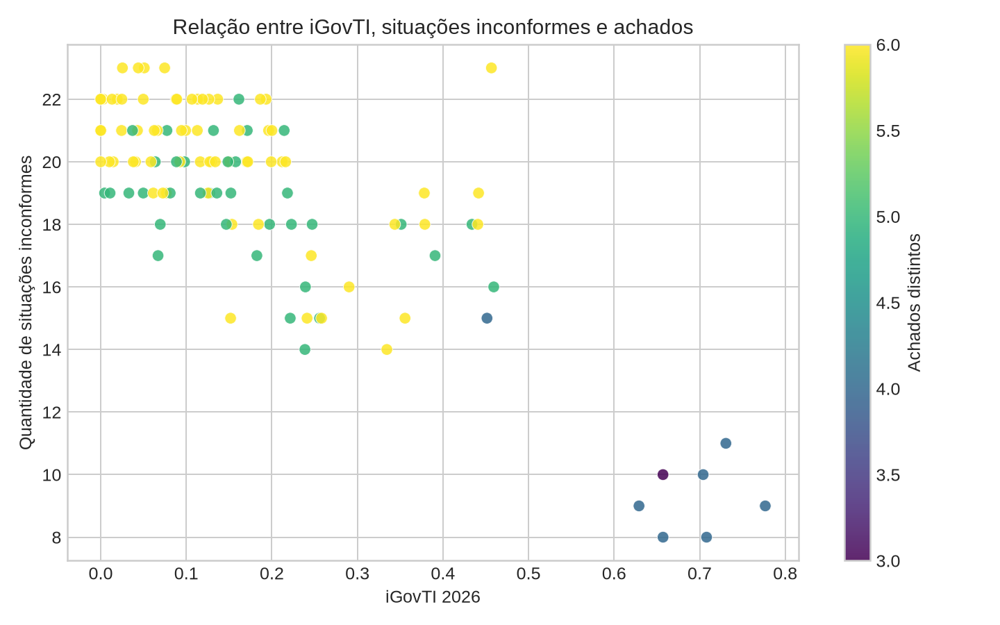
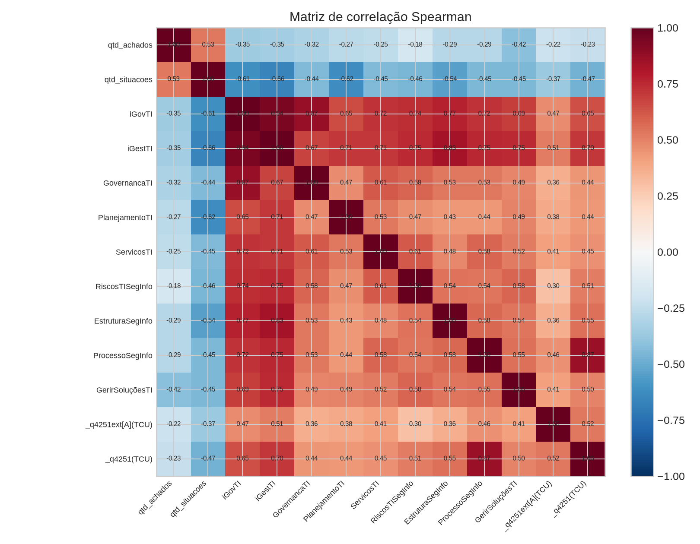
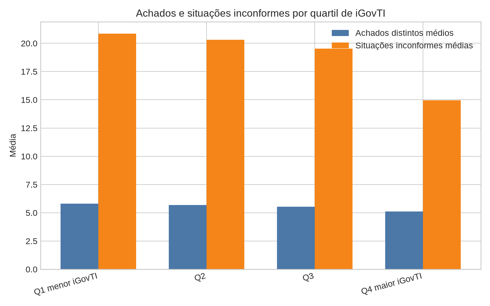
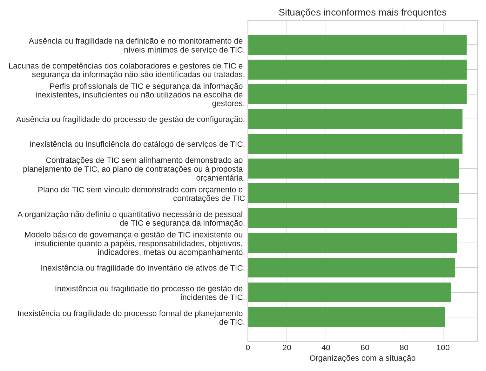

# Relatório técnico - relação entre achados de auditoria e notas do iGovTI 2026

## 1. Objetivo

Este relatório examina a relação entre os achados de auditoria registrados na execução dos procedimentos e as notas do iGovTI 2026 das organizações avaliadas. A análise foi atualizada com os artefatos informados na execução do script, contemplando resultados do índice, resultado estruturado da auditoria e tabelas consolidadas de achados, situações inconformes e encaminhamentos.

## 2. Fontes e método

Foram cruzadas duas fontes: o resultado do iGovTI 2026 e o resultado da aplicação dos procedimentos de auditoria (achados por auditado e situações inconformes por auditado).

A unidade de análise foi a organização auditada. Entraram no cruzamento **113 organizações** presentes simultaneamente nas bases. Para cada organização foram calculados a quantidade de achados distintos, a quantidade de situações inconformes, a quantidade de encaminhamentos associados, o iGovTI, o iGestTI, a nota de governança e os componentes do índice. Foram aplicadas correlações de Spearman e Pearson, comparação de médias por achado, análise de sensibilidade por recortes de iGovTI, prevalência das situações inconformes e identificação de casos divergentes em relação à tendência geral.

A correlação de Spearman foi priorizada porque a quantidade de achados é discreta e limitada a seis categorias. Essa limitação cria efeito de teto e exige cautela na interpretação. O arquivo JSON estruturado foi usado como conferência cruzada da contagem de achados; foram identificadas **0 divergências** entre a contagem derivada das tabelas consolidadas e a contagem dos procedimentos no JSON.

## 3. Resultado executivo

O resultado central da análise é que **na base atualizada a correlação entre iGovTI e a carga de achados é negativa**. Considerando todas as organizações, a correlação de Spearman entre `iGovTI` e `qtd_achados` foi **-0.354** (p = **0.0001**) e entre `iGovTI` e `qtd_situacoes` foi **-0.614** (p = **< 0.0001**).

Essa evidência é coerente com a expectativa de auditoria: organizações com maior maturidade relativa tendem a apresentar menos achados e, principalmente, menos situações inconformes. A relação é mais forte quando se usa a quantidade de situações inconformes, porque a contagem de achados está quase saturada na amostra.

Em termos de controle externo, o principal insight é que **o iGovTI se relaciona com a carga de fragilidades, mas a quantidade de achados distintos perdeu poder discriminatório por efeito de teto**. A quantidade de situações inconformes é mais granular e informativa, pois diferencia organizações que materializam os mesmos achados em poucas ou muitas fragilidades concretas.

## 4. Visão geral da base

- iGovTI médio: **0.184**; mediana: **0.134**.
- Média de achados distintos: **5.531**; mediana: **6.0**.
- Média de situações inconformes: **18.938**; mediana: **20.0**.
- Marcações de achados por auditado: **625**.
- Situações inconformes registradas: **2140**.
- Encaminhamentos associados nas tabelas consolidadas: **2140**.
- Organizações com 4 ou mais achados: **112 de 113**, ou **99.1%**.
- Organizações com 5 ou 6 achados: **105 de 113**, ou **92.9%**.
- Organizações com todos os 6 achados: **69 de 113**, ou **61.1%**.

A alta concentração em 5 a 6 achados mostra forte efeito de teto. Nessa configuração, a simples contagem de achados distingue mal as organizações em situação crítica. A quantidade de situações inconformes recupera parte da granularidade, pois diferencia organizações que materializam os mesmos achados em poucas ou muitas fragilidades concretas.

## 5. Correlações principais

### 5.1. Quantidade de achados

| Indicador | Spearman r | p Spearman | Pearson r | p Pearson | n |
| --- | --- | --- | --- | --- | --- |
| GerirSoluçõesTI | -0.422 | < 0.0001 | -0.617 | < 0.0001 | 113 |
| iGovTI | -0.354 | 0.0001 | -0.584 | < 0.0001 | 113 |
| iGestTI | -0.352 | 0.0001 | -0.544 | < 0.0001 | 113 |
| GovernancaTI | -0.317 | 0.0006 | -0.557 | < 0.0001 | 113 |
| ProcessoSegInfo | -0.289 | 0.0019 | -0.471 | < 0.0001 | 113 |
| EstruturaSegInfo | -0.286 | 0.0021 | -0.375 | < 0.0001 | 113 |

### 5.2. Quantidade de situações inconformes

| Indicador | Spearman r | p Spearman | Pearson r | p Pearson | n |
| --- | --- | --- | --- | --- | --- |
| iGestTI | -0.660 | < 0.0001 | -0.807 | < 0.0001 | 113 |
| PlanejamentoTI | -0.618 | < 0.0001 | -0.758 | < 0.0001 | 113 |
| iGovTI | -0.614 | < 0.0001 | -0.799 | < 0.0001 | 113 |
| EstruturaSegInfo | -0.540 | < 0.0001 | -0.567 | < 0.0001 | 113 |
| _q4251(TCU) | -0.473 | < 0.0001 | -0.590 | < 0.0001 | 113 |
| RiscosTISegInfo | -0.455 | < 0.0001 | -0.608 | < 0.0001 | 113 |

As correlações mais fortes com situações inconformes aparecem em `PlanejamentoTI`, `iGestTI` e `iGovTI`. Para situações inconformes, a associação com `iGestTI` chegou a **-0.660**. Esse resultado indica que a carga de fragilidades acompanha fortemente os componentes de gestão, planejamento e operação, e não apenas a governança formal. Na prática, organizações com melhor pontuação nesses componentes tendem a apresentar menos situações inconformes.

{#fig:achados_vs_igovti_2026#}

(Fonte: elaboração própria, com base nos artefatos de execução do iGovTI 2026)

{#fig:correlacao_achados_notas_igovti_2026#}

(Fonte: elaboração própria, com base nos artefatos de execução do iGovTI 2026)

## 6. Análise de sensibilidade

| Recorte | n | Spearman iGovTI x achados | p achados | Spearman iGovTI x situações | p situações |
| --- | --- | --- | --- | --- | --- |
| Todos | 113 | -0.354 | 0.0001 | -0.614 | < 0.0001 |
| iGovTI > 0 | 108 | -0.322 | 0.0007 | -0.604 | < 0.0001 |
| iGovTI >= 0,10 | 69 | -0.393 | 0.0008 | -0.674 | < 0.0001 |
| Sem Q1 de iGovTI | 84 | -0.315 | 0.0035 | -0.608 | < 0.0001 |
| iGovTI >= mediana | 57 | -0.364 | 0.0054 | -0.627 | < 0.0001 |

A sensibilidade confirma a robustez da relação negativa. A associação permanece estatisticamente relevante na base completa, quando se excluem organizações com iGovTI igual a zero, quando se restringe a análise a iGovTI igual ou superior a 0,10 e quando se observa apenas a metade superior da distribuição. Ainda assim, a magnitude é maior e mais estável para situações inconformes do que para achados distintos, reforçando que **a quantidade de situações deve ser usada como medida principal de intensidade das fragilidades**.

## 7. Quartis e níveis de maturidade

### 7.1. Quartis de iGovTI

| Quartil iGovTI | Organizações | Mín. iGovTI | Máx. iGovTI | Média iGovTI | Média de achados | Média de situações | % com 5 ou 6 achados | % com até 3 achados |
| --- | --- | --- | --- | --- | --- | --- | --- | --- |
| Q1 menor iGovTI | 29 | 0.000 | 0.066 | 0.029 | 5.793 | 20.862 | 100.0% | 0.0% |
| Q2 | 28 | 0.067 | 0.134 | 0.102 | 5.679 | 20.321 | 100.0% | 0.0% |
| Q3 | 28 | 0.136 | 0.223 | 0.179 | 5.536 | 19.536 | 100.0% | 0.0% |
| Q4 maior iGovTI | 28 | 0.239 | 0.777 | 0.432 | 5.107 | 14.964 | 71.4% | 3.6% |

{#fig:achados_por_quartil_igovti_2026#}

(Fonte: elaboração própria, com base nos artefatos de execução do iGovTI 2026)

O primeiro quartil concentra a maior média de situações inconformes e praticamente todos os auditados dos três primeiros quartis têm 5 ou 6 achados. O quarto quartil apresenta redução da média de achados e, sobretudo, da média de situações. Isso sugere que a maturidade medida pelo iGovTI está associada a menor intensidade de fragilidades, mas a saturação dos achados faz com que a melhora apareça de forma mais clara nas situações inconformes.

### 7.2. Níveis de maturidade declarados pelo iGovTI

| Nível de maturidade | Organizações | Média iGovTI | Média de achados | Média de situações | % com 6 achados | % com 5 ou 6 achados |
| --- | --- | --- | --- | --- | --- | --- |
| Inexpressivo | 61 | 0.070 | 5.705 | 20.541 | 70.5% | 100.0% |
| Iniciando | 39 | 0.231 | 5.590 | 18.282 | 59.0% | 100.0% |
| Intermediário | 9 | 0.514 | 4.778 | 15.111 | 33.3% | 55.6% |
| Aprimorado | 4 | 0.730 | 4.000 | 9.500 | 0.0% | 0.0% |

O recorte por nível de maturidade reforça que a distribuição de achados não segue uma relação linear simples. Mesmo nos níveis superiores da amostra, a média de achados permanece elevada, o que recomenda separar a comunicação do índice da comunicação dos achados. O índice informa maturidade relativa; os achados indicam descumprimentos, fragilidades ou lacunas verificadas nos critérios da fiscalização.

## 8. Achados e situações mais informativos

### 8.1. Prevalência dos achados

| Achado | n com achado | n sem achado | % | Média iGovTI com | Média iGovTI sem | Diferença sem - com | r ponto-bisserial | p-valor |
| --- | --- | --- | --- | --- | --- | --- | --- | --- |
| Achado 1 - Estrutura de TIC insuficiente para coordenar, gerir e sustentar a tecnologia... | 71 | 42 | 62.8% | 0.153 | 0.236 | 0.083 | -0.230 | 0.0142 |
| Achado 2 - Governança de TIC insuficiente para avaliar, dirigir e monitorar a tecnologia... | 107 | 6 | 94.7% | 0.157 | 0.663 | 0.506 | -0.649 | < 0.0001 |
| Achado 3 - Planejamento de TIC insuficiente para orientar a gestão, o orçamento e as... | 109 | 4 | 96.5% | 0.166 | 0.681 | 0.515 | -0.545 | < 0.0001 |
| Achado 4 - Capacidade institucional insuficiente para sustentar a gestão de TIC e... | 113 | 0 | 100.0% | 0.184 |  |  |  |  |
| Achado 5 - Gestão de serviços de TIC insuficiente para assegurar controle sobre serviços,... | 113 | 0 | 100.0% | 0.184 |  |  |  |  |
| Achado 6 - Fragilidades na governança técnica da fase preparatória das contratações de TIC | 112 | 1 | 99.1% | 0.180 | 0.657 | 0.477 | -0.256 | 0.0063 |

O achado mais disseminado foi **Achado 5 - Gestão de serviços de TIC insuficiente para assegurar controle sobre serviços, ativos e incidentes**, presente em **113 organizações** (**100.0%**). Mesmo o achado menos frequente, **Achado 1 - Estrutura de TIC insuficiente para coordenar, gerir e sustentar a tecnologia da informação.**, alcançou **71 organizações** (**62.8%**), o que demonstra amplitude sistêmica das fragilidades encontradas.

### 8.2. Situações inconformes mais frequentes

| Achado | Situação inconforme | n | % |
| --- | --- | --- | --- |
| Achado 5 | Ausência ou fragilidade na definição e no monitoramento de níveis mínimos de serviço de TIC. | 112 | 99.1% |
| Achado 4 | Lacunas de competências dos colaboradores e gestores de TIC e segurança da informação não são identificadas... | 112 | 99.1% |
| Achado 4 | Perfis profissionais de TIC e segurança da informação inexistentes, insuficientes ou não utilizados na... | 112 | 99.1% |
| Achado 5 | Ausência ou fragilidade do processo de gestão de configuração. | 110 | 97.3% |
| Achado 5 | Inexistência ou insuficiência do catálogo de serviços de TIC. | 110 | 97.3% |
| Achado 6 | Contratações de TIC sem alinhamento demonstrado ao planejamento de TIC, ao plano de contratações ou à... | 108 | 95.6% |
| Achado 3 | Plano de TIC sem vínculo demonstrado com orçamento e contratações de TIC | 108 | 95.6% |
| Achado 4 | A organização não definiu o quantitativo necessário de pessoal de TIC e segurança da informação. | 107 | 94.7% |
| Achado 2 | Modelo básico de governança e gestão de TIC inexistente ou insuficiente quanto a papéis, responsabilidades,... | 107 | 94.7% |
| Achado 5 | Inexistência ou fragilidade do inventário de ativos de TIC. | 106 | 93.8% |
| Achado 5 | Inexistência ou fragilidade do processo de gestão de incidentes de TIC. | 104 | 92.0% |
| Achado 3 | Inexistência ou fragilidade do processo formal de planejamento de TIC. | 101 | 89.4% |

{#fig:situacoes_mais_frequentes_igovti_2026#}

(Fonte: elaboração própria, com base nos artefatos de execução do iGovTI 2026)

A situação inconforme mais frequente foi **"Ausência ou fragilidade na definição e no monitoramento de níveis mínimos de serviço de TIC."**, registrada em **112 organizações** (**99.1%**). Esse tipo de leitura é especialmente útil para o corpo deliberativo porque indica problemas transversais, cuja resposta pode exigir orientação normativa, indução de boas práticas, priorização de capacitação ou monitoramento em bloco, e não apenas recomendações atomizadas por jurisdicionado.

### 8.3. Coocorrência de achados

Os pares de achados com maior coocorrência foram:

| Par de achados | n | % |
| --- | --- | --- |
| Achados 4 + 5 | 113 | 100.0% |
| Achados 4 + 6 | 112 | 99.1% |
| Achados 5 + 6 | 112 | 99.1% |

A coocorrência elevada mostra que as fragilidades não aparecem isoladamente. Em especial, deficiências de capacidade institucional, gestão de serviços e contratações tendem a compor o mesmo quadro de baixa capacidade de sustentação da TIC. Para a fiscalização, isso sugere que recomendações pontuais podem ter menor efetividade se não forem acompanhadas de medidas estruturantes de governança, força de trabalho, planejamento e responsabilização.

## 9. Casos divergentes

### 9.1. Mais achados do que o esperado pela nota iGovTI

| Auditado | iGovTI | Maturidade | Achados | Situações | Achados esperados | Diferença |
| --- | --- | --- | --- | --- | --- | --- |
| CEASA | 0.457 | Intermediário | 6 | 23 | 4.94 | 1.06 |
| TERESÓPOLIS | 0.442 | Intermediário | 6 | 19 | 4.97 | 1.03 |
| ISP | 0.441 | Intermediário | 6 | 18 | 4.97 | 1.03 |
| TCE-RJ | 0.379 | Iniciando | 6 | 18 | 5.11 | 0.89 |
| MESQUITA | 0.378 | Iniciando | 6 | 19 | 5.11 | 0.89 |
| AGENERSA | 0.356 | Iniciando | 6 | 15 | 5.16 | 0.84 |
| FS | 0.344 | Iniciando | 6 | 18 | 5.18 | 0.82 |
| GSI | 0.334 | Iniciando | 6 | 14 | 5.20 | 0.80 |
| QUEIMADOS | 0.290 | Iniciando | 6 | 16 | 5.30 | 0.70 |
| CEPERJ | 0.258 | Iniciando | 6 | 15 | 5.37 | 0.63 |
| CODIN | 0.246 | Iniciando | 6 | 17 | 5.40 | 0.60 |
| SECTI | 0.241 | Iniciando | 6 | 15 | 5.41 | 0.59 |

### 9.2. Menos achados do que o esperado pela nota iGovTI

| Auditado | iGovTI | Maturidade | Achados | Situações | Achados esperados | Diferença |
| --- | --- | --- | --- | --- | --- | --- |
| MPERJ | 0.657 | Intermediário | 3 | 10 | 4.50 | -1.50 |
| CGE | 0.451 | Intermediário | 4 | 15 | 4.95 | -0.95 |
| CASIMIRO DE ABREU | 0.004 | Inexpressivo | 5 | 19 | 5.92 | -0.92 |
| EMATER | 0.011 | Inexpressivo | 5 | 19 | 5.91 | -0.91 |
| QUISSAMÃ | 0.033 | Inexpressivo | 5 | 19 | 5.86 | -0.86 |
| BARRA DO PIRAÍ | 0.037 | Inexpressivo | 5 | 21 | 5.85 | -0.85 |
| SEDEICS | 0.050 | Inexpressivo | 5 | 19 | 5.82 | -0.82 |
| IRM | 0.064 | Inexpressivo | 5 | 20 | 5.79 | -0.79 |
| CAMPOS DOS GOYTACAZES | 0.067 | Inexpressivo | 5 | 17 | 5.79 | -0.79 |
| FUNARJ | 0.070 | Inexpressivo | 5 | 18 | 5.78 | -0.78 |
| PARATY | 0.077 | Inexpressivo | 5 | 21 | 5.76 | -0.76 |
| UERJ | 0.081 | Inexpressivo | 5 | 19 | 5.76 | -0.76 |

Esses casos são úteis para revisão qualitativa. Organizações com muitos achados acima do esperado podem ter pontuação global que mascara fragilidades procedimentais relevantes. Organizações com poucos achados abaixo do esperado podem ter iGovTI muito baixo por ausência de práticas, mas menor número de categorias distintas de achados geradas pelas regras de execução. Nesses casos, a ausência relativa de achados não deve ser confundida com suficiência de controles.

## 10. Insights para controle externo

1. **O iGovTI é um sinalizador relevante de maturidade, mas não substitui a execução dos procedimentos.** A relação encontrada é negativa e estatisticamente relevante, sobretudo quando se observa a quantidade de situações inconformes.
2. **Há forte efeito de teto na quantidade de achados.** Como 99.1% das organizações têm 4 ou mais achados e 92.9% têm 5 ou 6, a contagem de achados perde poder discriminatório. A quantidade de situações inconformes deve ser usada como medida complementar.
3. **O primeiro quartil de iGovTI deve ser tratado como grupo prioritário.** Ele concentra maturidade muito baixa e a maior média de situações inconformes.
4. **A melhoria de maturidade aparece mais claramente na redução de situações do que na redução de achados.** Como alguns achados atingem praticamente toda a amostra, a contagem de situações é mais adequada para priorização e monitoramento.
5. **As situações inconformes mais frequentes indicam problemas sistêmicos.** Quando uma mesma situação aparece em grande parte da amostra, a resposta de controle externo pode combinar recomendações individuais com orientação transversal aos jurisdicionados.
6. **Para seleção de fiscalizações futuras, recomenda-se combinar quatro variáveis:** iGovTI, quantidade de situações inconformes, natureza dos achados e divergência entre nota e achados esperados. Usar apenas a nota pode deixar de priorizar casos relevantes.
7. **Para comunicação do resultado, convém evitar reduzir a análise à nota do índice.** A evidência desta base aponta uma dinâmica mais completa: maior iGovTI está associado a menos fragilidades, mas a saturação dos achados exige olhar a quantidade e a natureza das situações inconformes.

## 11. Limitações

- A análise é transversal e não demonstra causalidade.
- A quantidade de achados é limitada a seis categorias, o que cria efeito de teto.
- Os achados derivam das regras e do escopo dos procedimentos desta fiscalização; portanto, a ausência de determinado achado não deve ser lida como ausência de risco fora do escopo.
- As avaliações de evidências e os artefatos de execução automatizada devem ser tratados como insumos sujeitos à revisão humana da equipe de auditoria.
- As correlações foram calculadas sobre os dados consolidados disponíveis; alterações posteriores nos ajustes de resposta, comentários do gestor ou reavaliações de evidência podem modificar os resultados.

## 12. Artefatos gerados

- Script reexecutável: `scripts/analisar_achados_igovti_2026.py`.
- Planilha de apoio: `03-Relatorios/99-Avaliacao_IgovTi_Achados/analise_achados_igovti_2026.xlsx`.
- Gráficos: `03-Relatorios/99-Avaliacao_IgovTi_Achados/img/achados_vs_igovti_2026.png`, `correlacao_achados_notas_igovti_2026.png`, `achados_por_quartil_igovti_2026.png` e `situacoes_mais_frequentes_igovti_2026.png`.
