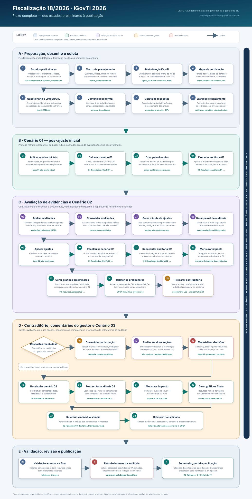

# Fiscalização 18/2026 - iGovTI 2026

**Tribunal de Contas do Estado do Rio de Janeiro (TCE-RJ)**  
**Auditoria temática de governança e gestão de tecnologia da informação**

Este repositório reúne os papéis de trabalho digitais da Fiscalização nº 18/2026, voltada à avaliação da governança e da gestão de tecnologia da informação dos jurisdicionados estaduais e municipais do Rio de Janeiro.

O trabalho combina matriz de planejamento, questionário estruturado no LimeSurvey, cálculo do índice iGovTI 2026, avaliação de evidências, execução automatizada dos procedimentos de auditoria e geração de relatórios individuais e consolidado.

## Visão geral do fluxo

O diagrama abaixo apresenta o ciclo completo da fiscalização, desde os estudos preliminares até a revisão final e a preparação para publicação. Ele evidencia os três estados preservados da base — pós-ajuste inicial, pós-avaliação de evidências e pós-comentários do gestor — e as 26 etapas do orquestrador rastreável.

[](fluxo-execucao-auditoria.svg)

Consulte também o [SVG em tamanho integral](fluxo-execucao-auditoria.svg).

## Objetivo

Avaliar se as estruturas, práticas e controles de governança e gestão de TIC dos jurisdicionados são suficientes para apoiar o alinhamento estratégico, a conformidade normativa, a segurança da informação, a gestão de serviços, a gestão de contratações e a melhoria contínua da administração pública.

Os principais produtos do trabalho são:

- diagnóstico consolidado de maturidade em governança e gestão de TIC;
- índice iGovTI 2026, inclusive versão ajustada para comparação longitudinal;
- avaliação de conformidade das respostas e evidências apresentadas;
- achados, recomendações e determinações por organização auditada;
- relatórios individuais preliminares e finais, com manifestação da Equipe de Auditoria sobre os comentários do gestor;
- relatório consolidado.

## Estrutura do Repositório

```text
.
├── 01-Planejamento/
│   ├── 01-Estudos_Preliminares/
│   ├── 02-Metodologia_iGovTI/
│   └── 03-Estrategia_e_Plano/
├── 02-Execucao/
│   ├── 01-Questionario/
│   ├── 02-Questionario iGovTI 2023/
│   ├── 03-Execucao_Procedimentos/
│   ├── 04-Matriz_Achados/
│   └── 05-Comentarios_Gestor/
├── 03-Relatorios/
│   ├── 01-Relatorio_Consolidado/
│   ├── 02-Relatorios_Individuais_Preliminares/
│   └── 03-Relatorios_Individuais_Finais/
├── 04-Portal_iGovTI/
└── scripts/
```

### Principais Artefatos

- `01-Planejamento/02-Metodologia_iGovTI/igovti_2026.md`: questionário-fonte do iGovTI 2026.
- `01-Planejamento/02-Metodologia_iGovTI/igovti_2026.lss`: questionário importável no LimeSurvey.
- `01-Planejamento/02-Metodologia_iGovTI/estrutura-igovti-2026.yaml`: estrutura oficial de cálculo do iGovTI 2026.
- `01-Planejamento/02-Metodologia_iGovTI/estrutura-igovti-2026-ajustado-comparavel.yaml`: estrutura ajustada para comparação com 2023.
- `01-Planejamento/03-Estrategia_e_Plano/04-Matriz_Planejamento/matriz_planejamento.md`: matriz de planejamento em formato estruturado.
- `02-Execucao/01-Questionario/03-Respostas_Processadas/20260621-respostas-questionario-01-pos-ajuste-inicial.xlsx`: base após os ajustes iniciais.
- `02-Execucao/01-Questionario/03-Respostas_Processadas/20260621-respostas-questionario-02-pos-avaliacao-evidencias.xlsx`: base após ajustes decorrentes da avaliação de evidências.
- `02-Execucao/03-Execucao_Procedimentos/01-Insumos/mapa-verificacao-achados-pos-comentarios-gestor.xlsx`: mapa revisado e vigente, que liga fontes, procedimentos, situações encontradas, achados e encaminhamentos. O arquivo `mapa-verificacao-achados.xlsx` preserva a versão histórica empregada nos relatórios preliminares.
- `02-Execucao/03-Execucao_Procedimentos/02-Resultados_Auditoria/resultado_auditoria.json`: resultado compacto da execução dos procedimentos de auditoria.
- `02-Execucao/05-Comentarios_Gestor/02-Avaliacao_Comentarios_Gestor/`: avaliações individuais, pareceres consolidados, ajustes e painel saneado dos comentários do gestor.
- `02-Execucao/05-Comentarios_Gestor/03-Produtos_Pos_Comentarios/`: quadro revisável e contexto dos produtos pós-comentários.
- `03-Relatorios/01-Relatorio_Consolidado/Relatório_altaresolucao_novo.md`: fonte Markdown do relatório consolidado.
- `03-Relatorios/02-Relatorios_Individuais_Preliminares/relatorio-individual-preliminar-template.md`: template dos relatórios individuais.
- `03-Relatorios/03-Relatorios_Individuais_Finais/relatorio-individual-template.md`: template final com a análise dos comentários do gestor.
- `scripts/calcula-igovti.html`: calculadora interativa para aplicar uma estrutura YAML de índice a uma fonte de informação e analisar resultados.
- `scripts/dashboard_avaliacao_evidencias.html`: dashboard para revisão humana das avaliações de evidências e exportação da consolidação por auditado e item.
- `scripts/montar_tabela_download_anexos_limesurvey.js`: script de apoio para gerar, a partir da tabela de respostas do LimeSurvey, a planilha com URLs de anexos e de respostas.
- `scripts/gerar_pacote_relatorios_igovti.py`: orquestrador rastreável do fluxo completo, com três cenários, retomada e manifesto de hashes.
- `scripts/argos_cli.py`: interface interativa e não interativa para o fluxo completo e suas principais rotinas individuais.
- `scripts/run_comentarios_gestor.py`: avaliação e consolidação integrada das Seções 1 e 2 dos comentários do gestor.
- `scripts/gerar_produtos_pos_comentarios_gestor.py`: geração exclusiva da base ajustada, do quadro revisável e do contexto pós-comentários; cálculos, auditoria e relatórios permanecem em rotinas próprias.

## Metodologia Sequencial

As etapas abaixo descrevem o fluxo operacional do trabalho, da concepção da auditoria à geração dos relatórios. Quando há automação disponível, o script correspondente é indicado.

### Fluxo completo em comando único

Para regenerar o pacote completo a partir da planilha bruta exportada do questionário eletrônico, use o orquestrador:

```bash
scripts/.venv/bin/python scripts/gerar_pacote_relatorios_igovti.py \
  --respostas-bruto 02-Execucao/01-Questionario/01-Coleta_LimeSurvey/20260621-respostas-questionario-bruto.xlsx \
  --data-final-preenchimento-comentarios-gestor 06/07/2026 \
  --email-contato-comentarios-gestor auditoriati@tcerj.tc.br \
  --numero-fiscalizacao-comentarios-gestor 18/2026 \
  --nome-fiscalizacao-comentarios-gestor "iGovTI 2026" \
  --output-root .
```

O script infere o prefixo `20260621` a partir do nome da planilha bruta e preserva separadamente os cenários `01-pos-ajuste-inicial`, `02-pos-avaliacao-evidencias` e `03-pos-comentarios-gestor`. Ele avalia evidências, exige ao menos três avaliações válidas por caso, recalcula o iGovTI em cada cenário, reexecuta a auditoria, mensura impactos e gera os relatórios preliminares, finais e consolidado.

O manifesto fica em `02-Execucao/00-Controle_Execucao/manifesto-pipeline-auditoria.json`; os eventos, logs, validação final e inventários JSON/XLSX ficam no mesmo diretório. Uma nova chamada retoma a primeira etapa incompleta e não sobrescreve produtos divergentes. Use `--adopt-existing` uma vez para incorporar papéis de trabalho legados ao manifesto sem regravá-los.

Se as respostas ou as evidências dos comentários do gestor não estiverem disponíveis, o fluxo termina com estado `awaiting_input` após gerar o survey. Depois das duas consolidações, o fluxo termina com estado `awaiting_review` enquanto houver caso prioritário sem aprovação humana. Nenhum ajuste, cálculo, auditoria, gráfico ou relatório pós-comentários é gerado antes dessa aprovação. `--from-stage`, `--until-stage`, `--status-only` e `--dry-run` apoiam execução parcial e diagnóstico.

Os parâmetros `--email-contato-comentarios-gestor`, `--numero-fiscalizacao-comentarios-gestor` e `--nome-fiscalizacao-comentarios-gestor` são repassados ao gerador do questionário LimeSurvey de comentários do gestor e usados no texto de boas-vindas, encerramento, título, descrição e assunto do convite. Os padrões são `auditoriati@tcerj.tc.br`, `18/2026` e `iGovTI 2026`.

Os cálculos e auditorias dos três estados ficam, respectivamente, sob:

```text
02-Execucao/01-Questionario/04-Resultados_iGovTI/<cenario>/
02-Execucao/03-Execucao_Procedimentos/02-Resultados_Auditoria/<cenario>/
03-Relatorios/00-Recursos_Gerados/<cenario>/
```

O Argos expõe a mesma execução e as rotinas individuais mais importantes:

```bash
scripts/.venv/bin/python scripts/argos_cli.py --list
scripts/.venv/bin/python scripts/argos_cli.py --run execucao-completa --yes
scripts/.venv/bin/python scripts/argos_cli.py --run calcular-igovti --cenario 02-pos-avaliacao-evidencias --yes
scripts/.venv/bin/python scripts/argos_cli.py --run ajustar-respostas --param respostas=/caminho/base.xlsx --param ajustes=/caminho/ajustes.xlsx --param output=/caminho/saida.xlsx --yes
```

### 1. Estudos preliminares e definição da abordagem

A equipe reúne antecedentes, referenciais externos e critérios de auditoria para definir escopo, riscos e questões de auditoria. As referências ficam principalmente em:

- `01-Planejamento/01-Estudos_Preliminares/`
- `01-Planejamento/01-Estudos_Preliminares/Referencias_Externas/`
- `01-Planejamento/01-Estudos_Preliminares/Analise_Riscos/`

Não há script único para esta etapa; trata-se de atividade analítica e documental.

### 2. Elaboração da matriz de planejamento

A matriz de planejamento organiza questões de auditoria, subquestões, riscos, fontes de informação, informações requeridas, critérios, procedimentos, evidências esperadas, possíveis achados e encaminhamentos.

Quando um critério é vinculante apenas para determinado público, a matriz também declara sua aplicabilidade e a variante de encaminhamento correspondente, aninhada na própria situação encontrada. Cada situação separa `fundamentacao_encaminhamento`, texto expositivo usado no relatório, de `encaminhamento`, providência operativa cuja identidade deve permanecer estável. A variante herda os critérios, o tipo, a fundamentação e o texto do encaminhamento geral quando esses campos forem omitidos e substitui integralmente os que declarar; seu identificador é gerado automaticamente. O cadastro de auditados materializa `segmento_institucional`, `natureza_administrativa` e `tags_aplicabilidade`; o motor não infere essas classificações nem converte recomendações em determinações. Campos ausentes ou listas vazias no seletor não restringem a aplicação, e classificações adicionais apenas estreitam o público selecionado.

Todos os critérios gerais e específicos são declarados no bloco único `criterios`. Cada item contém `id`, `descricao`, `natureza_fundamento` e `apto_a_fundamentar_determinacao`; critérios específicos acrescentam `publico` e `aplica_se`. O formato é estrito e não aceita os antigos blocos separados de metadados ou critérios específicos. Exemplo:

```yaml
criterios:
- id: C1
  descricao: >-
    Critério geral com a referência e a obrigação ou prática examinada.
  natureza_fundamento: boa_pratica
  apto_a_fundamentar_determinacao: false
- id: C11
  descricao: >-
    Critério aplicável especificamente ao Poder Executivo Estadual.
  natureza_fundamento: norma_regulamentar_vinculante
  apto_a_fundamentar_determinacao: true
  publico: Poder Executivo Estadual
  aplica_se:
    segmentos: [EXECUTIVO_ESTADUAL]
```

Fonte principal:

```text
01-Planejamento/03-Estrategia_e_Plano/04-Matriz_Planejamento/matriz_planejamento-pos-comentarios-gestor.md
```

Geração do DOCX:

```bash
scripts/.venv/bin/python scripts/gerar_matriz_planejamento.py \
  01-Planejamento/03-Estrategia_e_Plano/04-Matriz_Planejamento/matriz_planejamento-pos-comentarios-gestor.md
```

### 3. Criação da metodologia e do índice iGovTI

A metodologia do iGovTI 2026 é definida a partir do questionário e das estruturas YAML de cálculo. A versão oficial calcula o índice do ciclo atual; a versão ajustada comparável permite análise longitudinal com 2023.

Fontes principais:

```text
01-Planejamento/02-Metodologia_iGovTI/igovti_2026.md
01-Planejamento/02-Metodologia_iGovTI/metodologia-calculo.md
01-Planejamento/02-Metodologia_iGovTI/estrutura-igovti-2026.yaml
01-Planejamento/02-Metodologia_iGovTI/estrutura-igovti-2026-ajustado-comparavel.yaml
```

Cálculo dos resultados a partir das respostas:

```bash
scripts/.venv/bin/python scripts/gerar_igovti.py \
  --respostas 02-Execucao/01-Questionario/03-Respostas_Processadas/20260621-respostas-questionario.xlsx
```

Regeneração integrada dos artefatos do índice, comparação longitudinal e contexto estatístico:

```bash
scripts/.venv/bin/python scripts/gerar_artefatos_igovti.py \
  --respostas 02-Execucao/01-Questionario/03-Respostas_Processadas/20260621-respostas-questionario.xlsx \
  --prefixo 20260621 \
  --output-dir C:/tmp/tcerj-igovti-2026
```

Para simulações, validações metodológicas ou cálculo de um índice qualquer baseado em uma estrutura YAML, pode ser usada a página:

```text
scripts/calcula-igovti.html
```

Essa ferramenta permite carregar uma fonte de informação, aplicar a estrutura YAML de entrada, gerar resultados e visualizar estatísticas exploratórias do índice calculado.

### 4. Criação da matriz de procedimentos de auditoria

A matriz de procedimentos traduz a matriz de planejamento em verificações executáveis: fontes de informação, procedimentos, ações de verificação, lógica de achado, situações encontradas e encaminhamentos.

No mapa vigente, as ações mantêm a verificação factual e o `id_situacao`. As abas `Critérios de Auditoria` e `Variantes de Encaminhamento` são sincronizadas da matriz por `scripts/sincronizar_aplicabilidade_juridica.py`; esta última também materializa `fundamentacao_encaminhamento`. O campo legado `pre_encaminhamento` da aba `Ações de Verificação` não é fonte da fundamentação e permanece sem uso nessa modelagem, pois sua granularidade é a ação, não a situação. Antes da execução, `scripts/validar_aplicabilidade_juridica.py` bloqueia divergências entre matriz e mapa, classificações ausentes e conflitos de variantes.

Artefato principal:

```text
02-Execucao/03-Execucao_Procedimentos/01-Insumos/mapa-verificacao-achados-pos-comentarios-gestor.xlsx
```

O repositório usa a skill local `preencher-matriz-procedimentos-auditoria` para apoiar essa geração a partir da matriz de planejamento.

Depois de revisar critérios ou variantes aninhadas nas situações da matriz, sincronize e valide os três artefatos antes de executar a auditoria:

```bash
scripts/.venv/bin/python scripts/sincronizar_aplicabilidade_juridica.py
scripts/.venv/bin/python scripts/validar_aplicabilidade_juridica.py \
  --relatorio-xlsx 02-Execucao/00-Controle_Execucao/cobertura-aplicabilidade-juridica.xlsx
```

Os seletores aceitos são `segmentos`, `naturezas`, `tags_todas`, `tags_alguma` e `tags_excluidas`. Há OR entre valores de uma lista e AND entre as dimensões preenchidas. Por exemplo, apenas `segmentos: [EXECUTIVO_ESTADUAL]` alcança todas as naturezas desse segmento; acrescentar `naturezas` ou tags restringe o conjunto. A planilha de cobertura materializa a variante, o tipo e os critérios resolvidos para revisão humana.

A classificação inicial dos 119 auditados foi materializada por lista explícita, sem regra residual para organizações desconhecidas. Novos auditados devem ser classificados deliberadamente no cadastro; o script falha se não houver declaração expressa.

A matriz de achados em DOCX é gerada por:

```bash
scripts/.venv/bin/python scripts/gerar_matriz_achados.py
```

A geração utiliza, por padrão, o resultado pós-comentários do gestor. Somente
achados, situações, critérios específicos, efeitos e encaminhamentos com
ocorrência no resultado final são materializados. O tipo e o público de cada
encaminhamento são resolvidos pelas variantes declaradas na matriz e pela
classificação explícita de `bd_auditados.xlsx`; a rotina não infere o regime
jurídico do destinatário.

Ao final do DOCX, a rotina acrescenta um quadro em orientação paisagem com uma
linha para cada organização avaliada e uma coluna para cada situação ocorrida.
As células usam `D` para determinação, `R` para recomendação e permanecem
vazias quando a situação não foi identificada para o auditado.

### 5. Construção do questionário e publicação no LimeSurvey

O questionário-fonte é mantido em Markdown estruturado e convertido para LimeSurvey quando necessário.

Fonte e saída:

```text
01-Planejamento/02-Metodologia_iGovTI/igovti_2026.md
01-Planejamento/02-Metodologia_iGovTI/igovti_2026.lss
```

Conversão do Markdown para LSS:

```bash
scripts/.venv/bin/python scripts/resources/md2lss.py \
  01-Planejamento/02-Metodologia_iGovTI/igovti_2026.md \
  01-Planejamento/02-Metodologia_iGovTI/igovti_2026.lss
```

A importação, ativação e configuração final do survey no LimeSurvey são etapas operacionais da plataforma, sem script dedicado neste repositório.

### 6. Comunicação aos auditados

Após a ativação do survey, cada auditado recebe comunicação formal com link individualizado de acesso ao questionário. A consolidação dos identificadores e links de anexos aparece nos artefatos de execução, especialmente:

```text
02-Execucao/01-Questionario/01-Coleta_LimeSurvey/urls_anexos_limesurvey_consolidado.xlsx
```

Não há script dedicado para expedição das comunicações formais. O envio e o controle de ciência são procedimentos administrativos externos ao repositório.

### 7. Coleta das respostas e dos anexos

As respostas do LimeSurvey são exportadas para XLSX e armazenadas em `02-Execucao/01-Questionario/`. Os anexos enviados pelos auditados são baixados e extraídos para análise.

Antes de rodar o coletor de anexos, a planilha com URLs de download pode ser montada a partir da página administrativa de respostas do LimeSurvey com:

```text
scripts/montar_tabela_download_anexos_limesurvey.js
```

O script deve ser executado no navegador, na tela de listagem das respostas do survey. Ele lê a tabela de respostas do LimeSurvey e gera `urls_anexos_limesurvey_consolidado.xlsx`, contendo identificadores, nomes dos auditados, URLs de download dos anexos e URLs dos PDFs de respostas. Essa planilha é usada pelo coletor Python.

Coleta dos anexos:

```bash
scripts/.venv/bin/python scripts/coletar_anexos_limesurvey.py
```

Extração dos ZIPs de evidências:

```bash
scripts/.venv/bin/python scripts/extrair_evidencias.py
```

Principais artefatos:

```text
02-Execucao/01-Questionario/01-Coleta_LimeSurvey/20260621-respostas-questionario-bruto.xlsx
02-Execucao/01-Questionario/03-Respostas_Processadas/20260621-respostas-questionario.xlsx
02-Execucao/01-Questionario/01-Coleta_LimeSurvey/urls_anexos_limesurvey_consolidado.xlsx
02-Execucao/01-Questionario/01-Coleta_LimeSurvey/Evidencias_Coletadas/evidencias/
02-Execucao/01-Questionario/01-Coleta_LimeSurvey/Evidencias_Coletadas/evidencias_extraidas/
```

### 8. Aplicação de ajustes iniciais nas respostas

Antes das avaliações finais, a equipe pode aplicar ajustes decorrentes de retificações, saneamento de inconsistências, correção de bugs identificados no survey ou padronização de respostas.

Artefato de controle:

```text
02-Execucao/01-Questionario/02-Ajustes_Respostas/ajustes_respostas_questionario_inicial.xlsx
```

Quando o ajuste segue a estrutura esperada pelo script de ajustes, ele pode ser aplicado por:

```bash
scripts/.venv/bin/python scripts/ajustar_respostas_questionario.py \
  --respostas 02-Execucao/01-Questionario/01-Coleta_LimeSurvey/20260621-respostas-questionario-bruto.xlsx \
  --ajustes 02-Execucao/01-Questionario/02-Ajustes_Respostas/ajustes_respostas_questionario_inicial.xlsx \
  --output 02-Execucao/01-Questionario/03-Respostas_Processadas/20260621-respostas-questionario.xlsx
```

### 9. Avaliação das respostas e evidências

A avaliação confronta as respostas afirmativas dos auditados com as evidências anexadas. O pipeline usa catálogos de prompts, processa arquivos PDF/DOCX quando necessário, registra avaliações em JSONL e permite consolidação posterior por juiz IA e revisão humana.

Catálogo principal para achados:

```text
scripts/avaliacao_evidencias/prompt_catalogs/igovti_2026_achados_binario_v1.yml
scripts/avaliacao_evidencias/prompts/igovti_2026_achados_binario_v1/
```

Regeneração dos prompts binários de achados:

```bash
scripts/.venv/bin/python -m scripts.avaliacao_evidencias.prompt_catalog_achados build \
  scripts/avaliacao_evidencias/prompt_catalogs/igovti_2026_achados_binario_v1.yml \
  01-Planejamento/02-Metodologia_iGovTI/igovti_2026.md \
  scripts/avaliacao_evidencias/prompts/igovti_2026_achados_binario_v1
```

Validação local sem IA remota:

```bash
scripts/.venv/bin/python -m scripts.avaliacao_evidencias \
  02-Execucao/01-Questionario/03-Respostas_Processadas/20260621-respostas-questionario.xlsx \
  C:/tmp/tcerj-igovti-2026/evidencias_extraidas \
  --questionario 01-Planejamento/02-Metodologia_iGovTI/igovti_2026.md \
  --prompts-dir scripts/avaliacao_evidencias/prompts/igovti_2026_achados_binario_v1 \
  --prompt-version igovti_2026_achados_binario_v1 \
  --only-prompts-present \
  --provider fake \
  --model fake \
  --out-dir C:/tmp/tcerj-igovti-2026/02-Execucao/03-Execucao_Procedimentos/99-Avaliacao_Evidencias/individuais/teste-achados-binario
```

Execução paralela dos modelos configurados:

```bash
scripts/.venv/bin/python scripts/run_avaliacao_evidencias_v2.py
```

Consolidação das avaliações por juiz IA:

```bash
scripts/.venv/bin/python scripts/run_consolida_avaliacoes_v2.py
```

Revisão humana das avaliações e dos pareceres consolidados:

```text
scripts/dashboard_avaliacao_evidencias.html
```

O dashboard permite que a equipe revise as avaliações das evidências, inclusive pareceres consolidados pelo juiz, filtre por auditado e item avaliado, e exporte planilha XLSX com a consolidação da revisão. Isso permite dividir o mesmo conjunto de dados entre revisores em paralelo e depois usar a planilha exportada como insumo para os ajustes pós-avaliação.

Agregação por item do questionário:

```bash
scripts/.venv/bin/python scripts/agregar_analyses_por_item.py \
  02-Execucao/03-Execucao_Procedimentos/99-Avaliacao_Evidencias/individuais/analyses*.jsonl \
  --output 02-Execucao/03-Execucao_Procedimentos/99-Avaliacao_Evidencias/consolidado/agregado_avaliacoes_por_item.xlsx
```

Documentação detalhada:

```text
scripts/avaliacao_evidencias/README.md
```

### 10. Ajustes pós-avaliação de evidências

Após a revisão das evidências, respostas afirmativas não comprovadas podem ser convertidas em respostas não conformes ou removidas, conforme o tipo de item.

Por decisão metodológica, a etapa não ajusta itens do bloco `q30XX`. No bloco `q01XX`, somente os itens da `q0103` podem gerar ajustes de respostas.

Planilha de ajustes:

```text
02-Execucao/01-Questionario/02-Ajustes_Respostas/ajustes_respostas_questionario_pos_avaliacao_evidencias.xlsx
```

Aplicação dos ajustes:

```bash
scripts/.venv/bin/python scripts/ajustar_respostas_questionario.py \
  --respostas 02-Execucao/01-Questionario/03-Respostas_Processadas/20260621-respostas-questionario.xlsx \
  --ajustes 02-Execucao/01-Questionario/02-Ajustes_Respostas/ajustes_respostas_questionario_pos_avaliacao_evidencias.xlsx \
  --output 02-Execucao/01-Questionario/03-Respostas_Processadas/20260621-respostas-questionario-02-pos-avaliacao-evidencias.xlsx
```

Fonte derivada para uso nos procedimentos de auditoria:

```bash
scripts/.venv/bin/python scripts/gerar_fonte_ajustes_evidencias_auditoria.py
```

O script gera `02-Execucao/03-Execucao_Procedimentos/99-Avaliacao_Evidencias/painel-avaliacao-evidencias.xlsx`, em formato largo por auditado, contendo apenas itens já utilizados no mapa de verificação de achados. Essa fonte permite que a ocorrência de `Não conforme` na avaliação de evidências também componha a lógica dos achados, mantendo a justificativa do juiz ou do auditor revisor disponível para a descrição da evidência.

### 10.1. Reavaliação dos comentários do gestor e ajustes reversos

Embora os comandos estejam agrupados nesta seção por tratarem de ajustes de respostas, a etapa de comentários do gestor ocorre após a emissão dos relatórios individuais preliminares. Seus resultados alimentam o recálculo corrente, a reexecução da auditoria e os relatórios individuais finais.

O pipeline integrado avalia: (i) manifestações sobre as situações inconformes e seus motivos; e (ii) pedidos de reavaliação de respostas ajustadas por insuficiência de evidência. A terceira seção do survey, destinada às organizações sem resposta válida, permanece fora da avaliação por modelos.

Os avaliadores, o juiz, o quórum e o paralelismo não ficam codificados no orquestrador. A configuração padrão está em `scripts/avaliacao_evidencias/configs/comentarios_gestor_models_v1.json`. O juiz padrão é `gemini/gemini-3.5-flash-lite`, com quórum mínimo de três opiniões válidas.

Para acrescentar ou remover modelos, altere a lista `evaluators` do JSON. Cada entrada declara `name`, `enabled`, `provider`, `model`, `model_key`, `rpm`, `reasoning`, `pdf2md` e `docx2html`. Use `enabled: false` para manter uma rota disponível sem executá-la. Rotas de providers diferentes que representam o mesmo modelo devem compartilhar o mesmo `model_key`, e somente uma delas pode estar habilitada por vez. O cache e o quórum usam `model_key`: a troca de provider reaproveita uma avaliação concluída quando prompt, contexto, evidências, reasoning e modo de conversão permanecem iguais.

O objeto `judge` acrescenta `min_valid_opinions`, `max_parallel` e `tpm`. Na consolidação Gemini, `max_parallel` é um teto: a concorrência efetiva também é limitada pela quantidade de chaves únicas de `GEMINI_API_KEY`. Cada chave fica locada por uma única chamada, com `rpm` e `tpm` controlados individualmente; `tpm: 0` desativa o controle preventivo de tokens. Uma resposta 429 coloca somente a chave usada em cooldown e o caso aguarda outra chave livre, sem reutilizar credencial ocupada nem registrar o erro transitório como parecer. Os eventos detalhados de espera, locação, liberação e cooldown das chaves ficam ocultos por padrão; use `--verbose` para exibi-los. A exclusividade vale dentro de uma execução do processo e pressupõe cotas independentes para as chaves. Também é possível manter configurações alternativas fora do repositório e selecioná-las com `--models-config /caminho/config.json`. A configuração efetivamente usada em cada execução é copiada para `configuracao-modelos-efetiva.json` no diretório de saída.

O juiz recebe todas as opiniões válidas encontradas entre os avaliadores configurados, não apenas o número mínimo do quórum. Se uma nova opinião for produzida posteriormente, a identidade do conjunto muda e o juiz refaz o parecer, mantendo a versão anterior apenas no checkpoint histórico. Para a seção 1, o schema distingue `mantida`, `afastada_na_data_base`, `corrigida_posteriormente` e `inconclusiva` e exige conclusão estruturada para cada motivo ativo.

No Argos CLI, selecione **Avaliação de comentários do gestor** e escolha avaliação da seção 1, avaliação da seção 2, consolidação ou pipeline completo. O equivalente não interativo é:

```bash
scripts/.venv/bin/python scripts/argos_cli.py --run pipeline-comentarios-gestor --yes \
  --extra "--respostas-comentarios /caminho/respostas-comentarios.xlsx --evidencias-comentarios-root /caminho/evidencias_extraidas"
```

Também é possível chamar o orquestrador diretamente:

```bash
scripts/.venv/bin/python scripts/run_comentarios_gestor.py completo \
  --respostas-comentarios /caminho/respostas-comentarios.xlsx \
  --evidencias-comentarios-root /caminho/evidencias_extraidas \
  --catalog-comentarios scripts/avaliacao_evidencias/prompt_catalogs/igovti_2026_comentarios_gestor_atual_v4.yml \
  --models-config scripts/avaliacao_evidencias/configs/comentarios_gestor_models_v1.json
```

Use `--fake` para validar toda a estrutura sem chamadas remotas e `--preflight-only` para validar somente planilha, deduplicação, contextos, prompts e anexos. O preflight é bloqueante: nenhum modelo remoto é chamado enquanto houver anexo informado não localizado.

Links informados nas manifestações são capturados uma vez e preservados como evidência auditável. Consolidações posteriores reutilizam o arquivo e o hash registrados em `manifesto-links.json`, evitando que elementos dinâmicos de uma página alterem indevidamente a identidade do parecer. Use `--refresh-links` somente quando for necessário produzir intencionalmente uma nova captura; se o conteúdo mudar, o juiz refará o parecer.

No modo `completo`, a seção 1 é avaliada e consolidada antes da preparação da seção 2. Itens associados a situações `afastada_na_data_base` ou `corrigida_posteriormente`, quando possuem valor positivo inequívoco, são registrados como saneados e retirados da reavaliação da seção 2. A exclusão ocorre por auditado e item; outros subitens da mesma questão-base continuam sendo avaliados. Campos categóricos, quantitativos ou derivados sem valor positivo seguro permanecem como pendências e não são retirados do escopo.

O catálogo ativo `igovti_2026_comentarios_gestor_atual_v4.yml` orienta a Seção 2 para a situação corrente. A identidade lógica inclui o hash do prompt: avaliações antigas incompatíveis não são reutilizadas, enquanto checkpoints compatíveis da Seção 1 podem ser preservados.

Depois de consolidar as duas seções, o pipeline classifica como prioritário somente o caso que tenha ao menos uma dimensão com empate entre os avaliadores ou uma decisão do juiz contrária à maioria estrita dos avaliadores. A planilha `revisao-humana-pareceres.xlsx` apresenta os casos prioritários, as divergências que motivaram a seleção e o universo consolidado. Para liberar o fluxo, preencha `Status da revisão` como `Aprovado`, além de `Revisor` e `Data da revisão`, em todos os casos prioritários. As aprovações são preservadas apenas enquanto `Case ID`, identidade e hash do parecer permanecerem iguais.

Para preparar ou validar separadamente essa revisão:

```bash
scripts/.venv/bin/python scripts/run_comentarios_gestor.py preparar-revisao \
  --out-dir /tmp/tcerj-igovti-2026/02-Execucao/05-Comentarios_Gestor/99-Avaliacao_Comentarios_Gestor

scripts/.venv/bin/python scripts/run_comentarios_gestor.py validar-revisao \
  --out-dir /tmp/tcerj-igovti-2026/02-Execucao/05-Comentarios_Gestor/99-Avaliacao_Comentarios_Gestor
```

Os dois comandos retornam código 3 e estado `awaiting_review` enquanto houver pendência. Após a aprovação, repita o pipeline completo ou o comando `gerar-ajustes`; o orquestrador retoma a etapa de comentários e somente então segue para os produtos posteriores.

As saídas padrão ficam em `/tmp/tcerj-igovti-2026/02-Execucao/05-Comentarios_Gestor/99-Avaliacao_Comentarios_Gestor/` no Linux/macOS e no caminho correspondente sob `C:/tmp` no Windows. Além dos JSONL auditáveis, cada seção recebe `avaliacoes_modelos.xlsx`, com avaliações, motivos, erros e escopo. A consolidação gera `pareceres_consolidados.xlsx`. O diretório raiz recebe:

- `ajustes_respostas_questionario_pos_comentarios_gestor.xlsx`, com as abas `Ajustes`, `Pendências` e `Saneados seção 1`;
- `fontes-auditoria-pos-comentarios/painel-avaliacao-evidencias.xlsx`, no qual itens saneados deixam de acionar novamente as ações baseadas na avaliação de evidências;
- `resumo-execucao.json`, com contagens e caminhos dos artefatos.

A planilha de ajustes combina a seção 1 e a seção 2. Ela é uma minuta e não é aplicada automaticamente à base de respostas. A primeira aba permanece compatível com `scripts/ajustar_respostas_questionario.py`.

Para regenerar somente a minuta e o painel a partir de consolidações existentes:

```bash
scripts/.venv/bin/python scripts/run_comentarios_gestor.py gerar-ajustes \
  --out-dir /tmp/tcerj-igovti-2026/02-Execucao/05-Comentarios_Gestor/99-Avaliacao_Comentarios_Gestor
```

As variáveis necessárias são `GEMINI_API_KEY` e `OPENROUTER_API_KEY`. O provider OpenAI usa `OPENAI_BASE_URL` e `OPENAI_API_KEY` quando a API oficial é empregada; sem alteração, preserva o proxy local configurado pelo projeto.

O comando legado `scripts/avaliar_comentarios_gestor.py avaliar` permanece disponível apenas para compatibilidade da seção 2. Para novas execuções, use o pipeline integrado acima, que aplica deduplicação do survey, rota especial de `q2804`, índice global de uploads, prompts próprios da etapa de comentários e supressão de reavaliações já saneadas na seção 1.

#### Produtos básicos e rotinas pós-comentários

Depois de concluir e consolidar as duas seções, execute `scripts/gerar_produtos_pos_comentarios_gestor.py`. Essa etapa não chama provedores de IA e gera somente:

1. a base de respostas pós-comentários;
2. `avaliacao_comentarios_gestor.xlsx`;
3. `contexto-relatorios-comentarios-gestor.json`.

Para salvar os três artefatos básicos na estrutura do projeto:

```bash
scripts/.venv/bin/python scripts/gerar_produtos_pos_comentarios_gestor.py \
  --data-referencia 16/07/2026 \
  --respostas-base 02-Execucao/01-Questionario/03-Respostas_Processadas/20260621-respostas-questionario-02-pos-avaliacao-evidencias.xlsx \
  --respostas-comentarios 02-Execucao/05-Comentarios_Gestor/01-Coleta_LimeSurvey/20260715-respostas-bruto.xlsx \
  --avaliacao-comentarios-dir 02-Execucao/05-Comentarios_Gestor/02-Avaliacao_Comentarios_Gestor \
  --revisoes-pareceres 02-Execucao/05-Comentarios_Gestor/02-Avaliacao_Comentarios_Gestor/revisoes_pareceres.yml \
  --output-root .
```

O recálculo do cenário 03 usa `gerar_artefatos_igovti.py`; a auditoria usa `executa_auditoria.py`; os impactos usam `calcular_impactos_comentarios_gestor.py`; gráficos e relatórios usam seus geradores próprios. O orquestrador completo chama essas rotinas na ordem correta.

Os principais resultados são:

- `02-Execucao/05-Comentarios_Gestor/03-Produtos_Pos_Comentarios/avaliacao_comentarios_gestor.xlsx`;
- `02-Execucao/05-Comentarios_Gestor/03-Produtos_Pos_Comentarios/contexto-relatorios-comentarios-gestor.json`;
- `02-Execucao/01-Questionario/03-Respostas_Processadas/<AAAAMMDD>-respostas-questionario-pos-comentarios-gestor.xlsx`;
- `02-Execucao/01-Questionario/04-Resultados_iGovTI/03-pos-comentarios-gestor/<AAAAMMDD>-iGovTI-2026.xlsx`;
- `02-Execucao/03-Execucao_Procedimentos/02-Resultados_Auditoria/03-pos-comentarios-gestor/resultado_auditoria.json`;
- `03-Relatorios/03-Relatorios_Individuais_Finais/gerados/Relatório Individual - <SIGLA>.docx`.

A automação restaura somente valores originalmente declarados e comprovados. Ela não infere grau de adoção superior. Casos sem valor restaurável seguro permanecem na aba `Pendências`. Os produtos são minutas para revisão final da Equipe de Auditoria e só são gerados depois que o gate de revisão humana dos casos prioritários for aprovado.

Para revisar a redação sem repetir avaliações dos modelos, edite `Decisão revisada` e `Manifestação revisada da equipe` em uma cópia de `avaliacao_comentarios_gestor.xlsx` e repita o comando com `--revisoes-pareceres /caminho/avaliacao-revisada.xlsx`. Para mudar os valores aplicados à base, revise separadamente a planilha de ajustes e informe-a com `--ajustes-comentarios`.

#### Captura das respostas dinâmicas em PDF

O LimeSurvey pode gerar um PDF por auditado contendo somente os grupos que lhe são aplicáveis no questionário de comentários do gestor. Essa seleção não é feita por uma lista fixa: `scripts/exportar_respostas_comentarios_gestor_pdf.py` lê do LSS as expressões `grelevance` dos grupos, identifica as condições baseadas em `TOKEN:FIRSTNAME` e monta dinamicamente a relação de campos enviada ao exportador do LimeSurvey.

Primeiro, exporte pela interface administrativa do LimeSurvey a planilha XLSX das respostas do questionário de comentários do gestor. A planilha informada em `--participantes` deve conter, no mínimo, as colunas `id`, `orgao`, `datestamp` e `completed`. Use o mesmo LSS que originou o survey publicado.

Antes de acessar o LimeSurvey, valide quais grupos e campos serão selecionados para cada auditado:

```bash
scripts/.venv/bin/python scripts/exportar_respostas_comentarios_gestor_pdf.py \
  --lss C:/tmp/tcerj-igovti-2026/02-Execucao/05-Comentarios_Gestor/questionario_comentarios_gestor.lss \
  --participantes C:/tmp/tcerj-igovti-2026/02-Execucao/05-Comentarios_Gestor/respostas-comentarios-gestor.xlsx \
  --dry-run
```

O modo `--dry-run` não faz acesso de rede. Ele mostra, para cada resposta, os grupos condicionais e a quantidade de campos que seriam incluídos. Verifique especialmente avisos de órgão sem grupo correspondente, pois a comparação usa o nome do órgão registrado na coluna `orgao` e os valores previstos nas condições `TOKEN:FIRSTNAME` do LSS.

Para baixar os PDFs, mantenha uma sessão válida aberta na administração do LimeSurvey e execute:

```bash
scripts/.venv/bin/python scripts/exportar_respostas_comentarios_gestor_pdf.py \
  --lss C:/tmp/tcerj-igovti-2026/02-Execucao/05-Comentarios_Gestor/questionario_comentarios_gestor.lss \
  --participantes C:/tmp/tcerj-igovti-2026/02-Execucao/05-Comentarios_Gestor/respostas-comentarios-gestor.xlsx \
  --output-dir C:/tmp/tcerj-igovti-2026/02-Execucao/05-Comentarios_Gestor/PDF_Respostas
```

Se a autenticação não for fornecida por `LIMESURVEY_COOKIE` nem por `--cookie-file`, o script solicita no terminal, sem eco, o cabeçalho `Cookie` da sessão administrativa. Esse cabeçalho pode ser copiado de uma requisição autenticada nas ferramentas de desenvolvimento do navegador. O `YII_CSRF_TOKEN` é extraído do Cookie quando presente; caso contrário, também é solicitado sem eco. Não grave Cookie, token CSRF ou arquivo de cookie no repositório. Se usar `--cookie-file`, mantenha o arquivo fora do repositório e com acesso restrito.

Por padrão, são processadas somente respostas concluídas e apenas a resposta mais recente de cada órgão. As opções principais são:

- `--orgao SIGLA`: restringe a um órgão e pode ser repetida;
- `--response-id ID`: restringe a um identificador de resposta e pode ser repetida;
- `--include-incomplete`: inclui respostas ainda não concluídas;
- `--all-responses`: exporta todas as respostas, não apenas a mais recente de cada órgão;
- `--overwrite`: substitui PDFs existentes; sem essa opção, arquivos não vazios são preservados;
- `--base-url URL`: altera a URL da instalação do LimeSurvey, se necessário.

Cada arquivo recebe o padrão `<orgao>_id<id>_comentarios_gestor.pdf`. O script rejeita respostas que não comecem com a assinatura `%PDF` e informa redirecionamento para login como sessão expirada. A saída padrão no Windows é:

```text
C:/tmp/tcerj-igovti-2026/02-Execucao/05-Comentarios_Gestor/PDF_Respostas/
```

Esses PDFs registram a manifestação efetivamente apresentada por cada auditado e devem ser preservados como fonte auditável da fase de comentários do gestor. Em Linux/macOS, substitua `C:/tmp/tcerj-igovti-2026` por `/tmp/tcerj-igovti-2026`.

Geração das avaliações individuais:

```bash
scripts/.venv/bin/python scripts/avaliar_comentarios_gestor.py avaliar \
  --respostas-comentarios C:/tmp/tcerj-igovti-2026/02-Execucao/05-Comentarios_Gestor/respostas-comentarios-gestor.xlsx \
  --evidencias-comentarios-root C:/tmp/tcerj-igovti-2026/02-Execucao/05-Comentarios_Gestor/evidencias_extraidas \
  --ajustes-pos-avaliacao-evidencias 02-Execucao/01-Questionario/02-Ajustes_Respostas/ajustes_respostas_questionario_pos_avaliacao_evidencias.xlsx \
  --questionario 01-Planejamento/02-Metodologia_iGovTI/igovti_2026.md \
  --prompts-dir scripts/avaliacao_evidencias/prompts/igovti_2026_achados_binario_v1 \
  --prompt-version igovti_2026_comentarios_gestor_v1 \
  --provider fake \
  --model fake \
  --out-dir C:/tmp/tcerj-igovti-2026/02-Execucao/05-Comentarios_Gestor/99-Reavaliacao_Evidencias/individuais
```

Consolidação das avaliações por juiz IA:

```bash
scripts/.venv/bin/python -m scripts.avaliacao_evidencias.consolidacao \
  C:/tmp/tcerj-igovti-2026/02-Execucao/05-Comentarios_Gestor/99-Reavaliacao_Evidencias/individuais/analyses*.jsonl \
  --evidencias-root C:/tmp/tcerj-igovti-2026/02-Execucao/05-Comentarios_Gestor/evidencias_extraidas \
  --judge-provider fake \
  --judge-model fake \
  --out-dir C:/tmp/tcerj-igovti-2026/02-Execucao/05-Comentarios_Gestor/99-Reavaliacao_Evidencias/consolidado
```

Geração do arquivo de ajustes reversos:

```bash
scripts/.venv/bin/python scripts/avaliar_comentarios_gestor.py gerar-ajustes \
  --consolidado C:/tmp/tcerj-igovti-2026/02-Execucao/05-Comentarios_Gestor/99-Reavaliacao_Evidencias/consolidado/consolidated.jsonl \
  --ajustes-pos-avaliacao-evidencias 02-Execucao/01-Questionario/02-Ajustes_Respostas/ajustes_respostas_questionario_pos_avaliacao_evidencias.xlsx \
  --output C:/tmp/tcerj-igovti-2026/02-Execucao/05-Comentarios_Gestor/99-Reavaliacao_Evidencias/ajustes_respostas_questionario_pos_comentarios_gestor.xlsx
```

No pipeline integrado, o arquivo combina os itens `Conforme` da seção 2 com os itens binários saneados na seção 1. A coluna `Resposta ajustada` restaura a afirmação original ou registra o valor positivo validado. Use a aba `Pendências` para tratar manualmente campos sem conversão inequívoca.

Aplicação dos ajustes reversos sobre a base já ajustada por evidências:

```bash
scripts/.venv/bin/python scripts/ajustar_respostas_questionario.py \
  --respostas 02-Execucao/01-Questionario/03-Respostas_Processadas/20260621-respostas-questionario-02-pos-avaliacao-evidencias.xlsx \
  --ajustes C:/tmp/tcerj-igovti-2026/02-Execucao/05-Comentarios_Gestor/99-Avaliacao_Comentarios_Gestor/ajustes_respostas_questionario_pos_comentarios_gestor.xlsx \
  --output C:/tmp/tcerj-igovti-2026/02-Execucao/05-Comentarios_Gestor/99-Avaliacao_Comentarios_Gestor/fontes-auditoria-pos-comentarios/20260621-respostas-questionario-02-pos-avaliacao-evidencias.xlsx
```

Na reexecução da auditoria, use conjuntamente os dois arquivos de `fontes-auditoria-pos-comentarios/`. Os nomes são preservados porque o mapa identifica as fontes pelos respectivos `filepath`. Alterar apenas a planilha de respostas não é suficiente para ações cuja fonte é `avaliacao_evidencias_ajustes`.

Em Linux/macOS, substitua `C:/tmp/tcerj-igovti-2026` por `/tmp/tcerj-igovti-2026`. Use `provider fake` e `judge-provider fake` apenas para validação estrutural; a reavaliação substantiva exige os provedores reais configurados.

### 10.2. Consolidação dos dados e gráficos dos comentários do gestor

Após concluir a avaliação das duas seções, aplicar os ajustes e gerar a comparação anterior/posterior, execute o consolidador para calcular a participação, as concordâncias, as discordâncias, os pedidos de reavaliação, as decisões finais, os impactos e as manifestações das organizações sem resposta válida ao iGovTI. No Windows, use o ambiente Conda `igovti`:

```powershell
conda run -n igovti python 03-Relatorios/99-Avaliacao_Comentarios_Gestor/calcular_dados_comentarios_gestor.py --respostas C:/caminho/results-survey796352.xlsx
```

O script usa, por padrão, o questionário de comentários do gestor, o resultado compacto da auditoria, os ajustes pós-avaliação de evidências, a avaliação final das seções 1 e 2, os ajustes pós-comentários e a comparação dos impactos. Caminhos alternativos podem ser informados com `--lss`, `--resultado-auditoria`, `--ajustes-evidencias`, `--avaliacao-final`, `--ajustes-comentarios`, `--impactos` e `--output-dir`.

A consolidação considera apenas submissões concluídas, elimina registros de teste e, em caso de reenvio do mesmo token, mantém somente a resposta mais recente. Os resultados são gravados em:

- `03-Relatorios/99-Avaliacao_Comentarios_Gestor/dados/memoria-calculo-comentarios-gestor.xlsx`: memória detalhada das submissões válidas, exclusões, manifestações por situação, pedidos de reavaliação, decisões finais, ajustes e impactos;
- `03-Relatorios/99-Avaliacao_Comentarios_Gestor/dados/resumo-execucao.json`: totais da coleta, avaliação, ajustes e comparação anterior/posterior;
- `03-Relatorios/99-Avaliacao_Comentarios_Gestor/img/02-panorama-geral.png`: panorama geral no modelo da Figura 30 do relatório de segurança da informação;
- `03-Relatorios/99-Avaliacao_Comentarios_Gestor/img/achado-1-situacoes.png` a `achado-6-situacoes.png`: barras empilhadas das situações inconformes de cada achado;
- `03-Relatorios/99-Avaliacao_Comentarios_Gestor/img/05-resultados-avaliacao.png`: decisões consolidadas das seções 1 e 2;
- `03-Relatorios/99-Avaliacao_Comentarios_Gestor/img/06-impactos-organizacoes.png`: organizações alcançadas por cada dimensão de impacto;
- `03-Relatorios/99-Avaliacao_Comentarios_Gestor/img/07-saldo-situacoes-achados.png`: comparação dos estoques de situações e achados;
- `03-Relatorios/99-Avaliacao_Comentarios_Gestor/img/08-evolucao-igovti.png`: evolução da média do iGovTI;
- demais arquivos em `img/`: participação, consolidação por achado e pedidos de reavaliação por questão-base.

Nas figuras por achado, cada barra representa uma situação inconforme. A parcela cinza, `Situação encontrada inexistente`, corresponde às organizações respondentes para as quais aquela situação não constava do relatório individual. O denominador é, portanto, o total de organizações com manifestação válida sobre os relatórios individuais.

O script não gera nem altera `anexo-avaliacao-comentarios-gestor.md`. A redação do anexo e a análise de procedência das discordâncias e novas evidências permanecem atividades editoriais e técnicas da Equipe de Auditoria.

### 11. Cálculo de estatísticas, índices e comparação longitudinal

Com a base ajustada, são recalculados os resultados do iGovTI, a versão comparável, os dados históricos 2023-2026 e o contexto usado nos relatórios.

Regeneração completa recomendada:

```bash
scripts/.venv/bin/python scripts/gerar_artefatos_igovti.py \
  --respostas 02-Execucao/01-Questionario/03-Respostas_Processadas/20260621-respostas-questionario-02-pos-avaliacao-evidencias.xlsx \
  --prefixo 20260621 \
  --output-dir C:/tmp/tcerj-igovti-2026
```

Execução manual das etapas estatísticas:

```bash
scripts/.venv/bin/python scripts/consolidar_dados_comparativos_igovti.py
scripts/.venv/bin/python scripts/calcular_contexto_relatorios_igovti.py
```

Geração de gráficos para relatórios:

```bash
scripts/.venv/bin/python scripts/gerar_graficos_relatorios_consolidado_individuais_igovti.py \
  --auditados FTM \
  --output-root C:/tmp/tcerj-igovti-2026
```

Geração de gráficos específicos da comparação harmonizada iGovTI 2023-2026:

```bash
scripts/.venv/bin/python scripts/gerar_graficos_igovti_comparavel.py
```

Geração de gráficos consolidados dos achados por esfera, a partir do banco de auditados e do resultado da auditoria:

```bash
scripts/.venv/bin/python scripts/gerar_graficos_achados_consolidado.py \
  --output-dir C:/tmp/tcerj-igovti-2026/relatorio-consolidado/img
```

### 12. Execução dos procedimentos de auditoria e consolidação de achados

A execução automatizada cruza o banco de auditados, a matriz de procedimentos e as fontes de informação para produzir achados, encaminhamentos, rankings e artefatos de suporte à manifestação dos gestores.

```bash
scripts/.venv/bin/python scripts/executa_auditoria.py \
  --auditados 02-Execucao/03-Execucao_Procedimentos/01-Insumos/bd_auditados.xlsx \
  --mapa 02-Execucao/03-Execucao_Procedimentos/01-Insumos/mapa-verificacao-achados-pos-comentarios-gestor.xlsx \
  --matriz 01-Planejamento/03-Estrategia_e_Plano/04-Matriz_Planejamento/matriz_planejamento-pos-comentarios-gestor.md \
  --fontes \
    02-Execucao/01-Questionario/03-Respostas_Processadas/20260621-respostas-questionario-02-pos-avaliacao-evidencias.xlsx \
    02-Execucao/03-Execucao_Procedimentos/99-Avaliacao_Evidencias/painel-avaliacao-evidencias.xlsx \
  --resultado-json C:/tmp/tcerj-igovti-2026/02-Execucao/03-Execucao_Procedimentos/02-Resultados_Auditoria/resultado_auditoria.json \
  --tabelas-xlsx C:/tmp/tcerj-igovti-2026/02-Execucao/03-Execucao_Procedimentos/02-Resultados_Auditoria/tabelas_consolidadas_auditoria.xlsx \
  --data-final-preenchimento-comentarios-gestor 06/07/2026 \
  --email-contato-comentarios-gestor auditoriati@tcerj.tc.br \
  --numero-fiscalizacao-comentarios-gestor 18/2026 \
  --nome-fiscalizacao-comentarios-gestor "iGovTI 2026"
```

Saídas principais:

- `resultado_auditoria.json`: serialização compacta dos resultados, suficiente para gráficos, relatórios e plano de ação.
- `tabelas_consolidadas_auditoria.xlsx`: tabelas de achados, recomendações e ranking.
- `relatorios_procedimentos.zip`: relatórios de procedimentos por auditado.
- `anexo_evidencias.docx`: consolidação de evidências vinculadas aos achados.
- `comentarios_gestor/questionario_comentarios_gestor.lss`: survey para comentários dos gestores.
- `comentarios_gestor/anexos_docx_comentarios.zip`: modelos Word para manifestação dos gestores.

Para depuração da execução, incluindo todas as ações de verificação avaliadas, informe também `--resultado-detalhado-json C:/tmp/tcerj-igovti-2026/02-Execucao/03-Execucao_Procedimentos/02-Resultados_Auditoria/resultado_auditoria_detalhado.json`.

Antes da execução, o script valida o mapa de auditoria de forma bloqueante, incluindo referências a fontes, ações citadas na lógica, colunas das fontes, valores booleanos e expressões lógicas. Para uma execução leve, sem ZIP, DOCX ou LSS acessórios, use `--somente-dados`. Também é possível pular saídas específicas com `--skip-relatorios-procedimentos`, `--skip-anexo-evidencias`, `--skip-comentarios-gestor`, `--skip-comentarios-gestor-lss` e `--skip-comentarios-gestor-anexos`. Use `--jobs-relatorios-procedimentos` e `--jobs-comentarios-gestor-anexos` para ajustar a paralelização dos DOCX.

### 13. Escrita dos relatórios individuais preliminares

Os relatórios individuais combinam o resultado da execução dos procedimentos, o contexto estatístico do iGovTI, gráficos e templates Markdown.

```bash
scripts/.venv/bin/python scripts/gerar_relatorios_individuais.py \
  --auditados C:/tmp/tcerj-igovti-2026/02-Execucao/03-Execucao_Procedimentos/02-Resultados_Auditoria/resultado_auditoria.json \
  --templates 03-Relatorios/02-Relatorios_Individuais_Preliminares/relatorio-individual-preliminar-template.md \
  --context-files 02-Execucao/01-Questionario/04-Resultados_iGovTI/20260621-contexto-relatorios-igovti-2026.xlsx \
  --ajustes-respostas 02-Execucao/01-Questionario/02-Ajustes_Respostas/ajustes_respostas_questionario_pos_avaliacao_evidencias.xlsx \
  --resource-files "C:/tmp/tcerj-igovti-2026/relatorios-individuais/img/**/*" "03-Relatorios/02-Relatorios_Individuais_Preliminares/img/igovti_2026_composicao_infografico_v6.png" \
  --auditados-select FTM \
  --output-dir C:/tmp/tcerj-igovti-2026/relatorios-individuais/FTM \
  --reference-docx scripts/resources/template-base-estilos-sigiloso.docx
```

O argumento `--ajustes-respostas` alimenta o Apêndice B de cada relatório individual com os ajustes aplicados após a avaliação de evidências, incluindo item, resposta declarada, resposta ajustada e justificativa do juiz ou do auditor revisor, quando houver revisão humana.

### 14. Escrita do relatório consolidado

O relatório consolidado é mantido em Markdown e convertido para DOCX com aplicação de estilos, recursos gráficos e referências.

Fonte principal:

```text
03-Relatorios/01-Relatorio_Consolidado/Relatório_altaresolucao_novo.md
```

Geração do DOCX:

```bash
scripts/.venv/bin/python scripts/gerar_relatorio_consolidado.py \
  --input 03-Relatorios/01-Relatorio_Consolidado/Relatório_altaresolucao_novo.md \
  --output C:/tmp/tcerj-igovti-2026/relatorio-consolidado/Relatório_altaresolucao_novo.docx \
  --resource-files "C:/tmp/tcerj-igovti-2026/relatorio-consolidado/img/**/*" "C:/tmp/tcerj-igovti-2026/relatorios-individuais/img/**/*" \
  --resultados-2026 C:/tmp/tcerj-igovti-2026/02-Execucao/01-Questionario/04-Resultados_iGovTI/20260621-iGovTI-2026.xlsx \
  --respostas-2026 C:/tmp/tcerj-igovti-2026/02-Execucao/01-Questionario/03-Respostas_Processadas/20260621-respostas-questionario-02-pos-avaliacao-evidencias.xlsx \
  --comparavel-2026 C:/tmp/tcerj-igovti-2026/02-Execucao/01-Questionario/04-Resultados_iGovTI/20260621-iGovTI-2026-Ajustado-Comparavel.xlsx \
  --auditados-xlsx 02-Execucao/03-Execucao_Procedimentos/01-Insumos/bd_auditados.xlsx \
  --resultado-auditoria-json C:/tmp/tcerj-igovti-2026/02-Execucao/03-Execucao_Procedimentos/02-Resultados_Auditoria/resultado_auditoria.json
```

O gerador do consolidado também recria, em diretório temporário interno, os gráficos gerais e os gráficos de achados usados pelo DOCX. Quando os argumentos acima são informados, esses gráficos são produzidos a partir dos artefatos recém-gerados, e não dos arquivos padrão do repositório.

### 15. Publicação e portal iGovTI

Os requisitos do portal ficam em:

```text
04-Portal_iGovTI/PRD.md
```

Essa etapa consolida a estratégia de transparência e comunicação dos resultados após a validação dos produtos de auditoria.

## Convenções de Execução

- Use preferencialmente o ambiente virtual do repositório: `scripts/.venv/bin/python`.
- Gere artefatos intermediários em `C:/tmp/tcerj-igovti-2026` quando estiver validando uma nova execução.
- Não edite diretamente prompts Markdown gerados em `scripts/avaliacao_evidencias/prompts/`; altere o catálogo YAML correspondente e regenere os prompts.
- Trate saídas de IA como minutas auxiliares. A conclusão de auditoria depende de revisão humana da equipe.
- Para documentação, preserve português do Brasil e os identificadores técnicos do questionário, como `q0101`, `evidence_text`, `visible_if` e códigos de alternativas.

## Comandos de Inspeção Úteis

```bash
rg --files -g '!**/.git/**'
find . -maxdepth 3 -type d | sort
rg -n "^## Grupo:|^### q|evidence_text:" 01-Planejamento/02-Metodologia_iGovTI/igovti_2026.md
```

## Equipe Técnica

**Unidade técnica:** Coordenadoria de Auditoria de Tecnologia da Informação (CAD-TI/TCE-RJ)  
**Responsável:** Equipe de Auditoria

---

© 2026 Tribunal de Contas do Estado do Rio de Janeiro. Repositório de uso interno/restrito até a publicação do relatório final.
